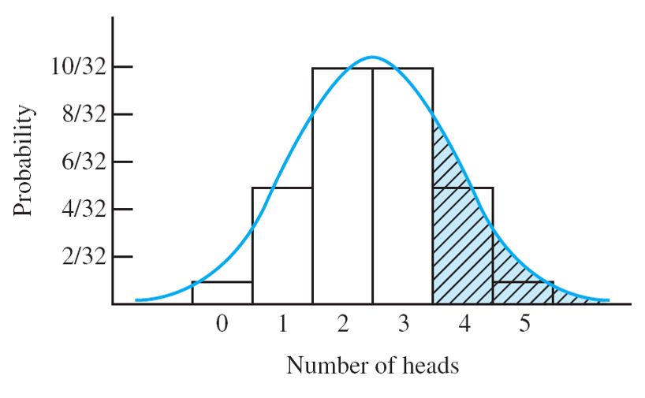

% PSQF 4143: Section 10
% Brandon LeBeau


```{r opts, echo = FALSE}
opts_chunk$set(error=FALSE, warning=FALSE, message=FALSE, dev='png', fig.height=8, fig.width=12,background='white', echo=FALSE)
```

# Dichotomous Populations


# Dichotomous Populations 2
$$ \phi = \frac{\mbox{# of Democrats}}{N} $$
$$ \phi = \frac{\sum X_{i}}{N} $$

- Thus, $\phi$ is the mean of the population of dichotomous scores
- More simply, $\phi = \mu$

# Dichotomous Populations 3
- Recall: $\sigma^2 = \frac{\sum X_{i}^{2}}{N} - \mu^2$
- Now: because $X_{i}$ is dichotomous, $X_{i}^{2} = X_{i}$
- Therefore: 
$$\sigma^{2} = \frac{\sum X_{i}}{N} - \mu^2$$
$$\sigma^2 = \phi - \phi^2$$
$$ \sigma^2 = \phi (1 - \phi)$$

# The sampling distribution of the proportion


# The sampling distribution of the proportion 2
- Definition:
> Given an infinite dichotomous population, the elements of which are assigned a score of 1 if they belong to Class A and a score of 0 if they do not belong to Class A, the sampling distribution of the proportion p in random samples of size n taken from this population, approaches the normal distribution with:

- Mean: $\mu_{p} = \phi$
- Variance: $\sigma_{p}^{2} = \frac{\phi (1 - \phi)}{n}$
- SD: $\sigma_{p} = \sqrt{\frac{\phi (1 - \phi)}{n}}$

as $n$ increases:
- Variance: $\sigma_{\bar{X}}^{2} = \frac{\sigma_{X}^2}{n}$
- SD: $\sigma_{\bar{X}} = \frac{\sigma_{X}}{\sqrt{n}}$

- Note: 
    - This approximation (to the normal distribution) improves as $n$ gets larger, and the closer $\phi$ is to 0.5.
    - The farther away $\phi$ is away from 0.5, and the smaller $n$, the worse the approximation to the normal distribution.
    
# Normal Approximation Example (n = 5; p = 0.5)


- These probabilities can be looked up from the binomial table in the course packet.


