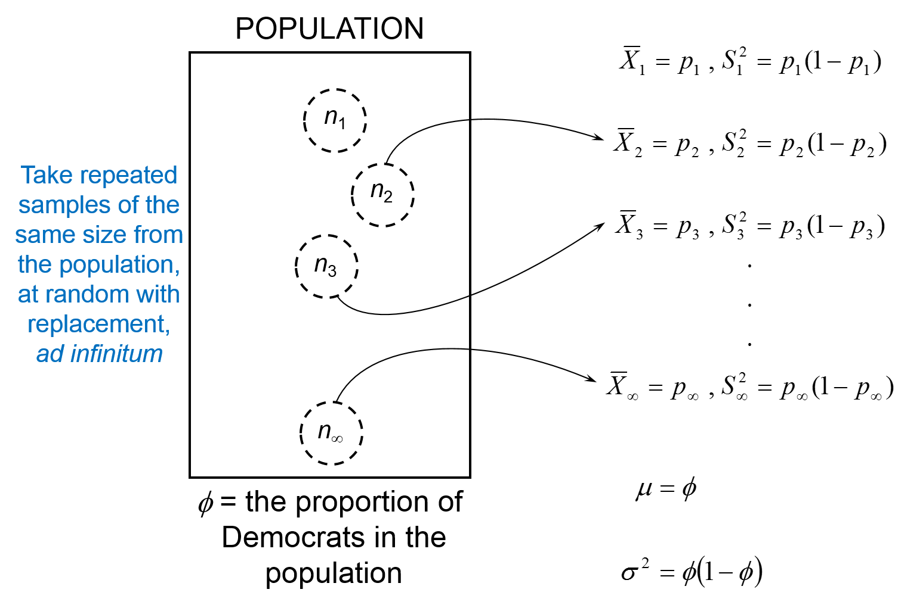
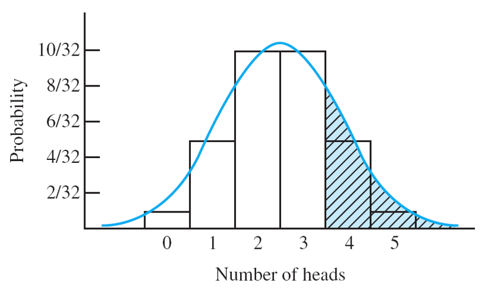

% PSQF 4143: Section 10
% Brandon LeBeau

# Dichotomous Populations

# Dichotomous Populations 2
$$ \phi = \frac{\mbox{# of Democrats}}{N} $$
$$ \phi = \frac{\sum X_{i}}{N} $$

- Thus, $\phi$ is the mean of the population of dichotomous scores
- More simply, $\phi = \mu$

# Dichotomous Populations 3
- Recall: $\sigma^2 = \frac{\sum X_{i}^{2}}{N} - \mu^2$
- Now: because $X_{i}$ is dichotomous, $X_{i}^{2} = X_{i}$
- Therefore: 
$$\sigma^{2} = \frac{\sum X_{i}}{N} - \mu^2$$
$$\sigma^2 = \phi - \phi^2$$
$$ \sigma^2 = \phi (1 - \phi)$$

# The sampling distribution of the proportion

# The sampling distribution of the proportion 2
- Definition: 
    - Given an infinite dichotomous population, the elements of which are assigned a score of 1 if they belong to Class A and a score of 0 if they do not belong to Class A, the sampling distribution of the proportion p in random samples of size n taken from this population, approaches the normal distribution with:

# Sampling disribution of the proportion 3
- Mean: $\mu_{p} = \phi$
- Variance: $\sigma_{p}^{2} = \frac{\phi (1 - \phi)}{n}$
- SD: $\sigma_{p} = \sqrt{\frac{\phi (1 - \phi)}{n}}$

as $n$ increases:
- Variance: $\sigma_{\bar{X}}^{2} = \frac{\sigma_{X}^2}{n}$
- SD: $\sigma_{\bar{X}} = \frac{\sigma_{X}}{\sqrt{n}}$

- Note: 
    - This approximation (to the normal distribution) improves as $n$ gets larger, and the closer $\phi$ is to 0.5.
    - The farther away $\phi$ is away from 0.5, and the smaller $n$, the worse the approximation to the normal distribution.
    
# Normal Approximation Example (n = 5; p = 0.5)

- These probabilities can be looked up from the binomial table in the course packet.

# Sampling distribution of the proportion 4
- The sampling distribution of the proportion follows the binomial distribution
- It is known that the normal distribution provides a good approximation to the binomial distribution when n is large
- Here, we have chosen the normal distribution as an approximation to the sampling distribution of proportion, rather than using its true binomial sampling distribution

# Sampling distribution of the proportion 5
- There are three reasons for doing this:
    1. $p$ is a special case of $\bar{X} | X_{i} = {0 \mbox{ or } 1}$
        - As such, a sampling theory for $p$ is easily derived from a sampling theory for the mean.
    2. The normal distribution is a commonly used probability model.
    3. Based on the assumption of large samples.
    
# Example 1
- A few days before the 2008 presidential election, an ABC News/Washington Post tracking poll surveyed a national random sample of 2,172 likely voters including landline and cell-phone-only respondents
- 1,173 of those surveyed said they would vote for Barack Obama
 -Conduct a hypothesis test at the a = .05 level of significance to determine whether a majority of the population of likely voters would vote for Barack Obama

# Example 2
- A news reporter wants to investigate the advertising claim that a particular speed reading course will “help to improve reading comprehension”
- She decides to conduct the following experiment:
    1. Select 200 freshman at random from all UI freshman.  What is the EAP?  What is the TP?
    2. Form 100 matched pairs (using ACT Reading scores).
    3. Randomly assign one member of each pair to the speed reading course (assume all students will participate).
    4. After the course is completed, administer a reading achievement test to all 200 students.
    5. For each pair of students, subtract the reading score of the control student from that of the experimental student.
    6. For these 100 difference scores, calculate the proportion (p) that are positive (greater than 0).  This proportion is the outcome (statistic) of interest.
    
# Example 2 continued
- After completing the experiment, the news reporter found that 65% (p = 0.65) of the difference scores were positive
- Conduct a hypothesis test at the $\alpha = .10$ level of significance to determine whether the speed reading course was effective in increasing reading comprehension in the population of UI freshman
    - What is the interpretation of $\alpha = .10$?

# Calculating a confidence interval
- Suppose we wanted to calculate a 95\% confidence interval for $\phi$ of the 2008 presidential election data.
    - $n = 2172, p = 0.54$

# Calculating a confidence interval - specifics
$$ \hat{\sigma}_{p} = \sqrt{\frac{p (1 - p)}{n - 1}} $$
$$ CI = p \pm z_{crit} * \hat{\sigma}_{p} $$
where $z_{crit}$ is based on the level of confidence or $1 - \alpha$.

# Interpretting a confidence interval
- How is the confidence interval: $c(0.52 \leq \phi \leq 0.56) = .95$ interpretted?
    - Does $\phi$ fall in the interval?
    - Is there a 95\% chance that $\phi$ falls in this interval?
    - Do we know if $\phi$ falls in the interval?
    - If we construct 100 such intervals, how many would contain $\phi$?
    - If we were to construct an infinite number of intervals, how many would contain $\phi$?
    
# Using Confidence interval to do hypothesis testing
- You can use a 95\% confidence interval to conduct a two-tailed test of any null hypothesis at the specificied $\alpha$ level.
- If the hypothesized value falls within the confidence interval, fail to reject $H_{0}$ (retain $H_{0}$).
- If the hypothesized value falls outside the confidence interval, reject $H_{0}$.
- Example:
    - $H_{0}: \phi = 0.5$
    - $H_{1}: \phi \neq 0.5$
    - $c(0.52 \leq \phi \leq 0.56) = .95$, $\alpha = 0.05$
    - 0.5 lies outside of 95\% confidence interval, therefore, reject $H_{0}$
    
# Summary of one-sample hypothesis tests
| $H_{0}$ | Standard Error |  Test Statistic | Confidence Interval | 
|:--------|---------------:|----------------:|--------------------:|
| $\mu = constant$; $\sigma_{x}$ known | $\sigma_{\bar{X}} = \frac{\sigma_{X}}{\sqrt{n}}$ | $z = \frac{\bar{X} - \mu_{0}}{\sigma_{\bar{X}}}$ | $\bar{X} \pm \sigma_{\bar{X}} * z_{crit}$ |
| $\mu = constant$; $\sigma_{x}$ unknown | $\hat{\sigma}_{\bar{X}} = \frac{s_{X}}{\sqrt{n - 1}}$; $df = n - 1$ | $t_{n - 1} = \frac{\bar{X} - \mu_{0}}{\hat{\sigma}_{\bar{X}}}$ | $\bar{X} \pm \hat{\sigma}_{\bar{X}} * t_{crit(n - 1)}$ |
$\phi = constant$ | $\sigma_{p} = \sqrt{\frac{\phi_{0} (1 - \phi_{0})}{n}}$ | $z = \frac{p - \phi_{0}}{\sigma_{p}}$ | $p \pm \hat{\sigma}_{p} * z_{crit}$; $\hat{\sigma}_{p} = \sqrt{\frac{p (1 - p)}{n - 1}}$ |

