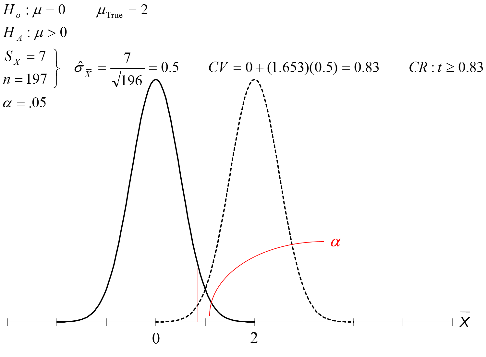

% PSQF 4143: Section 11
% Brandon LeBeau

# Possible Errors
- In making a conclusion from our statistical analysis, there are four possible conclusions that can be made:  
    1. Reject the null hypothesis that is false (correct conclusion).
    2. Fail to reject a null hypothesis that is true (correct conclusion).
    3. Reject a null hypothesis even though it is true (Type I Error).
    4. Fail to reject a null hypothesis even though it is false (Type II Error).
    
# Type I and Type II Errors

~                     | $H_{0}$ is true       | $H_{0}$ is false  
--------------------- | --------------------- | ----------------  
Reject $H_{0}$        | Type I Error $\alpha$ | Correct  $1 - \beta$
Fail to reject $H_{0} | Correct $1-\alpha$    | Type II Error $\beta$  

# Type I Errors
- Type I Error occurs when we find an effect or relationship in our sample that is not in the population.
    - Have a significant result when in fact it is not significant.
    - Reject a true null hypothesis.
    - The probability of a Type I Error $= \alpha$.
    - The conventional (historical) $\alpha$ value is .05.
    - Since the probability of a Type I Error is $\alpha$, the researcher has direct control over how likely a Type I Error would occur.
    - Using an $\alpha = .05$ means that even when no difference exists in the population, 5% of random samples will show a significant difference.
    - To reduct type I errors, simply use a smaller $\alpha$, (i.e. .01 or .001).
    
# Type II Errors
- Type II Error occurs when we do not find an effect or relationship in our sample that exists in the population.
    - Have a non-significant result when in fact it is significant.
    - Fail to reject a false null hypothesis.
    - Probability of a Type II Error $= \beta$
- Type II Errors ($\beta$) depends on the size of the difference in the population and the sample size.
- A similar measure is **power** ($1-\beta$), the probability that a study will produce a statistically significant result **if the research hypothesis is true**.
- The conventional level for power is .8, this is what researchers strive for when planning a research study.

# Type I and Type II Error Example
- Suppose we're interested in examining the safety of a drug.  
    - $H_{0}$: The drug is unsafe.
    - $H_{1}$: The drug is safe.
- What is the type I error?
    - Reject $H_{0}$ when true; more specifically, conclude drug is safe when in fact it is unsafe.
- What is the type II error?
    - Fail to reject $H_{0}$ when it is actually false; more specifically, conclude drug is unsafe when it is actually safe.
- In this example, which error is more harmful?
    - Would like want to make the likelihood of a Type I Error to be very small.
    
# Type I and Type II Error Example 2
- Suppose we are testing blood to determine if it is appropriate for use (contaminated or not contaminated)
    - $H_{0}$: The blood is not contaminated.
    - $H_{1}$: The blood is contaminated.
- What is the type I error?
    - Conclude blood is contaminated when in fact it is not.
- What is the type II error?
    - Conclude blood is not contaminated when it is contaminated.
- In this example, which error is more harmful?
    - Type II Error is probably worse here.
- What if there was a blood shortage?
    - If there was a serious shortage, you may take the increased type II error risk as opposed to not getting the blood transfusion.
    
# Type I and Type II Error Example 3
- Is the U of A women's soccer team significantly taller than the adult women population?
    - $H_{0}$: The team is not significantly taller.
    - $H_{1}$: The team is significantly taller.
- What is the type I error?
    - Conclude team is taller when in fact it is not.
- What is the type II error?
    - Conclude team is not taller when it is actually taller.
    
# Type I Error Rate Control
- As a researcher, we have direct control over $\alpha$. 
    - Why not make this really small to protect against a type I error?
        - This makes it more difficult to reject $H_{0}$ when we should
        - $\alpha$ and $\beta$ are inversely related, therefore decreasing the $\alpha$ will increase $\beta$.
    
# Guidelines for $\alpha$ level
- Laboratory Studies
    - $\alpha = .05$ or smaller
    - Type I error is considered to be more serious
    - Don't want to risk lives or cause harm
- Exploratory Studies
    - $\alpha = .10$ rarely, if ever, bigger than this
    - Type II error is considered to be more serious
    - Don't want to ignore something unnecessarily
    
# How to increase power
- Increase sample size
- Intensify or prolong treatment
- Increase the type I error rate (i.e. $\alpha$)
- Use a one-tailed test rather than a two-tailed test
- Use a stronger research design: e.g. paired t-test rather than pooled t-test

# Practical vs Statistical Significance
- Having a statistically significant result, does not necessarily mean that we have a result that is of practical importance.
$$ \mbox{Test Statistic} = \frac{\mbox{OBS - HYP}}{SE} $$
- The magnitude of the test statistic depends on both the numerator and denominator.

# Test Statistic Numerator
- When the null hypothesis is true, the difference between observed mean and hypothesized mean is due to random variation.
- When the null hypothesis is false, the difference between observed mean and hypothesized mean depends partly on random variation and partly between difference between hypothesized mean and true mean.
    - Other things equal, the larger the discrepancy between hypothesized mean and true mean, the larger the numerator, hence the larger the test statistic.
    

    
# Test Statistic Denominator
1. The standard error
2. This measures only random variation
3. Other things being equal, the larger the sample size, the smaller the standard error
4. If you have a very large sample size, the standard error can be very small.
    - Therefore, even with a very small difference between observed mean and hypothesized mean, you can end up with a large value for the test statistic, thus leading to a statistically significant result.
5. However, the result may not be of practical importance - too small to make a difference in the real world.

# Practical vs Statistical Significance 2
- In other words, with a large enough sample, even a very small difference between observed mean and hypothesized mean can lead to a rejection of the null hypothesis.
- In cases like this, we have a result that is statistically significant, but in which the difference between hypothesized mean and true mean is so small as to be unimportant in a practical sense.

# Type I Errors, Type II Errors, and Power
- $Pr(\mbox{Reject true } H_{0}) = Pr(\mbox{Type I Error}) = \alpha$
- $Pr(\mbox{Reject false } H_{0}) = Pr(\mbox{Type II Error}) = \beta$
- $Pr(\mbox{Reject false } H_{0}) = Power = 1 - \beta$
- As $\alpha$ increases (decreases)
    - Power increases (decreases)
    - $\beta$ decreases (increases)
- Changing the sample size does not affect $\alpha$
    - As n increases, $\beta$ decreases, power increases, $\alpha$ does not change.
    
# Type I Errors, Type II Errors, and Power Examples

    
# Calculating $\beta$ and Power

- Suppose $\mu_{true} = 12$ for this example.

# Power Curve

