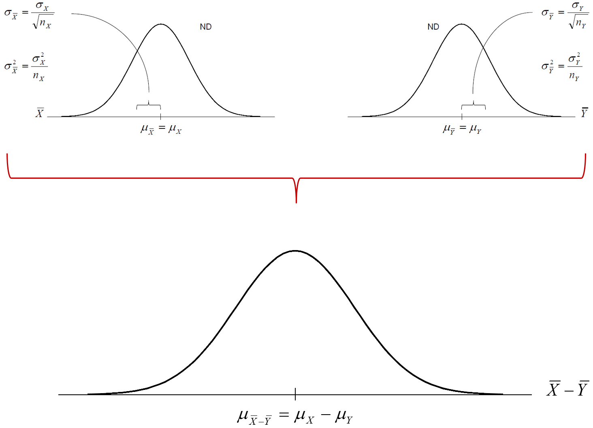
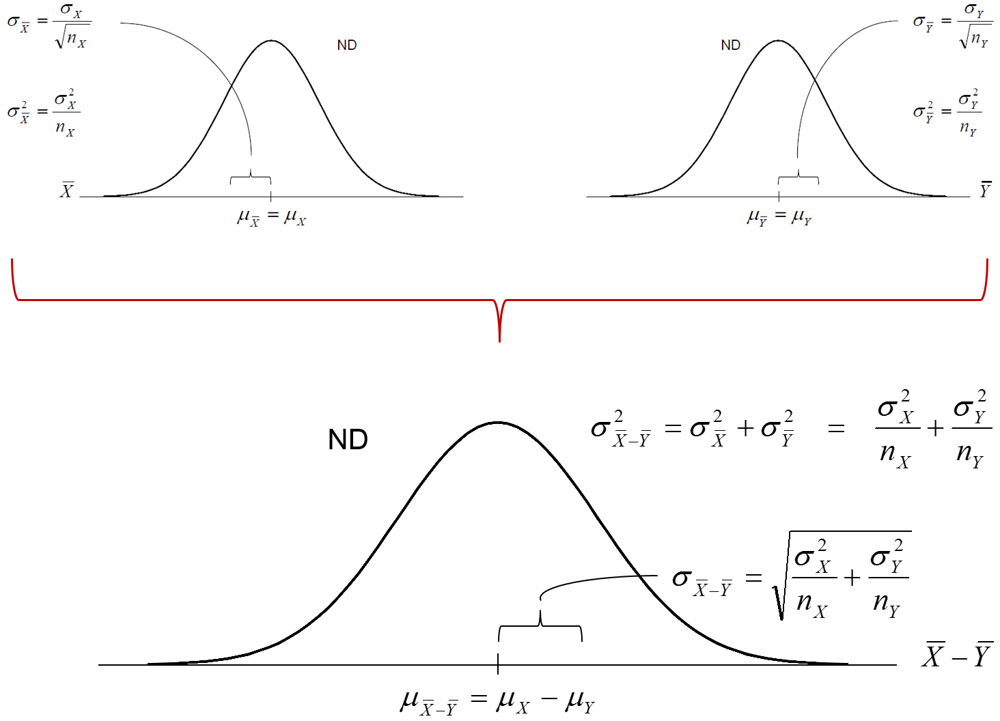

% PSQF 4143: Section 12
% Brandon LeBeau

# Example 1
- Does speed reading help or hurt reading comprehension?
- Random sample of UI freshman students, $n = 100$
- Divide randomly in 2 groups of 50
    - **Independent** groups
    - No matching
    - No equating
- Experimental group ($n_{e} = 50$): take speed reading course
- Control group ($n_{c} = 50$)

# Example 1 (cont).
- State the statistical hypotheses.
    - $H_{0}$: The treatment has no effect
    - $H_{0}$: The two groups are the same (after the speed reading course)
    - $H_{0}$: $\mu_{E} = \mu_{C}$
    - $H_{0}$: $\mu_{E} - \mu_{C} = 0$
- Conduct Experiment:

|   | Experimental | Control |
|---|--------------|---------|
| n | 50           | 50      |
| $\bar{X}$ | 35   | 31      |
| $\sigma$  | 8    | 6       | 

- Is $\bar{X}_{E} - \bar{X}_{C} = 4$ an unlikely result?
- To answer this, we need a probability distribution for $\bar{X}_{E} - \bar{X}_{C}$

# Sampling Distribution $\bar{X}_{E} - \bar{X}_{C}$
- The sampling distribution of the difference between two independent means ($\sigma_{E}$ and $\sigma_{C}$ known).

# Example 1 (cont.)
$$ \sigma_{\bar{X}_{E} - \bar{X}_{C}} = \sqrt{\frac{\sigma_{E}^{2}}{n_{E}} + \frac{\sigma_{C}^{2}}{n_{C}}} $$
- What is the $Pr(\bar{X}_{E} - \bar{X}_{C} \geq 4)$?
$$ z = \frac{(\bar{X}_{E} - \bar{X}_{C}) - (\mu_{E} - \mu_{C})_{HYP}}{\sigma_{\bar{X}_{E} - \bar{X}_{C}}} $$

# Sampling Distribution Explanation

# When population SDs are unknown
- Recall: $\sigma_{\bar{X} - \bar{Y}} = \sqrt{\frac{\sigma_{X}^{2}}{n_{X}} + \frac{\sigma_{Y}^{2}}{n_{Y}}}$
- Assumption: $\sigma_{X}^{2} = \sigma^2_{X} = \sigma^2$
- Then: $\sigma_{\bar{X} - \bar{Y}} = \sqrt{\frac{\sigma^{2}}{n_{X}} + \frac{\sigma^{2}}{n_{Y}}}$
- Now: $\hat{\sigma}_{\bar{X} - \bar{Y}} = \sqrt{\frac{\hat{\sigma}^{2}}{n_{X}} + \frac{\hat{\sigma}^{2}}{n_{Y}}} = \sqrt{\hat{\sigma}^2\left(\frac{1}{n_{X}} + \frac{1}{n_{Y}}\right)}$

# When population SDs are unknown 2
- $\hat{\sigma}_{\bar{X} - \bar{Y}} = \sqrt{\frac{\hat{\sigma}^{2}}{n_{X}} + \frac{\hat{\sigma}^{2}}{n_{Y}}} = \sqrt{\hat{\sigma}^2\left(\frac{1}{n_{X}} + \frac{1}{n_{Y}}\right)}$
- $\hat{\sigma}^2$ is a weighted average of the unbiased estimates of $\sigma^2_{X}$ and $\sigma^2_{Y}$
- Since $\sigma^2_{X}$ and $\sigma^2_{Y}$ are both not known to us: $\hat{\sigma}_{\bar{X} - \bar{Y}} = \sqrt{\frac{n_{X}S^2_{X} + n_{Y}S^2_{Y}}{(n_{X} - 1) + (n_{Y} = 1)} \left(\frac{1}{n_{X}} + \frac{1}{n_{Y}}\right)}$

# Putting all together: Pop SDs unknown

# Example 2
- Does speed reading help or hurt reading comprehension?
- Random sample of UI freshman students, $n = 100$
- Divide randomly in 2 groups of 50

|   | Experimental | Control |
|---|--------------|---------|
| n | 50           | 50      |
| $\bar{X}$ | 35   | 31      |
| $S$  | 8    | 6       | 

- Conduct the hypothesis test at $\alpha = 0.01$ significance level.

# Summary
- If Population SDs are known:
$$ \sigma_{\bar{X} - \bar{Y}} = \sqrt{\frac{\sigma_{X}^{2}}{n_{X}} + \frac{\sigma_{Y}^{2}}{n_{Y}}} $$
$$ TS = \frac{(\bar{X} - \bar{Y}) - (\mu_{X} - \mu_{Y})_{HYP}}{\sigma_{\bar{X} - \bar{Y}}} \sim Z $$
- If Population Sds are **NOT** known:
$$ \hat{\sigma}_{\bar{X} - \bar{Y}} = \sqrt{\frac{n_{X}S^2_{X} + n_{Y}S^2_{Y}}{(n_{X} - 1) + (n_{Y} = 1)} \left(\frac{1}{n_{X}} + \frac{1}{n_{Y}}\right)} $$
$$ TS = \frac{(\bar{X} - \bar{Y}) - (\mu_{X} - \mu_{Y})_{HYP}}{\hat{\sigma}_{\bar{X} - \bar{Y}}} \sim t_{df} $$
$$ df = n_{X} + n_{Y} - 2 $$

# Example 3
- 2 methods (A & B) of teaching addition of fractions
- Is method A more effective than Method B?
- Randomly sample 2 classes
- Results:

|   | A | B |
|---|--------------|---------|
| n | 10           | 24      |
| $\bar{X}$ | 115   | 105      |
| $S$  | 14    | 17       | 

- Conduct the hypothesis test at the $\alpha = .05$ significance level.

# Assumptions
1. Each sample is drawn at random from its respective population
2. The two samples must be independently selected.
3. Sampling with replacement, or $ n < 5\%$ of N.
4. The two populations (of raw scores) are normally distributed.
5. The unknown population variances are equal (homogeneity of variances assumption).

# Assumptions 1 - 3
- In Example 2, we analyzed the data as if we had drawn each of the two samples
    - independent (assumption 2)
    - from its respective population randomly (assumption 1)
    - with replacement (assumption 3)
- However, that is not how the experiment was done.
    - First, we randomly sampled without replacement from a single population
    - Then, we randomly assigned each participant to one of two groups (experimental or control)
    - This is called a randomized experiment

# Assumptions 1 - 3 (cont)
- In other words, a random sampling model (Independent Means t-Test) was used to analyze data that came from two groups formed by random assignment
- Technically, a random assignment model (Permutation Test) should have been used to analyze the data
- Two mistakes when analyzing the data as we did
    1. Draws were made without replacement (inflates the SE)
    2. There was a slight degree of dependency between the two groups (deflates the SE)
    
# Assumptions 1 - 3 (cont)
- It is a lucky break that in randomized experiments, the first mistake outweighs the second
    - Thus, when the random sampling model is applied to randomized experiments, the statistical test is conservative (the SE tends to be overestimated)
- For most randomized experiments, using the random sampling model yields the same statistical conclusions as the random assignment model
- However, with only random assignment of available participants, conclusions do not generalize beyond
    - the participants studied, and
    - the conditions of the study
    
# Random Sampling vs Random Assignment
- Random Sampling
    - a method for obtaining a sample from an experimentally accessible population
    - a basic assumption underlying statistical inference
    - this is what makes it possible for us to make statistical conclusions based on theoretical probability models, and generalize those conclusions to a population
- Random Assignment
    - a method for dividing an available group of participants into two or more subgroups
    - its purpose is to make the comparison groups randomly equivalent to each other prior to any treatment(s)
    - it controls for extraneous variables (known and unknown)
    
# The normality assumption
- The independent means t-test is robust with respect to violations of the normality assumption
    - If the two sample sizes are equal, the t-test gives fairly accurate p-values for a broad range of population distributions, provided the populations
        - have similar shapes
        - are unimodal
        - have no outliers
    - This holds for sample sizes as small as  $n_{X} = n_{Y} = 5$
- When $n_{X}$ and $n_{Y}$ are both greater than 30, the normality assumption is unimportant, thanks to the central limit theorem

# The homogeneity of variance assumption
- The independent means t-test is robust with respect to violations of the assumption of equal population variances, provided that $n_{X} = n_{Y}$
- There is a statistical test of the equality of population variances
    - F-test
- If the population variances are unequal, and if $n_{X} \neq n_{Y}$, the sample variances should not be pooled
    - A modified t-statistic with modified df can be used, often times called the Welch t-test
    
# Confidence Intervals
- Recall the speed reading data:

|   | Experimental | Control |
|---|--------------|---------|
| n | 50           | 50      |
| $\bar{X}$ | 35   | 31      |
| $S$  | 8    | 6       | 

- Find a 99\% CI for $\mu_{E} - \mu_{C}$
- Confidence form looks as follows:
$$ (\bar{X} - \bar{X}) \pm t_{crit} \hat{\sigma}_{\bar{X} - \bar{Y}} $$

# Confidence Interval Interpretations
- Interpretations for 99\% CI [0.24, 7.76]:
    1. Does $\mu$ fall in this interval?
    2. Is there a 99\% chance that $\mu$ falls in this interval?
    3. If 100 intervals were constructed, about how many intervals would contain $\mu$?
    4. If we constructed an infinte number of intervals, how many would contain $\mu$?
    
# Using confidence intervals to conduct a two-tailed hypothesis
- You can use a confidence interval to conduct a two-tailed hypothesis of any null hypothesis.
    - If the hypothesized value falls within the CI, fail to reject $H_{0}$
    - If the hypothesized value falls outside the CI, reject $H_{0}$
- Using the previous example [0.24, 7.76], would we fail to reject or reject $H_{0}$?

