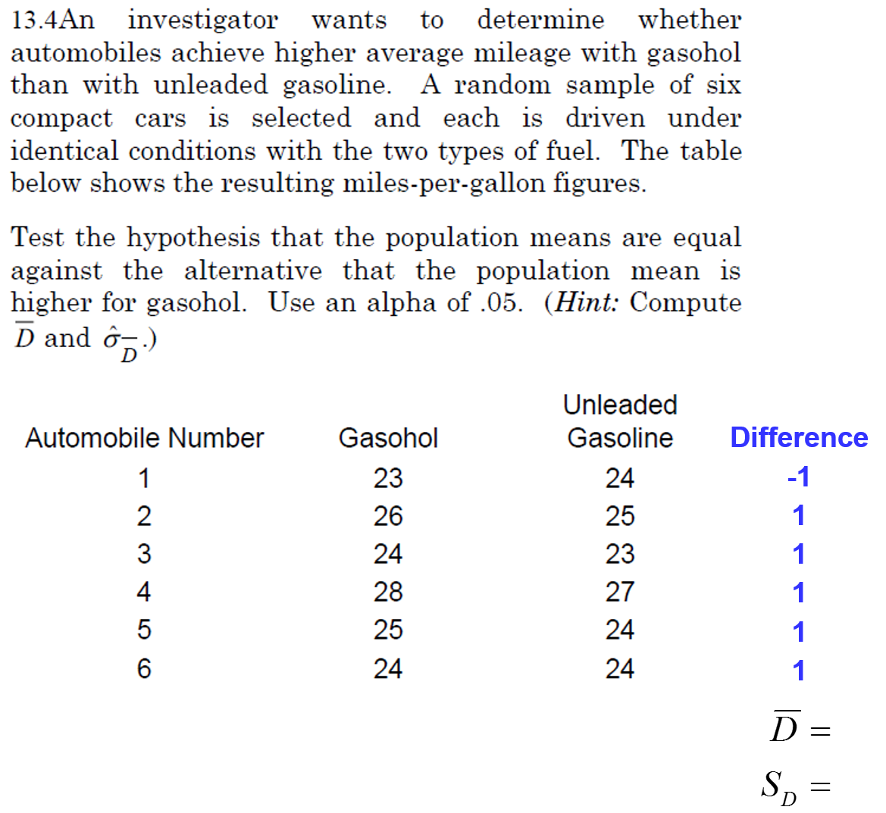

% PSQF 4143: Section 13
% Brandon LeBeau

# Dependent Groups
- Dependency between groups usually occurs in one of the following ways:
    1. Repeated measures
    2. Matching
    3. Obtaining sets of identical twins or litter mates
    4. Obtaining pairs of participants who are matched by mutual selection (e.g. husband-wife pairs, business partners).
    
# Exprimental Designs
1. Random Assignment (Independent Groups)
2. Matched Pairs (Dependent Groups)
3. Repeated Measures (Dependent Groups)

# Random Assignment Example
- Randomly select 50 UI freshmen
- Randomly assign 25 to E-group and 25 to C-group
- assuming the experiment is properly executed, with no biasing influences, the difference is due to
    - chance factors associated with random assignment, and
    - the treatment effect
    
# Matched Pairs Example
- Randomly select 100 UI freshmen
- Rank order by IQ
- Form 50 matched pairs by randomly assigning one person from the first pair to E-group and the other to C-group, etc.
- assuming the experiment is properly executed, with no biasing influences, the difference $\bar{X}_{E} - \bar{X}_{C}$ is due to
    - chance factors associated with random assignment, and
    - the treatment effect, but
    - not IQ, because it has been controlled for by matching

# Repeated Measures Example
- Randomly select 50 UI freshmen
- Administer pre-test
- All participants take speed reading course
- Administer post-test
- Assuming no memory or practice effects associated with the pre-test, the difference $\bar{X}_{post} - \bar{X}_{pre}$ is due to
    - chance factors associated with random assignment, and
    - the treatment effect, but
    - not IQ, nor any other individual background characteristics, because they have been controlled for (each person serves as his/her own control)

# Example 1
- Does speed reading help or hurt reading comprehension?
- Random sample of UI freshman students, n = 100
- Students are rank ordered on ACT composite score
- 50 matched pairs of students are formed
- One student from each pair is randomly assigned to the E-group, the other to the C-group
- Experimental group ($n_{E} = 50$): speed reading course
- Control group ($n_{C} = 50$)

# Two ways to analyze
- There are two ways to analyze this data, the easy way and the hard way.
    - The easy way we have seen before, the hard way is something completely new.
    
| Pair | Experimental | Control | Difference |
|------|--------------|---------|------------|
| 1    | 38           | 36      | 2          |
| 2    | 37           | 38      | -1         | 
| .    | .            | .       | .          | 
| 50   | 28           | 25      | 3          | 

- Easy Way:
    - We take the mean and standard deviation of the difference scores
- Hard Way:
    - Mean of both groups, standard deviations of both groups and the correlation between the two groups.
    
# Example 1 (cont)
- Suppose:
    - $\bar{D} = 4$
    - $S_{D} = 7$
- Is $\bar{D} = 4$ an unlikely outcome?
- We need a probability distribution for $\bar{D}$.

# Sampling Distribution of difference scores

# Example 2

# Standard Error Hard Way

# Standard Error Hard Way 2
- Independent (uncorrelated) means:
$$ \sigma_{\bar{X} - \bar{Y}} = \sqrt{\frac{\sigma_{X}^{2}}{n_{X}} + \frac{\sigma_{Y}^{2}}{n_{Y}}} $$
- Dependent (correlated) means:
$$ \sigma_{\bar{X} - \bar{Y}} = \sqrt{\frac{\sigma_{X}^{2}}{n_{X}} + \frac{\sigma_{Y}^{2}}{n_{Y}} - 2 \rho_{XY} \frac{\sigma_{X}}{\sqrt{n_{X}}} \frac{\sigma_{Y}}{\sqrt{n_{Y}}}} $$

- When $\rho = 0$, $SE_{dep} = SE_{ind}$
- When $\rho > 0$, $SE_{dep} < SE_{ind}$
- When $\rho < 0$, $SE_{dep} > SE_{ind}$

# Advantages of dependent means design
- Repeated measures or pairing of observations makes possible the elimination of an extraneous source of variation
- The reduction in standard error that is induced by pairing the observations depends on the value of    $\rho_{XY}$  (population correlation between X and Y)
- so how do we know whether $\rho_{XY}$ is 0 , + , or – ?
    - when the matching variable is positively related to the outcome of interest, $\rho_{XY}$ is positive
    - when the matching variable is negatively related to the outcome of interest, $\rho_{XY}$ is negative
    

# Advantages of dependent means design 2
- When pairing is on the basis of a variable that is positively and importantly related to the performance of the participants on the outcome variable, $\rho_{XY}$ will be higher than otherwise
    - consequently, the reduction in the standard error will be greater
    - decreased standard error results in increased power
    
# Advantages of dependent means design 3
- However, note that pairing of observations cuts the df in half
    - smaller df results in decreased power 
    - the smaller the df, the thicker the tails of the t-distribution
    - and the further out in the tails the critical region
    - this effect is especially pronounced when sample size is small ($n < 50$)
- Thus, $\rho_{XY}$ must be large enough to offset the decrease in power, induced by the lower df which results from pairing

# Assumptions
- In testing $H_{0}: \mu_{D} = 0$, it is assumed that the population of differences ($D = X – Y$) is normally distributed
    - These differences will be normally distributed if X and Y are normally distributed
- If repeated measures are obtained, it is assumed that participants are a random sample from the population of interest
    - The order in which the conditions are presented should be randomized for each participant if the nature of the independent variable permits it
- If pairs of matched participants are used, the participants in each pair should be randomly assigned to experimental and control conditions

# Calculating a confidence interval
- Recall speed reading data
    - $n = 50$; $\bar{D} = 4$; $S_{D} = 7$
- Suppose we wanted to calculate a 99\% CI for $\mu_{D}$
- We can do that with the following form:
$$ \bar{X}_{D} \pm t_{crit} * \frac{S_{D}}{\sqrt{n - 1}} $$

# Interpreting a confidence interval
- Interpretations for 99\% CI [1.32, 6.68]:
    1. Does $\mu_{D}$ fall in this interval?
    2. Is there a 99\% chance that $\mu_{D}$ falls in this interval?
    3. If 100 intervals were constructed, about how many intervals would contain $\mu_{D}$?
    4. If we constructed an infinte number of intervals, how many would contain $\mu_{D}$?

# Using confidence intervals to conduct a two-tailed hypothesis
- You can use a confidence interval to conduct a two-tailed hypothesis of any null hypothesis.
    - If the hypothesized value falls within the CI, fail to reject $H_{0}$
    - If the hypothesized value falls outside the CI, reject $H_{0}$
- Using the previous example [1.32, 6.68], would we fail to reject or reject $H_{0}$?

# Three Experimental Designs
1. Random Assignment (Independent Groups)
    - Randomly select 50 UI freshmen
    - Randomly assign 25 to E-group and 25 to C-group
2. Matched Pairs (Dependent Groups)
    - Randomly select 100 UI freshmen
    - Rank order by IQ
    - Randomly assign one person from the first pair to E-group and the other to C-group, etc.
3. Repeated Measures (Dependent Groups)
    - Randomly select 50 UI freshmen
    - Administer pre-test
    - All participants take speed reading course
    - Administer post-test

