% PSQF 4143: Section 13
% Brandon LeBeau

# Correlation Introduction
- Up to now, we have primarily focused on statistics for single variables
- We will now shift to discuss how to quantify and explore the relationship between two variables.
- To display the relationship between two variables, could use a bivariate frequency distribution or a scatterplot.

# Bivariate Frequency Distribution
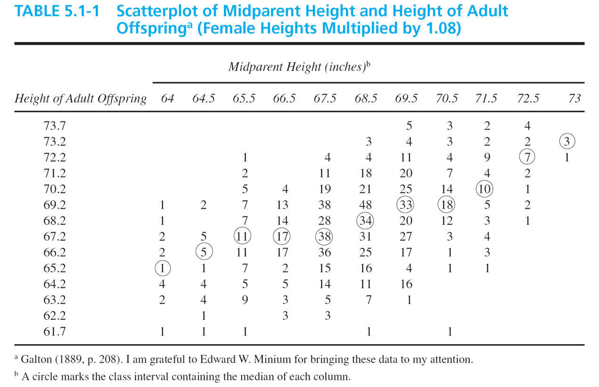

# Scatterplot 
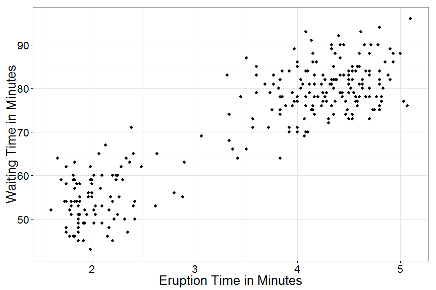 

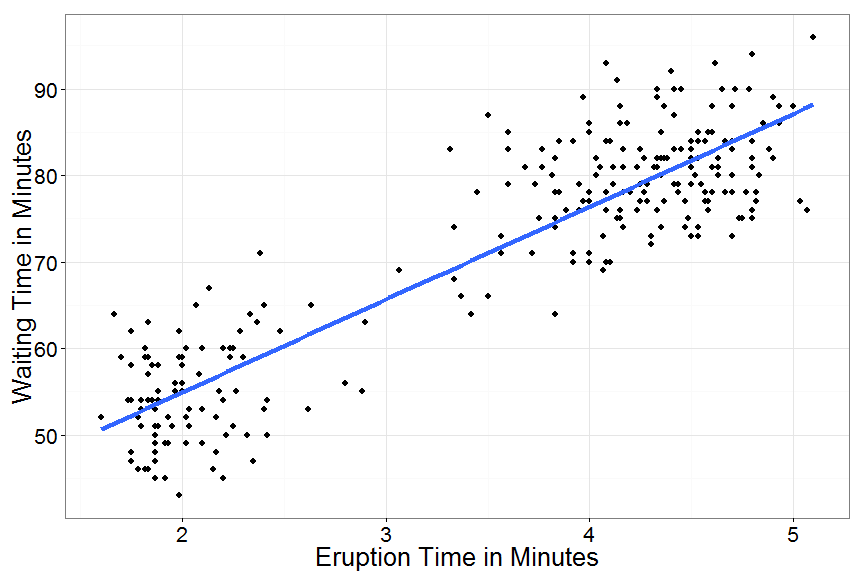 

# Correlation 2
- The correlation gives us a measure to describe the relationship between two variables.
    - The form of the relationship
    - The direction of the relationship
    - The strength of the relationship
- The pearson product-moment correlation coefficient (correlation) describes the amount of **linear** relationship between two variables.
- Notation:
    - Sample: $r$
    - Population: $\rho$

    
# Correlation 3
- Correlations can be either positive or negative:
    - Positive: Effort and Achievement -- People who expend more effort tend to achieve more.
    - Negative: Cholesterol level and life expectancy -- People with lower cholesterol levels tend to live longer.
- A correlation of 1 represents a perfect positive relationship.
    - Example: Annual precipitation in inches and annual precipitation in centimeters.
- A correlation of -1 represents a perfect negative relationship.
    - Example: Number of days in class and number of days absent.
- A correlation of 0 represents no relationship.
    - Example: height and last digit of social security number.
    
# Examples
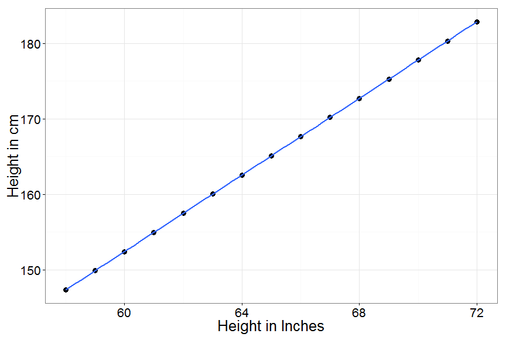 

 

# Real world Examples
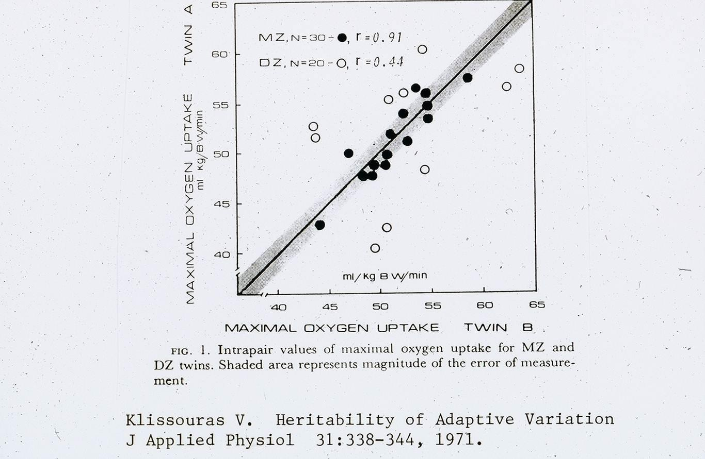

# Real World Example 2
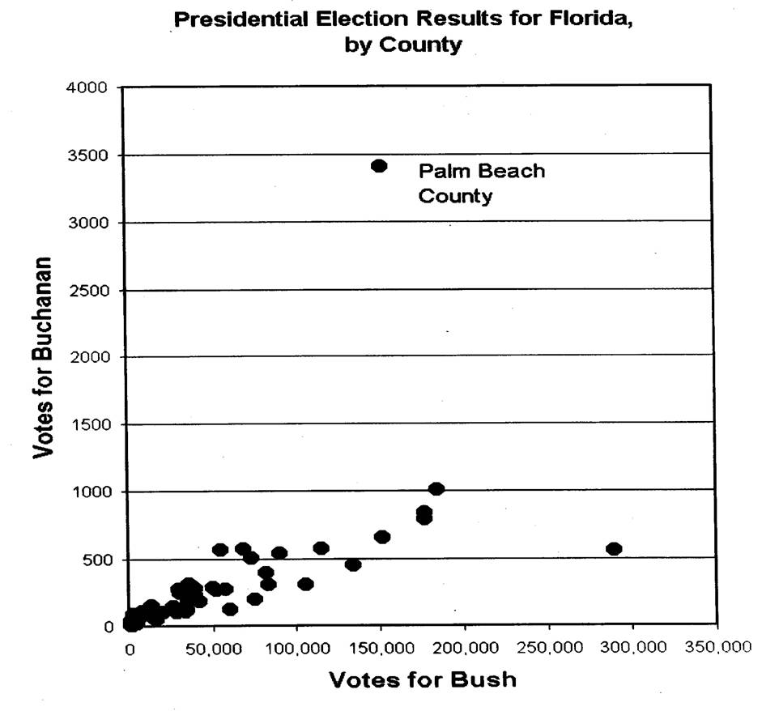

# Real World Example 2 cont.
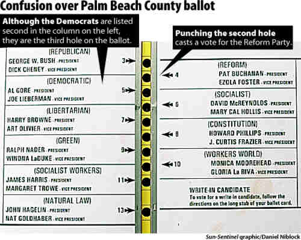

# Guessing Correlations

http://istics.net/stat/Correlations/  

# Correlation Formula 
$$ r = \frac{\mbox{degree to which X and Y vary together}}{\mbox{degree to which X and Y vary separately}} $$

$$ r = \frac{s_{XY}}{s_{X}s_{Y}} = \frac{\sum(X-\bar{X})(Y-\bar{Y})}{s_{X}s_{Y}}*\frac{1}{n} $$

where $s_{XY} = \frac{\sum(X-\bar{X})(Y-\bar{Y})}{n-1}$ is the **covariance**  
and $s_{X}$ and $s_{Y}$ are the standard deviations of the $X$ and $Y$ respectively.

$$ r = \frac{\sum z_{x} z_{y}}{n} $$

# Calculating the Correlation
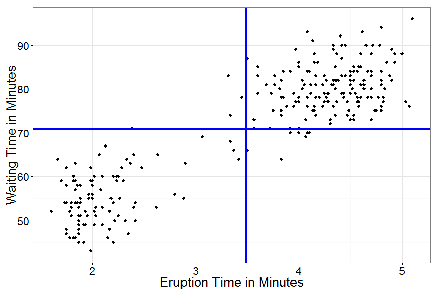 

# Correlation Formula 2
- Formula for raw scores:
$$ r = \frac{\sum (X - \bar{X})(Y- \bar{Y})}{(n)s_{x}s_{y}} $$
$$ \rho = \frac{\sum (X - \mu_{X})(Y- \mu_{Y})}{(N)\sigma_{x}\sigma_{y}} $$

# Correlation Properties
1. $r$ ranges from -1 (perfect negative relationship) to +1 (perfect positive relationship)
2. $r = 0$ when there is no **linear** relationship between the variables.
3. The closer $r$ is to +1 or -1, the stronger the relationship
    - For example, $r = -0.7$ is stronger than $r = 0.49$.
4. Changes in the scale are not uniform.
    - For example, a change from $r = 0.4$ does not represent half the relationship as $r = 0.8$
    
# Correlation Properties 2
5. Linear transformations do not impact the correlation.
    - Example, the corelation between the temperatures in Boston and New York would be identical on Fahrenheit or Celsius scales

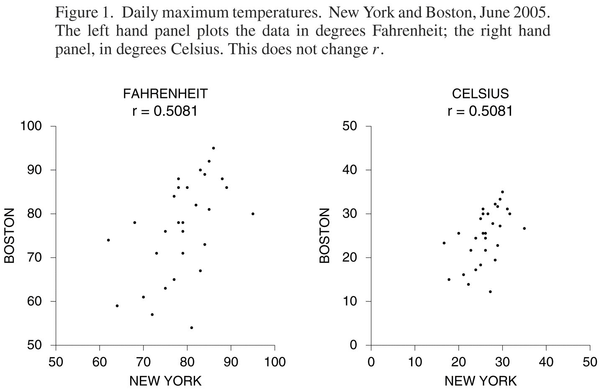

6. Flipping the X and Y variables does not change the correlation.

# Perfect Linearity
- Perfect linearity does not always imply perfect correlation.

# Non-linear Trends
- Remember that the correlation we have discussed measures the **linear** relationship, not non-linear.

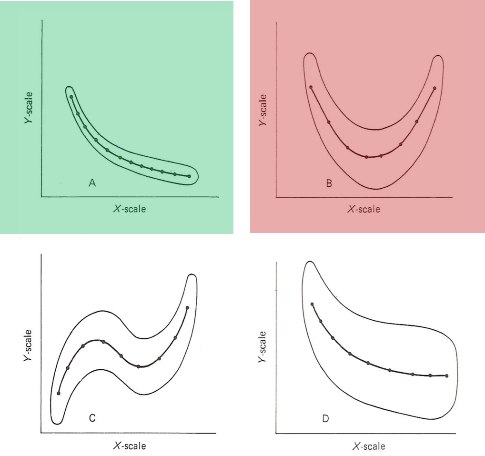

# Interpretation of the Correlation
- Assuming linearity exists, what does $r = 0.75$ mean?

1. Interpret $r$ in an absolute sense (can be troublesome out of context):
    - $| r | > 0.75$; strong correlation
    - $| r | > 0.3$; medium correlation
    - $| r | < 0.3$; weak correlation
2. Interpret in a relative sense:
    - Parallel test forms (Form A -- Form B); $r = 0.75$ is low
    - ACT to Freshman GPA; $r = 0.75$ is high

# Interpretation of the Correlation 2
3. $r^2$ is an indication of the amount of variability one variable explains in the other variable.
    - Example: $r = 0.75$, $r^2 = 0.56$; 56\% of the variation in Y is explained by X.
4. $r$ as an index of prediction accuracy.

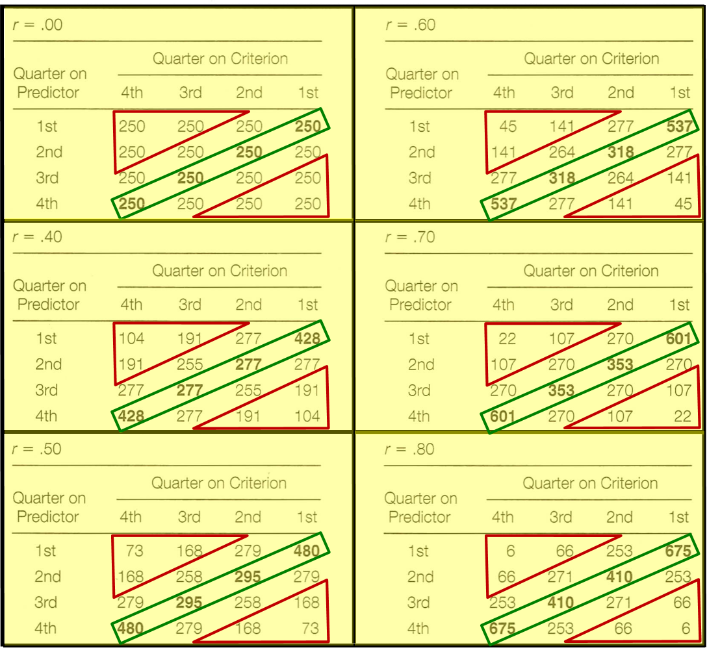

# Correlation is not Causation
- We find a relationship between X and Y
    - This relationship may be that X **causes** Y
    - Or it could be that Y **causes** X
    - It could be that a third variable causes both X and Y
- Most likely, there is a complex web of variables that are at play.

# Confounding
- Confounding is when Y is caused by X and a third variable (but the third variable is not related to X). Therefore, the effect of X is confounded with a third variables

# Correlation with time
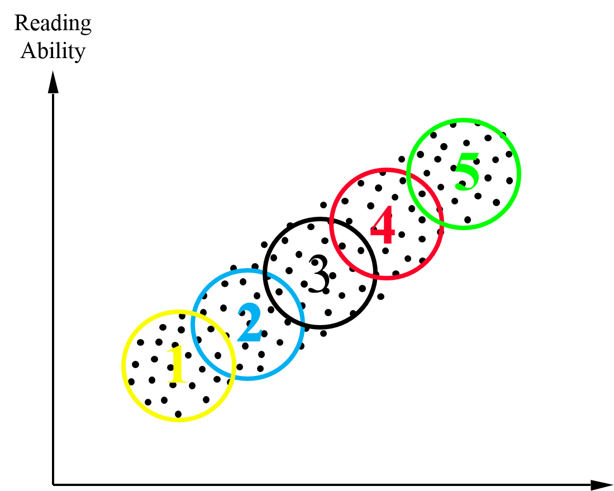

# Correlation is not Causation Summary
- Correlation specifically measures association/relationships
- Being associated or related is not the same as causation
- Inferences about causation can only be made with logic and careful experimental design/control.
- The value of $r$ itself can not be used for causation

# Restriction of Range
- Restriction of range can have the effect of decreasing the correlation.
- This happens due to decreasing the variability.

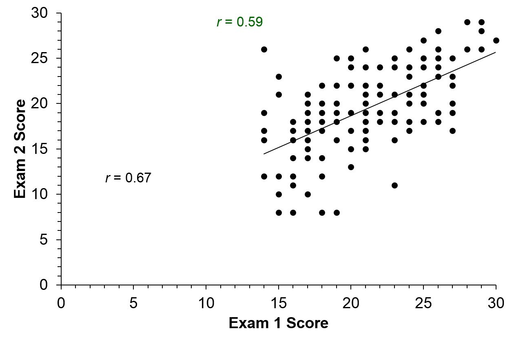

# Correlations with subpopulations
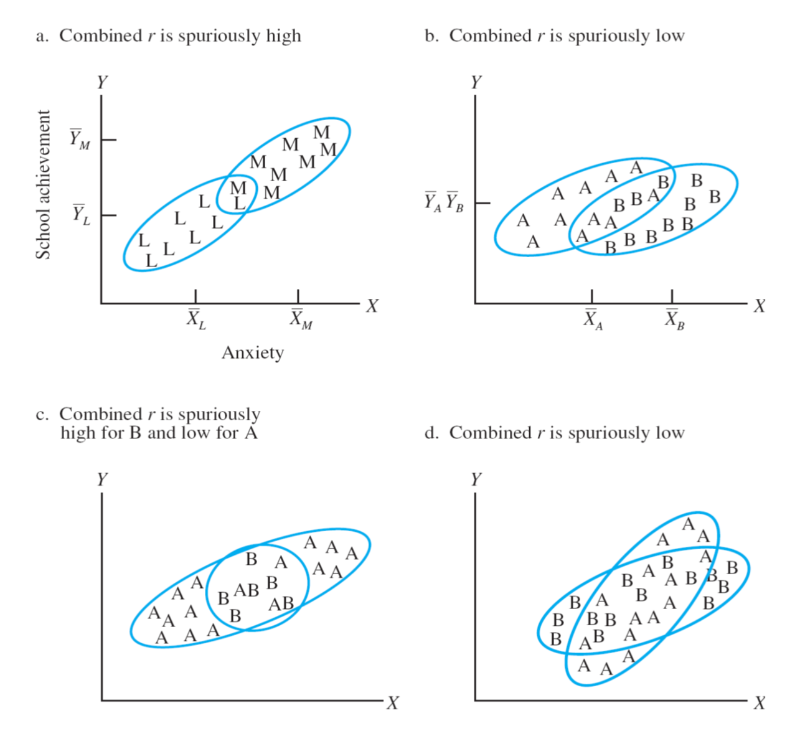
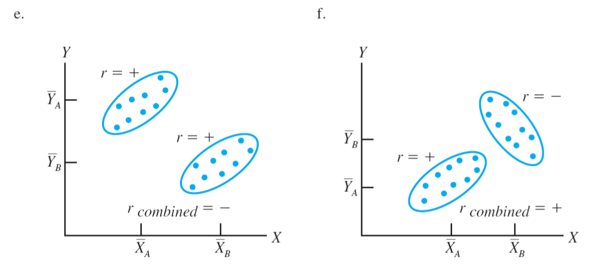

# Cautions for Correlation Summary
1. Careful about causation, remember correlation does not imply causation
2. Outliers can alter the correlation.
3. We discussed the correlation for **linear** relationships, not non-linear.
4. Restriction of range can decrease (attenuate) correlations.
5. More than one population can change the effect of the correlation.
6. Correlations of averages can be stronger than correlation of raw scores.

