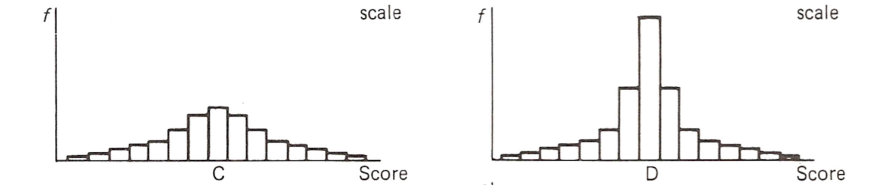
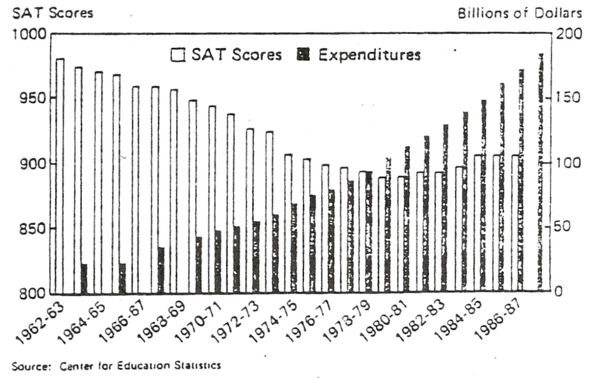

% PSQF 4143: Section 2
% Brandon LeBeau

```{r opts, echo = FALSE}
opts_chunk$set(error=FALSE, warning=FALSE, message=FALSE, dev='png', fig.height=8, fig.width=12,background='white', echo=FALSE)
```


# Summarizing Data
- Data in its raw form is often too complex to summarize and understand quickly.
- As such, summarizing the data with descriptive statistics (section 3) or with tables and graphs (this section) can be very helpful.

# Motivating Example
```{r summarize}
# Function to wrap printing.
wrap_print <- function(table, num_row = NULL, num_col = 2) {
  if(is.null(num_row)) {
    num_row <- nrow(table)/2
  }
  ngroups <- nrow(table)/num_row
  
  tmp <- lapply(1:ngroups, function(xx) 
    table[((xx-1)*num_row+1):((xx-1)*num_row + num_row), ])
  tmp <- do.call("cbind", tmp)
  return(tmp)
}

library(ggplot2)
library(dplyr)
title_movie <- c('Mean Girls', 'Notebook, The', 'Troy',
                 'Incredibles, The', 
                 'Harry Potter and the Prisoner of Azkaban',
                 'Napoleon Dynamite', 
                 'Eternal Sunshine of the Spotless Mind',
                 'Crash', '13 Going On 30', 
                 'Girl Next Door, The', 
                 'Dodgeball: A True Underdog Story',
                 'Anchorman: The Legend of Ron Burgundy',
                 'Million Dollar Baby',
                 'Shaun of the Dead', 'White Chicks',
                 'Spider-Man 2', 'Saw', 'Dawn of the Dead',
                 'Van Helsing', 'Cinderella Story, A', 
                 'King Arthur', 'Phantom of the Opera, The',
                 '50 First Dates', 'Aviator, The', 
                 'Kill Bill: Vol. 2', 'Punisher, The',
                 'Village, The', 'Collateral',
                 'Butterfly Effect, The', 'Hellboy')
freq_tab <- movies %>%
  filter(title %in% title_movie & year == 2004) %>%
  select(title, length)
wrap_print(freq_tab, num_row = 15)
```

# Ungrouped Frequency Table
<br>
<br>
<br>
<br>
<br>
<br>
<br>

# Ungrouped Frequency Table Creation Steps
- To create an ungrouped frequency table:
    1. List all numbers from the minimum to maximum
    2. Count the number that fall within each number
    3. Numbers can have 0 frequency
    
- Strengths:
    - Able to see all the numbers in the distribution
    - Can quickly glance at the range
    - Can quickly see which number is most frequent.
- Weaknesses:
    - Tables can be large depending on range
    - Lose some information, namely who had which value
    
# Grouped Frequency Table
<br>
<br>
<br>
<br>
<br>
<br>
<br>

# Grouped Frequency Table Creation Steps
- To create a grouped frequency table:
    1. First need to find the class interval size
       $$ i = Real Upper Limit - Real Lower Limit $$
    2. List out all the class intervals
    3. Count the number that fall within each interval
    
- Strengths:
    - Can quickly see where most values fall
    - 
- Weaknesses:
    - No longer know exact values
    - The choice of class interval size can influence the table
    
# Effect of Class Interval Size
```{r freqclass}
freq_tab2 <- movies %>%
  filter(year == 2004) %>%
  select(title, length)

breaks <- seq(0, 200, by = 5)
data.frame(table(cut(freq_tab2$length, breaks, right = FALSE)))

breaks <- seq(0, 200, by = 10)
data.frame(table(cut(freq_tab2$length, breaks, right = FALSE)))

breaks <- seq(0, 200, by = 20)
data.frame(table(cut(freq_tab2$length, breaks, right = FALSE)))

breaks <- seq(0, 200, by = 50)
data.frame(table(cut(freq_tab2$length, breaks, right = FALSE)))
```

# Additional Notes for Grouped Frequency Tables
- The class intervals should be mutually exclusive
- For quantitative values, no gaps between class intervals
- All class intervals should be the same size
- On average, 10 to 20 class intervals are most appropriate
- Common class interval sizes include: 1, 2, 3, 5, 10, 15, 20, 25, ...
- The lower limit should equal the class size times a constant integer (i.e. 5 * 10 = 50)

# Unequal Frequency Distributions
- One area where unequal frequency distributions can be useful is with variables such as income.
- Income tends to have more individuals at the low end and fewer at the high end.
- As such, it can be helpful to have larger class intervals at the upper end of the income scale.
- Unequal intervals can be used for tables, but not for graphs.

# Unequal Frequency Distribution Example


# Relative Frequency Distributions
- These are frequency distributions with proportion or percentage of each class interval
- Useful for comparisons of two or more groups especially when the number in each group differ

# Relative Frequency Distribution Example
<br>
<br>
<br>
<br>
<br>
<br>
<br>

# Relative Frequency by Groups
```{r freqgroups}
tmp_movies <- movies %>%
  filter(year == 2004 & mpaa %in% c('PG', 'R')) %>%
  select(length, mpaa)
breaks <- seq(10, 180, by = 15)
tmp <- split(tmp_movies, tmp_movies$mpaa)
tmp <- lapply(1:length(tmp), function(xx)
  cut(tmp[[xx]]$length, breaks, right = FALSE))
tmp2 <- data.frame(length = c(tmp[[3]], tmp[[5]]), 
                   mpaa = rep(c('PG', 'R'), 
                              times = c(length(tmp[[3]]),
                                        length(tmp[[5]]))))
tmp_tab <- table(tmp2$length, tmp2$mpaa)
```

# Cumulative Frequency Distributions
<br>
<br>
<br>
<br>
<br>
<br>
<br>
<br>

# Cumulative Frequency Creation
1. Start with a basic frequency distribution, grouped or ungrouped.
2. Starting with the smallest value, keep a running tally of the number encountered.
    - This can be done by taking the frequency for the current category plus all prior categories
3. Optional - add columns for cumulative proportion or cumulative percentage.

# Frequency Distribution for Qualitative Variables
```{r qual}
table(movies$mpaa)
```

# Graphs
- Graphs are a great alternative to many of the tables we discussed above as they tend to be easier to quickly interpret and understand.
- One benefit of graphs is the ability to explore the shape of distributions.
- However, it is also easier to create misleading graphics.
- Graphs for quantiative variables:
    - Histograms
    - Frequency Polygons
    - Cumulative Polygon (Ogive)
    - Stem and Leaf
- Graphs for qualitative variables:
    - Bar Graphs
    - Pie Charts
- Note: there are many other graphs that can be used too that we are not discussing.

# Histograms
- A histogram is a visual representation of a frequency table for quantitative variables.
- No gaps between bars as the x-axis is continuous.

```{r hist}
h <- ggplot(freq_tab, aes(x = length)) + theme_bw(base_size = 16)
h + geom_histogram(binwidth = 10, color = "grey30") + 
  scale_x_continuous(breaks = seq(70, 180, 10))
```

# Shapes of Distributions
- Distributions can be categorized based on their symmetry (skewness) and kurtosis.
- Symmetry/Skewness is the amount a distribution leans one way or the other.
    - A symmetric distribution is one where each half of the distribution are mirror images of one another.
    - An asymmetric (skewed) distribution is one where they are not mirror images.
    - A positively (right) skewed distribution is one where the bulk of data lie in the lower portion with a long upper tail.
    - A negatively (left) skewed distribution is one where the bulk of data lie in the upper portion with a long lower tail.
- Kurtosis refers to the peakedness of the distribution. Relatedly, this also refers to the portion of the distribution that resides in the tails.
    - Mesokurtic refers to an intermediate distribution with average tails and peakedness.
    - Platykurtic refers to a distribution that is flatter with more observations in the tail.
    - Leptokurtic refers to a distribution that is steeper with fewer observations in the tail.
    
# Describing Distributions
- Location (Central Tendency)
    - Where is the middle score?
    - Where are the scores concentrated?
- Variability
    - Dispersion
    - Spread
    - Range
    
# Examples of common shapes


# Shapes with Histograms



# Factors Affecting Distribution Shape
1. Sampling
    - The larger the sample size, the closer it will approximate the population.
2. Relative Scale
    - The height of the histogram should be 3/4 of the width.
3. Frequency Scale
    - Always continuous and start at 0.
4. Interval size / number of intervals

# Effect of Sampling
```{r histsamp}
h <- ggplot(sample_n(freq_tab2, 500), aes(x = length)) + 
  theme_bw(base_size = 16)
h + geom_histogram(binwidth = 15, color = "grey30") + 
  scale_x_continuous(breaks = seq(0, 240, 15))

h <- ggplot(sample_n(freq_tab2, 100), aes(x = length)) + 
  theme_bw(base_size = 16)
h + geom_histogram(binwidth = 15, color = "grey30") + 
  scale_x_continuous(breaks = seq(0, 240, 15))

h <- ggplot(sample_n(freq_tab2, 10), aes(x = length)) + 
  theme_bw(base_size = 16)
h + geom_histogram(binwidth = 15, color = "grey30") + 
  scale_x_continuous(breaks = seq(0, 240, 15))
```

# Effect of Relative Scale


# Effect of Frequency Not Starting at Zero



# Effect of Binwidth on Histograms
```{r histbin}
h <- ggplot(freq_tab, aes(x = length)) + theme_bw(base_size = 16)
h + geom_histogram(binwidth = 5, color = "grey30") + 
  scale_x_continuous(breaks = seq(70, 180, 5))

h + geom_histogram(binwidth = 10, color = "grey30") + 
  scale_x_continuous(breaks = seq(70, 180, 10))

h + geom_histogram(binwidth = 20, color = "grey30") + 
  scale_x_continuous(breaks = seq(70, 180, 20))

h + geom_histogram(binwidth = 40, color = "grey30") + 
  scale_x_continuous(breaks = seq(70, 180, 40))
```


# Cumulative Polygon (Ogive)
- The cumulative polygon or ogive, is a graphical representation of the cumulative frequency.
- This plot is unique in that it never decreases.

```{r ogive}
breaks <- seq(70, 180, 10)
length_cut <- cut(freq_tab$length, breaks, right = FALSE)
length_tab <- table(length_cut)
cumfreq <- c(0, cumsum(length_tab))
length_df <- data.frame(freq = c(0, length_tab), cf = cumfreq, brks = seq(70, 180, 10))
cf <- ggplot(length_df, aes(x = brks, y = cf)) + theme_bw(base_size = 16)
cf + geom_point() + geom_line() + 
  scale_x_continuous("Length", breaks = breaks) + 
  ylab("Cumulative Freq")
```

# Ogive - Cumulative Percentage
```{r ogivepercent}
cf <- ggplot(length_df, aes(x = brks, y = I(cf/max(cf)*100))) + 
  theme_bw(base_size = 16)
cf + geom_point() + geom_line() + 
  scale_x_continuous("Length", breaks = breaks) + 
  scale_y_continuous("Cumulative Per", breaks = seq(0, 100, 10))
```

# Percentile Ranks and Percentiles
- Percentile Ranks:
    - The percentage of scores at or below a given point.
    - Denoted by $P_{R}(X)$, read as the percentile rank of score $X$.
- Percentiles:
    - The point on the score scale below which a specified percentage of scores fall.
    - Denoted by $P_{%}%
- A percentile is the inverse of a percentile rank.
- The percentile rank of a given point on the score scale is the percentage of scores falling below this point in the ordered series of scores.
    - The value of the point iteself is the percentile corresponding to this percentile rank.
    - Example: if $P_{R}(X) = 60$, then $P_{60} = X$.
- Never say, 'My score was **in** the top quartile'.
    - A quartile (or percentile or decile) is a point on the score scale, not an interval.
    - Instead say, 'My score was at the top quartile'.
    
# Special Percentile Points
- Deciles:
    - $D_{1} = P_{10}$ - First decile
    - $D_{2} = P_{20}$ - Second decile
    - $D_{5} = Q_{2} = P_{50} = Mdn$ - Median
    - $Q_{1} = P_{25}$ - First Quartile
    - $Q_{3} = P_{75}$ - Third Quartile
    
# Estimate Percentile Ranks/Percentiles
```{r ogivepercent2}
cf <- ggplot(length_df, aes(x = brks, y = I(cf/max(cf)*100))) + 
  theme_bw(base_size = 16)
cf + geom_point() + geom_line() + 
  scale_x_continuous("Length", breaks = breaks) + 
  scale_y_continuous("Cumulative Per", breaks = seq(0, 100, 10))
```

- $P_{R}(122) = $
- $P_{R}(160) = $
- $P_{50} = $
- $P_{80} = $

# Decile Differences


# Quartiles and Shape
- Symmetrical: 
    - $Q_{3} - Q_{2} = Q_{2} - Q_{1}$
- Positive Skew:
    - $Q_{3} - Q_{2} > Q_{2} - Q_{1}$
- Negative Skew:
    - $Q_{3} - Q_{1} < Q_{2} - Q_{1}$
    

# Ogive Shape


# Bar Graphs
- Bar graphs are a way to visually show a frequency table for qualitative variables.
- Can also be used to show other variables on the y-axis for qualitative variables.
- Has gaps to show the differences in groups.
- Order should be meaningful, either alphabetical for nominal variables or in the correct order for ordinal variables.

```{r bar}
b <- ggplot(filter(movies, mpaa != ''), aes(x = mpaa)) + theme_bw(base_size = 16)
b + geom_bar()
```

# Pie Charts
- Pie charts are useful to show the percentage of the whole for each group.
- The sum of the pieces of the pie must add up to 100% for this chart to be meaningful.

```{r pie}
pie_tab <- table(filter(movies, mpaa != '')$mpaa)[2:5]
lbls <- paste(names(pie_tab), "\n", pie_tab, sep = "")
pie(pie_tab, labels = lbls)
```

# Poor graphics
- Care needs to be made when constructing good graphics.
- It is easy for graphs to mislead/mask the purpose. 
- The goal should be to easily convey the message.

[Poor Charts](http://flowingdata.com/2013/07/15/open-thread-what-is-wrong-with-these-charts/)

# Interesting Graphic Examples
[Languages other than English Spoken at home](http://www.washingtonpost.com/wp-srv/special/national/us-language-map/)

[The Racial Dot Map](http://www.coopercenter.org/demographics/Racial-Dot-Map)


