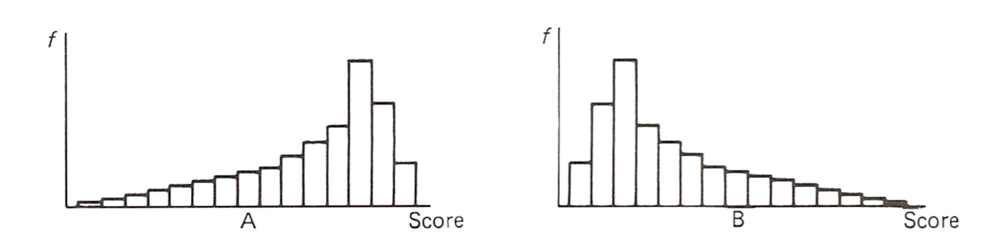
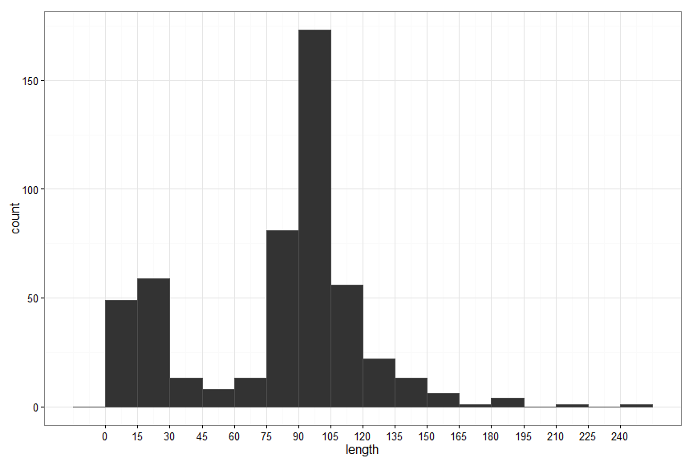
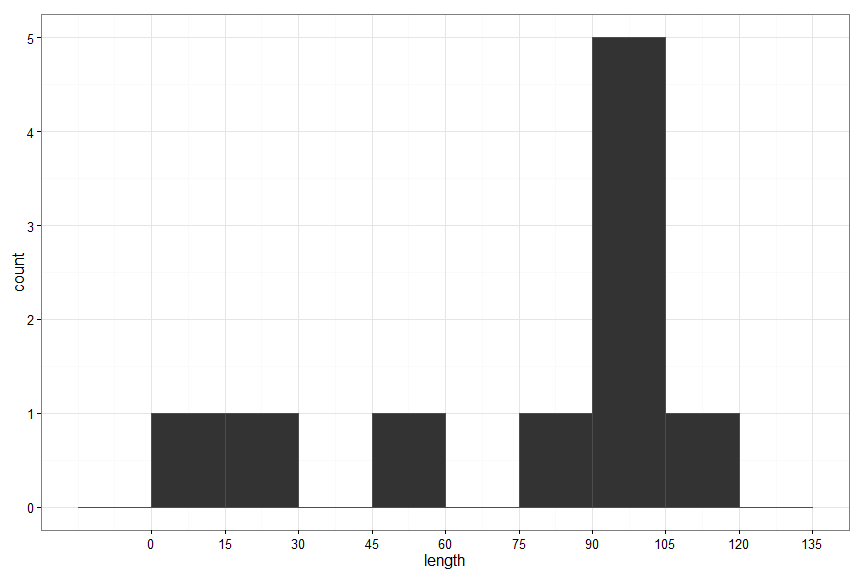
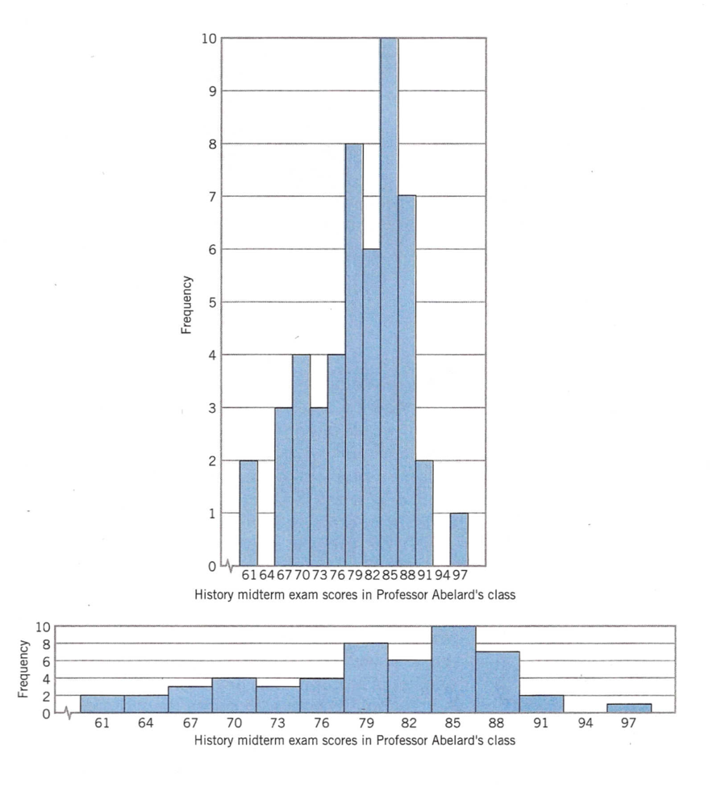
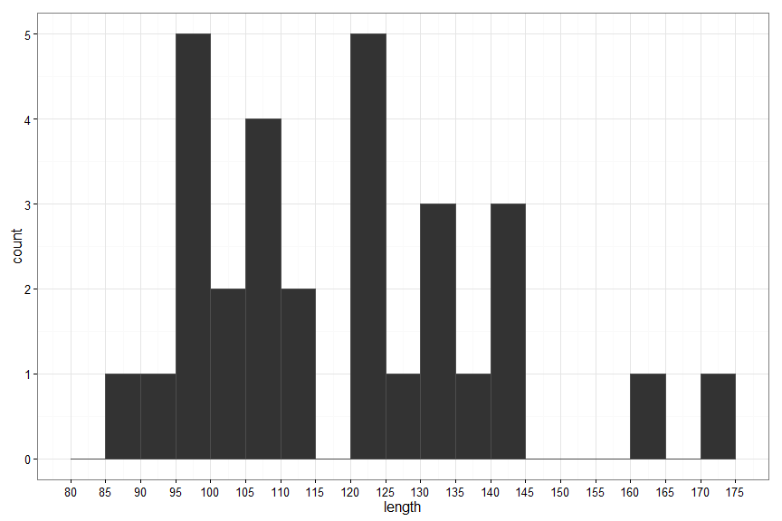
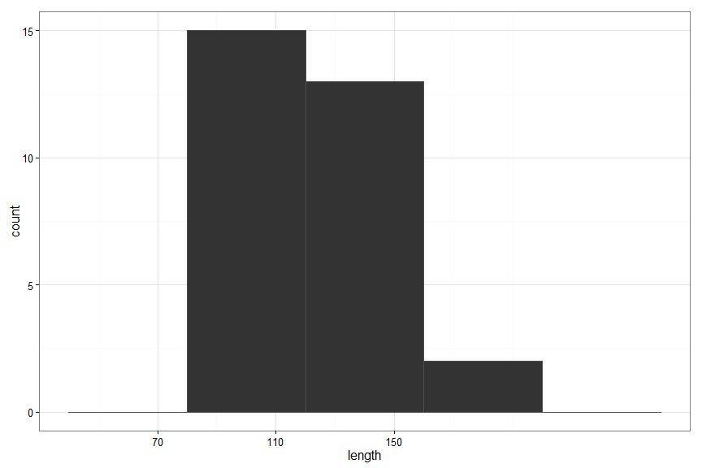
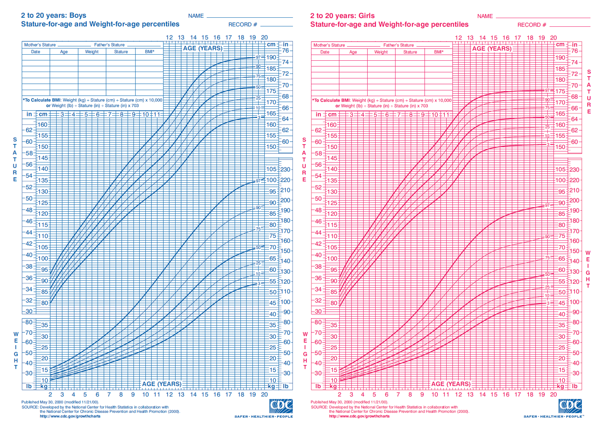
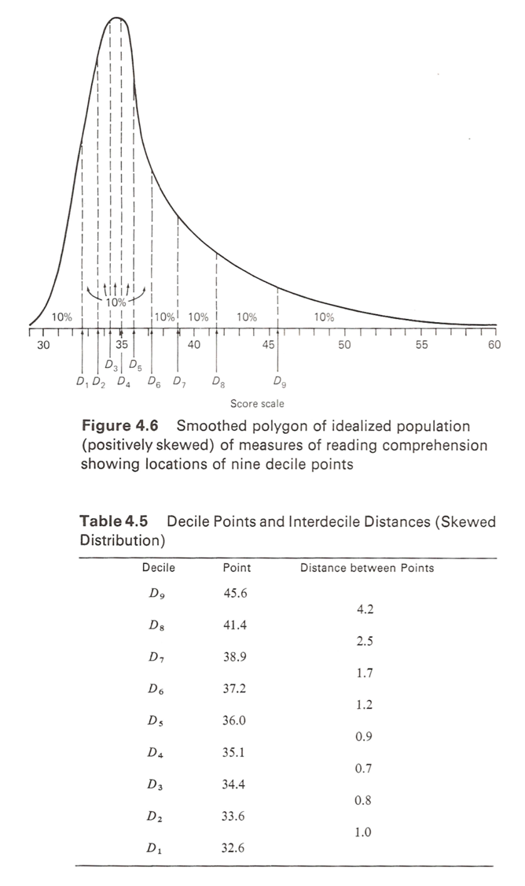

% PSQF 4143: Section 2
% Brandon LeBeau


# Summarizing Data
- Data in its raw form is often too complex to summarize and understand quickly.
- As such, summarizing the data with descriptive statistics (section 3) or with tables and graphs (this section) can be very helpful.

# Motivating Example

```
##                                       title length
## 1                            13 Going On 30     98
## 2                            50 First Dates     99
## 3     Anchorman: The Legend of Ron Burgundy    104
## 4                              Aviator, The    170
## 5                     Butterfly Effect, The    120
## 6                       Cinderella Story, A     95
## 7                                Collateral    120
## 8                                     Crash    113
## 9                          Dawn of the Dead    109
## 10         Dodgeball: A True Underdog Story     92
## 11    Eternal Sunshine of the Spotless Mind    108
## 12                      Girl Next Door, The    110
## 13 Harry Potter and the Prisoner of Azkaban    141
## 14                                  Hellboy    132
## 15                         Incredibles, The    121
##                        title length
## 1          Kill Bill: Vol. 2    136
## 2                King Arthur    140
## 3                 Mean Girls     97
## 4        Million Dollar Baby    132
## 5          Napoleon Dynamite     86
## 6              Notebook, The    123
## 7  Phantom of the Opera, The    143
## 8              Punisher, The    124
## 9                        Saw    100
## 10         Shaun of the Dead     99
## 11              Spider-Man 2    127
## 12                      Troy    162
## 13               Van Helsing    132
## 14              Village, The    108
## 15              White Chicks    109
```

# Ungrouped Frequency Table
<br>
<br>
<br>
<br>
<br>
<br>
<br>

# Ungrouped Frequency Table Creation Steps
- To create an ungrouped frequency table:
    1. List all numbers from the minimum to maximum
    2. Count the number that fall within each number
    3. Numbers can have 0 frequency
    
- Strengths:
    - Able to see all the numbers in the distribution
    - Can quickly glance at the range
    - Can quickly see which number is most frequent.
- Weaknesses:
    - Tables can be large depending on range
    - Lose some information, namely who had which value
    
# Grouped Frequency Table
<br>
<br>
<br>
<br>
<br>
<br>
<br>

# Grouped Frequency Table Creation Steps
- To create a grouped frequency table:
    1. First need to find the class interval size
       $$ i = Real Upper Limit - Real Lower Limit $$
    2. List out all the class intervals
    3. Count the number that fall within each interval
    
- Strengths:
    - Can quickly see where most values fall
    - 
- Weaknesses:
    - No longer know exact values
    - The choice of class interval size can influence the table
    
# Effect of Class Interval Size

```
##         Var1 Freq
## 1      [0,5)   34
## 2     [5,10)   98
## 3    [10,15)  111
## 4    [15,20)   84
## 5    [20,25)   57
## 6    [25,30)   47
## 7    [30,35)   23
## 8    [35,40)    9
## 9    [40,45)   15
## 10   [45,50)    7
## 11   [50,55)    4
## 12   [55,60)   12
## 13   [60,65)   16
## 14   [65,70)    8
## 15   [70,75)   35
## 16   [75,80)   44
## 17   [80,85)  116
## 18   [85,90)  184
## 19   [90,95)  280
## 20  [95,100)  215
## 21 [100,105)  146
## 22 [105,110)  104
## 23 [110,115)   62
## 24 [115,120)   49
## 25 [120,125)   55
## 26 [125,130)   34
## 27 [130,135)   13
## 28 [135,140)   17
## 29 [140,145)   17
## 30 [145,150)    5
## 31 [150,155)    8
## 32 [155,160)    4
## 33 [160,165)    7
## 34 [165,170)    0
## 35 [170,175)    6
## 36 [175,180)    4
## 37 [180,185)    2
## 38 [185,190)    2
## 39 [190,195)    2
## 40 [195,200)    0
```

```
##         Var1 Freq
## 1     [0,10)  132
## 2    [10,20)  195
## 3    [20,30)  104
## 4    [30,40)   32
## 5    [40,50)   22
## 6    [50,60)   16
## 7    [60,70)   24
## 8    [70,80)   79
## 9    [80,90)  300
## 10  [90,100)  495
## 11 [100,110)  250
## 12 [110,120)  111
## 13 [120,130)   89
## 14 [130,140)   30
## 15 [140,150)   22
## 16 [150,160)   12
## 17 [160,170)    7
## 18 [170,180)   10
## 19 [180,190)    4
## 20 [190,200)    2
```

```
##         Var1 Freq
## 1     [0,20)  327
## 2    [20,40)  136
## 3    [40,60)   38
## 4    [60,80)  103
## 5   [80,100)  795
## 6  [100,120)  361
## 7  [120,140)  119
## 8  [140,160)   34
## 9  [160,180)   17
## 10 [180,200)    6
```

```
##        Var1 Freq
## 1    [0,50)  485
## 2  [50,100)  914
## 3 [100,150)  502
## 4 [150,200)   35
```

# Additional Notes for Grouped Frequency Tables
- The class intervals should be mutually exclusive
- For quantitative values, no gaps between class intervals
- All class intervals should be the same size
- On average, 10 to 20 class intervals are most appropriate
- Common class interval sizes include: 1, 2, 3, 5, 10, 15, 20, 25, ...
- The lower limit should equal the class size times a constant integer (i.e. 5 * 10 = 50)

# Unequal Frequency Distributions
- One area where unequal frequency distributions can be useful is with variables such as income.
- Income tends to have more individuals at the low end and fewer at the high end.
- As such, it can be helpful to have larger class intervals at the upper end of the income scale.
- Unequal intervals can be used for tables, but not for graphs.

# Unequal Frequency Distribution Example


# Relative Frequency Distributions
- These are frequency distributions with proportion or percentage of each class interval
- Useful for comparisons of two or more groups especially when the number in each group differ

# Relative Frequency Distribution Example
<br>
<br>
<br>
<br>
<br>
<br>
<br>

# Relative Frequency by Groups

```
##     
##       PG   R
##   1    0   1
##   2    0   1
##   3    1   0
##   5    3  10
##   6   23 111
##   7    7  40
##   8    5  21
##   9    3   8
##   10   0   2
##   11   0   1
```

# Cumulative Frequency Distributions
<br>
<br>
<br>
<br>
<br>
<br>
<br>
<br>

# Cumulative Frequency Creation
1. Start with a basic frequency distribution, grouped or ungrouped.
2. Starting with the smallest value, keep a running tally of the number encountered.
    - This can be done by taking the frequency for the current category plus all prior categories
3. Optional - add columns for cumulative proportion or cumulative percentage.

# Frequency Distribution for Qualitative Variables

```
## 
##       NC-17    PG PG-13     R 
## 53864    16   528  1003  3377
```

# Graphs
- Graphs are a great alternative to many of the tables we discussed above as they tend to be easier to quickly interpret and understand.
- One benefit of graphs is the ability to explore the shape of distributions.
- However, it is also easier to create misleading graphics.
- Graphs for quantiative variables:
    - Histograms
    - Frequency Polygons
    - Cumulative Polygon (Ogive)
    - Stem and Leaf
- Graphs for qualitative variables:
    - Bar Graphs
    - Pie Charts
- Note: there are many other graphs that can be used too that we are not discussing.

# Histograms
- A histogram is a visual representation of a frequency table for quantitative variables.
- No gaps between bars as the x-axis is continuous.

 

# Shapes of Distributions
- Distributions can be categorized based on their symmetry (skewness) and kurtosis.
- Symmetry/Skewness is the amount a distribution leans one way or the other.
    - A symmetric distribution is one where each half of the distribution are mirror images of one another.
    - An asymmetric (skewed) distribution is one where they are not mirror images.
    - A positively (right) skewed distribution is one where the bulk of data lie in the lower portion with a long upper tail.
    - A negatively (left) skewed distribution is one where the bulk of data lie in the upper portion with a long lower tail.
- Kurtosis refers to the peakedness of the distribution. Relatedly, this also refers to the portion of the distribution that resides in the tails.
    - Mesokurtic refers to an intermediate distribution with average tails and peakedness.
    - Platykurtic refers to a distribution that is flatter with more observations in the tail.
    - Leptokurtic refers to a distribution that is steeper with fewer observations in the tail.
    
# Describing Distributions
- Location (Central Tendency)
    - Where is the middle score?
    - Where are the scores concentrated?
- Variability
    - Dispersion
    - Spread
    - Range
    
# Examples of common shapes


# Shapes with Histograms



# Factors Affecting Distribution Shape
1. Sampling
    - The larger the sample size, the closer it will approximate the population.
2. Relative Scale
    - The height of the histogram should be 3/4 of the width.
3. Frequency Scale
    - Always continuous and start at 0.
4. Interval size / number of intervals

# Effect of Sampling
   

# Effect of Relative Scale


# Effect of Frequency Not Starting at Zero


# Effect of Binwidth on Histograms
    


# Cumulative Polygon (Ogive)
- The cumulative polygon or ogive, is a graphical representation of the cumulative frequency.
- This plot is unique in that it never decreases.

 

# Ogive - Cumulative Percentage
 

# Real Life Ogive Example


# Percentile Ranks and Percentiles
- Percentile Ranks:
    - The percentage of scores at or below a given point.
    - Denoted by $P_{R}(X)$, read as the percentile rank of score $X$.
- Percentiles:
    - The point on the score scale below which a specified percentage of scores fall.
    - Denoted by $P_{%}%
- A percentile is the inverse of a percentile rank.
- The percentile rank of a given point on the score scale is the percentage of scores falling below this point in the ordered series of scores.
    - The value of the point iteself is the percentile corresponding to this percentile rank.
    - Example: if $P_{R}(X) = 60$, then $P_{60} = X$.
- Never say, 'My score was **in** the top quartile'.
    - A quartile (or percentile or decile) is a point on the score scale, not an interval.
    - Instead say, 'My score was at the top quartile'.
    
# Special Percentile Points
- Deciles:
    - $D_{1} = P_{10}$ - First decile
    - $D_{2} = P_{20}$ - Second decile
    - $D_{5} = Q_{2} = P_{50} = Mdn$ - Median
    - $Q_{1} = P_{25}$ - First Quartile
    - $Q_{3} = P_{75}$ - Third Quartile
    
# Estimate Percentile Ranks/Percentiles
 

- $P_{R}(122) = $
- $P_{R}(160) = $
- $P_{50} = $
- $P_{80} = $

# Decile Differences




# Quartiles and Shape
- Symmetrical: 
    - $Q_{3} - Q_{2} = Q_{2} - Q_{1}$
- Positive Skew:
    - $Q_{3} - Q_{2} > Q_{2} - Q_{1}$
- Negative Skew:
    - $Q_{3} - Q_{1} < Q_{2} - Q_{1}$
    

# Ogive Shape


# Calculating Percentiles and Percentile Ranks
- Percentiles:
    - $ P_ - X_{ll})}{i})$
where:
    - X = Score of Interest
    - n = Total Sample size
    - $\sum f_{b}$ = Number of scores below interval containing X
    - i = interval size = $X_{ul} - X_{ll}$
    - $X_{ll}$ = Lower limit of interval containing X
    - $X_{ul}$ = Upper limit of interval containing X
    
# Calculating Examples
- Using the table below, find $P_{R}(112)$, $P_{R}(158)$, $P_{25}$, $P_{50}$, $P_{75}$


```
##           freq cf
##              0  0
## [70,80)      0  0
## [80,90)      1  1
## [90,100)     6  7
## [100,110)    6 13
## [110,120)    2 15
## [120,130)    6 21
## [130,140)    4 25
## [140,150)    3 28
## [150,160)    0 28
## [160,170)    1 29
## [170,180)    1 30
```

# Bar Graphs
- Bar graphs are a way to visually show a frequency table for qualitative variables.
- Can also be used to show other variables on the y-axis for qualitative variables.
- Has gaps to show the differences in groups.
- Order should be meaningful, either alphabetical for nominal variables or in the correct order for ordinal variables.

 

# Pie Charts
- Pie charts are useful to show the percentage of the whole for each group.
- The sum of the pieces of the pie must add up to 100% for this chart to be meaningful.

 

# Poor graphics
- Care needs to be made when constructing good graphics.
- It is easy for graphs to mislead/mask the purpose. 
- The goal should be to easily convey the message.

[Poor Charts](http://flowingdata.com/2013/07/15/open-thread-what-is-wrong-with-these-charts/)

# Interesting Graphic Examples
[Languages other than English Spoken at home](http://www.washingtonpost.com/wp-srv/special/national/us-language-map/)

[The Racial Dot Map](http://www.coopercenter.org/demographics/Racial-Dot-Map)


