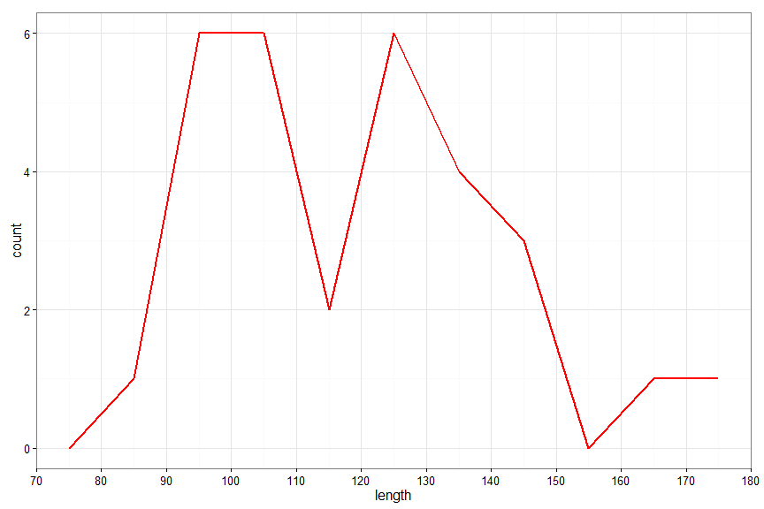
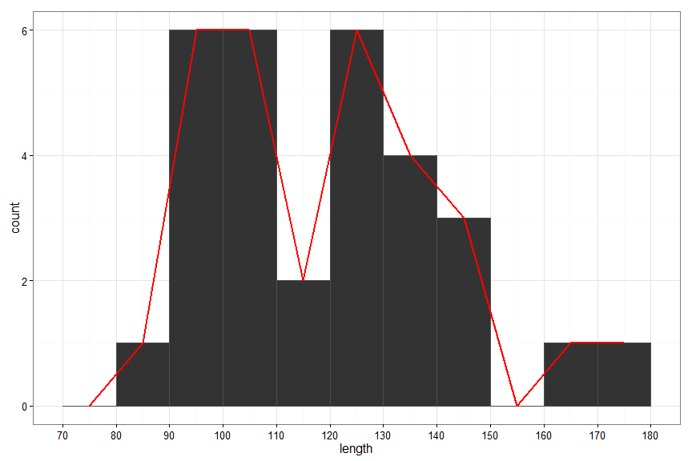
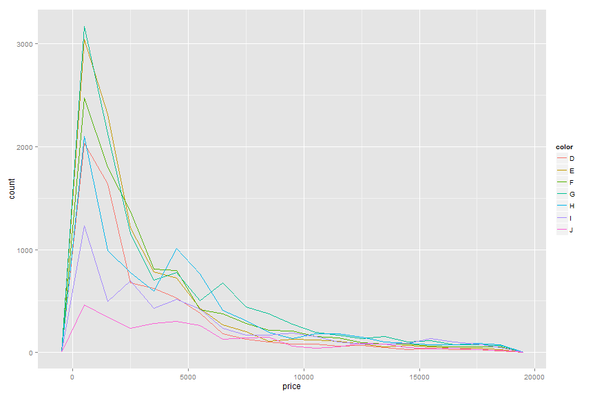

% PSQF 4143: Section 2 Supplemental
% Brandon LeBeau


# Frequency Polygons
- Similar to a histogram, but the frequency are plotted above the midpoint of each interval.
- The midpoint is the middle of the interval taking into account the real limits.
     - $mid = X_{ll} + \frac{(X_{ul} - X_{ll})}{2}$


```
##         Var1 Freq midpoint
## 1    [80,90)    1     84.5
## 2   [90,100)    6     94.5
## 3  [100,110)    6    104.5
## 4  [110,120)    2    114.5
## 5  [120,130)    6    124.5
## 6  [130,140)    4    134.5
## 7  [140,150)    3    144.5
## 8  [150,160)    0    154.5
## 9  [160,170)    1    164.5
## 10 [170,180)    1    174.5
```

   

# Stem and Leaf
- The leaf is the last digit of the number
- The stem is everything except for the last digit.


```
## 
##   The decimal point is 1 digit(s) to the right of the |
## 
##    8 | 6
##    9 | 257899
##   10 | 048899
##   11 | 03
##   12 | 001347
##   13 | 2226
##   14 | 013
##   15 | 
##   16 | 2
##   17 | 0
```


