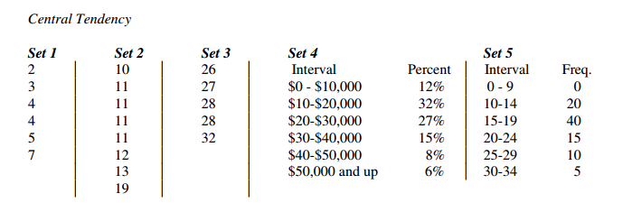
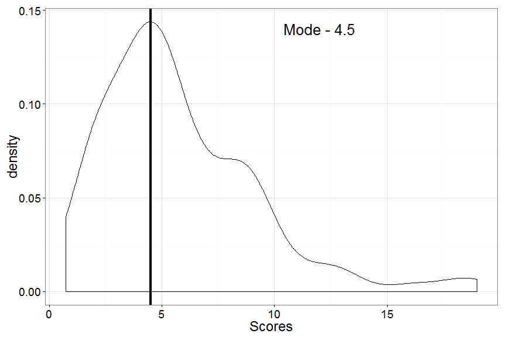
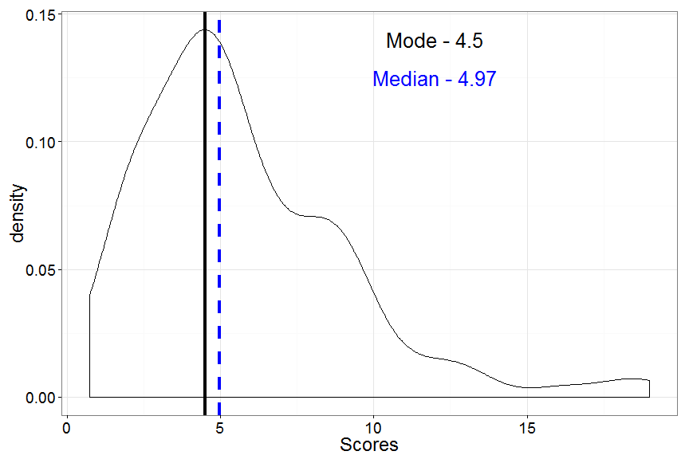

% PSQF 4143: Section 3
% Brandon LeBeau

# Statistics vs Parameters
- *Statistics* - A number that describes the sample; hopefully a representative number for the population
    - Notation: An English letter (i.e. $X$, $\bar{X}$)
- *Parameter* - A number to describe the population (i.e. the true value)
    - Notation: A Greek letter (i.e. $\mu$, $\sigma$)
    
# Notation
- An observed data point is represented with a capital letter, commonly $X$.  This would represent the value for a single individual.
    - Example: X = 25
- Little $x$ is used for a deviation score.
- The number of subjects in the population is denoted with a capital $N$.  The number in the sample is denoted with a small $n$.
- If there are multiple observations or groups a subcript is used.
    - Example: A sample of 3 observations (n = 3):
    $X_{1} = 12$, $X_{2} = 23$, $X_{3} = 8$.
    
# Notation 2
- The greek captial letter, $\Sigma$, is used to indicate summation.
    - More formally: $\displaystyle \sum^{n}_{i=1} X_{i} = X_{1} + X_{2} + ... + X_{n}$
    - This means sum the value of $X$ from 1 to $n$.
    
- Example: $X_{1} = 12$, $X_{2} = 23$, $X_{3} = 8$.
$$ \displaystyle \sum_{i=1}^{n} X_{i} = 12 + 23 + 8 = 43  $$

# Single number Descriptive Statistics
- *Central Tendency* - a set of descriptive statistics that describes a data set in a single number; also known as measures of central tendency as they describe where the center of the distribution lies
    - Mode
    - Median
    - Mean (Average)

# Measure of Central Tendency
- Mode:
    - Indicates the most frequent value/category in the distribution.

- Calculating the mode:
    - Discrete Data: Value with the greatest frequency.
    - Categorized Continuous Data (i.e. Frequency Table): Midpoint of the interval with the greatest frequency.
    - Continuous Data: The highest point of the frequency distribution.
    
# Mode Calculations

    
# Measure of Central Tendency 2
- Median: 
    - Is the value where half of the data fall above and half fall below.
    
- Calculating the median:
    - Nominal Data: Cannot be done meaningfully
    - Discrete Data: 
        1. Order values from highest to lowest, find the middle value.
        2. Alternatively: find the value: $$ L = \frac{n+1}{2} $$
            - If L is a whole number, the median is the Lth value
            - If L is a decimal, the median is the average between the two values around L (i.e. the value rounded up and down from L)
            
# Measure of Central Tendency 2
- Calculating the median:
    - Continuous Data:
        - determine where in the interval the median falls as a fraction, then go that fraction from the interval's lower limit to its upper limit
        - $$ Median = L + \frac{ \frac{n}{2} - f_{below}}{f_{at}} * w $$
         Where $L$ is the lower limit of the of the interval containing the median
         $n$ is total frequency
         $f_{below}$ is the frequency below the interval
         $f_{at}$ is the frequency at the interval
         $w$ is the bin width
         
# Median Calculations
2  
3  
4  
4  
5  
7  

# Median Calculations 2
10  
11  
11  
11  
11  
12  
13  
19  

# Median Calculations 3
26  
27  
28  
28  
32  

# Median Calculations 4
Interval | Percent
-------- | ----------
$0-$10000 | 12%
$10000-$20000 | 32%
$20000-$30000 | 27%
$30000-$40000 | 15%
$40000-$50000 | 8%
$50000 and up | 6%

# Median Calculations 5
Interval | Percent
-------- | ---------
0 - 9 | 0 
10 - 14 | 20
15 - 19 | 40
20 - 24 | 15
25 - 29 | 10
30 - 34 | 5
    
# Measures of Central Tendency 3
- Mean:
    - Is the average of the data, also known as the "balance point" or the place where the distribution would balance on a fulcrum.
    - The mean is used for interval or ratio data and the value is interpretted in the same metric as the raw data.
    
- Notation: 
    - Sample: $\bar{X}$ - called "X-bar"
    - Population: $\mu$ - Greek letter "mu"
    
# Measures of Central Tendency 3
- Calculating the Mean
    - Sample: $$\bar{X} = \frac{\sum X}{n} = \frac{X_{1} + X_{2} + ...}{n} $$
    - Population: $$\mu = \frac{\sum X}{N} = \frac{X_{1} + X_{2} + ...}{N} $$
    
# Mean Calculations 1
2  
3  
4  
4  
5  
7 

# Mean Comic

# Measures of Central Tendency 3
- Calculating the Mean
    - Categorized Data (Frequency Table):
      $$ \bar{X} = \frac{\sum f * X_{midpoint}}{\sum f} $$
      where $f$ and $X_{midpoint}$ are the frequency and midpoint of each bin/class.
     
# Mean Calculations 2
Interval | Percent
-------- | ---------
0 - 9 | 0 
10 - 14 | 20
15 - 19 | 40
20 - 24 | 15
25 - 29 | 10
30 - 34 | 5

# Mean Calculations 3
Interval | Percent
-------- | ----------
$0-$10000 | 12%
$10000-$20000 | 32%
$20000-$30000 | 27%
$30000-$40000 | 15%
$40000-$50000 | 8%
$50000 and up | 6%

# Mean is Mathematically Tractable
- This is fancy math lingo meaning that the mean is able to be manipulated algebraicly.
- Proof:

$$\frac{\sum X}{n} = \bar{X}$$
$$n \frac{\sum X}{n} = n \bar{X}$$
$$\sum X = n \bar{X}$$
    
# Weighted Mean 
- Used when groups are different sizes.

$$ \bar{X} = \frac{n_{a}\bar{X}_{a} + n_{b}\bar{X}_{b} + n_{c}\bar{X}_{c}}{n_{a} + n_{b} + n_{c}} $$

- More generally:

$$ \bar{X} = \frac{\sum n_{j} \bar{X}_{j}}{\sum n_{j}} $$

# Weighted Mean Example
Boys | Girls
---- | -----
5 | 10
8 | 12
3 | 16
7 | 8
7 | 4
  | 8
  
# Weighted Mean Example 2

District 1: n = 3347; Mean = 78.4  
District 2: n = 200; Mean = 52.8  
District 3: n = 334; Mean = 55.2  

# Puzzler - Simpson's Paradox
- The boys at Elm have a higher mean than the boys at Oak.
- The girls at Elm have a higher mean than the girls at Oak.
- The combined mean at Elm is lower than the combined mean at Oak.

# Choosing a Statistic
- What statistic would you choose if the distribution was normally distributed? Why?
- What if the distribution was skewed?

# What to use for skewed distributions?
Suppose we have the following distribution:

 

 

 

 

# Strengths/Weaknesses of the Mode
- Strengths: 
     - The mode is simple, easy to compute, and can be used with qualitative variables.
- Weaknesses: 
     - However, it can change easily or be undefined for multimodal data.
          - This is often called sampling stability.
     - Not mathematically tractable.

# Strengths/Weaknesses of the Median
- Strengths:
     - The median is the most typical number in the distribution.
          - The median minimizes $\sum |X - Mdn| \leq \sum |X - c|$ where c is any other value.
          - As such, the median is commonly used with income or prices.
     - The median is not affected by outliers
          - This is due to the median is not based on the value of the scores, but rather the ranking of scores.
          - The median would only be affected if the ranking of scores would change.
     - Easy to compute and computed for open-ended groups.
     - Is the 50th percentile
- Weaknesses:
     - Poor sampling stability compared to the mean (better than the mode).
     - Not as mathematically tractable compared to the mean.
     - Does not use all data in the calculation.
     - Can not be calculated for qualitative data
     
# Strengths/Weaknesses of the Mean
- Strengths:
     - Mathematically tractable
          - Sum of deviation scores equals 0 ($\sum(X - \bar{X}) = 0$)
          - Minimizes the sum of squared deviations scores ($\sum(X - \bar{X})^2$)
     - The mathematic properties make the mean the balance point of the distribution.
     - Takes into account value of all numbers in the distribution.
     - Used in many advanced statistical techniques.
- Weaknesses:
     - Sensitive to outliers
     - Unable to calculate for open-ended groups.
     - Can not be calculated for qualitative data

