% ESRM 5393: Variability
% Brandon LeBeau

# Properties of the mean
- Deviations sum to 0: Deviations are defined as $X-\bar{X}$.
- Sum of squared deviations is least for the mean (least squares property)
- Graphically, mean is a balancing point.
- In skewed distributions, mean is in the direction of the skew.

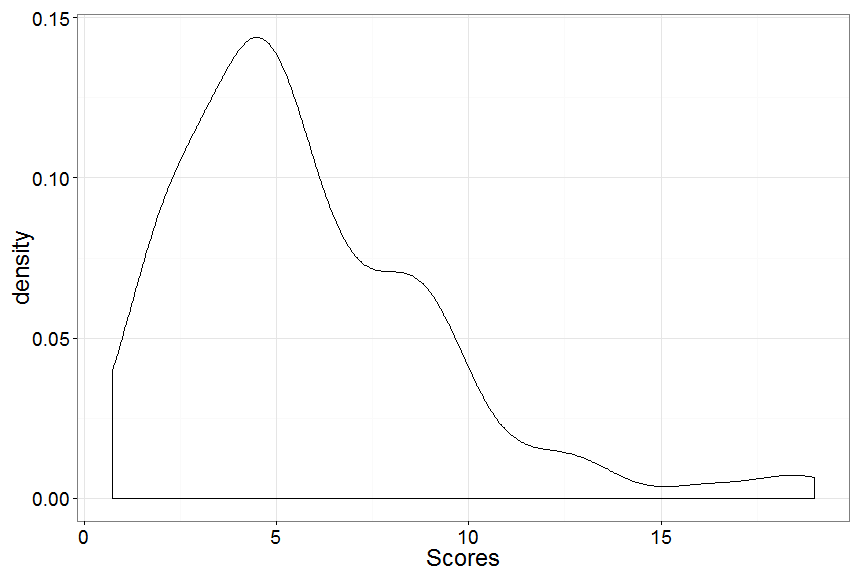 

# Variation Example
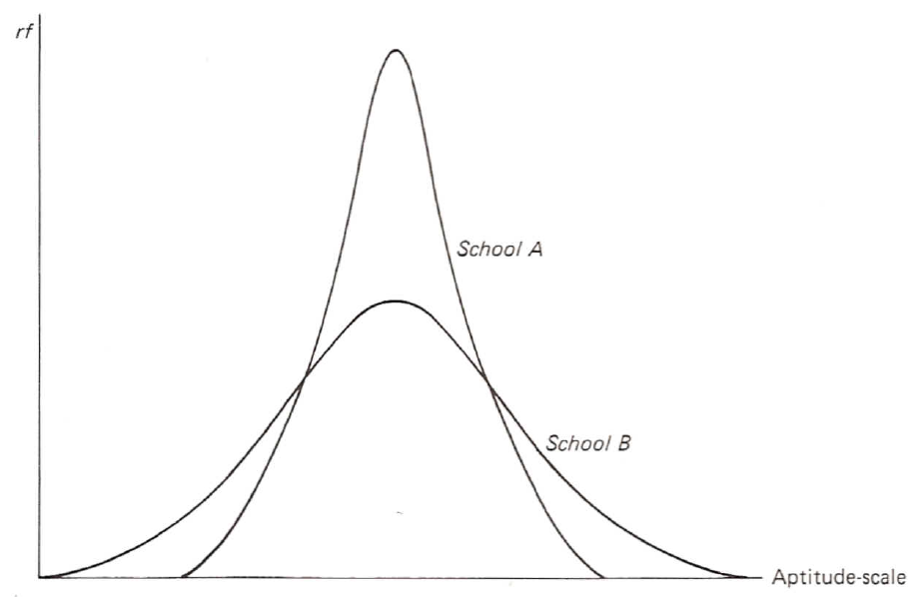

# Variation
- Variability - how spread out scores are in a distribution
- Central Question of Research: Why are there differences on outcomes?

- Range: 
    - Upper limit of highest score (H) minus low limit of lowest score (L)
    - If scores are continuous and rounded to the nearest point: $Range = H - L + 1$
    - If scores are discrete: $Range = H - L$
    - Using range as a verb: "ACT scores ranged from 17 to 24 for the group"
- Interquartile Range:
    - $IQR = Q_{3} - Q_{1}$

- Is the range of the sample equal to the range of the population?
- Is the mean of a sample equal to the mean of the population?

# Expected Value
- Expected value of a statistic is the mean over all possible samples; a long run average.
    - $E(sample mean) ______  population mean (\mu)$
    - $E(sample range) _______ population range$
- Range is very crude as it only takes into account two scores in our distribution.

# Semi-Interquartile Range
$$ Q = \frac{Q_{3} - Q_{1}}{2} $$
$$ Q = \frac{(Q_{3} - Mdn) + (Mdn - Q_{1})}{2} $$

- Q is the average of the distances from the median to $Q_{1}$ and $Q_{3}$.

# Semi IQR Example
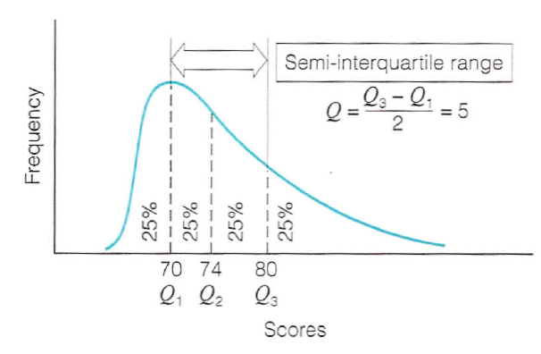

- For non-symmetrical distributions, the semi IQR is interpreted as *roughly* half of the scores deviate by more than 5 units from the median and *roughly* half of the scores deviate by less than 5 units.
- For symmetrical distributions change *roughly* above to *exactly*.

# Variability Measures with the Median
- Average deviation from the median:
$$ \frac{\sum (X_{i} - Mdn)}{n} $$
     - Positive differences will tend to offset negative differences.
     - Half of the scores are above, half are below.
- Average absolute deviation from the median:
$$ \frac{\sum |X_{i} - Mdn|}{n} $$
     - Uses all scores in the distribution
     - Influenced by extreme scores
     - Not too bad as an index of variability
     - One problem is that absolute values are difficult mathematically

# Variability Measures with the Mean
- Average deviation from the mean:
$$ \frac{\sum (X_{i} - \bar{X})}{n} $$
     - No Good, why?
- Average absolute deviation from the mean:
$$ \frac{\sum |X_{i} - \bar{X}|}{n} $$
     - Not too bad as an index of variability
     - One problem is that absolute values are difficult mathematically
     - For more advanced statistical techniques, this will become a problem.
- Average squared deviations from the mean:
$$ \frac{\sum (X_{i} - \bar{X})^2}{n} $$
     - This is formally called the variance
     - This is a very important statistical measure and the most used measure of variability.


# Variance
- Sample Variance:  
$$ s^2 = \frac{\sum (X - \bar{X})^2}{n} $$
- Population Variance:  
$$ \sigma^2 = {\frac{\sum (X - \mu)^2}{N} $$
      - Sum of Squares (SS) = $\sum(X-\mu)^2$
      - Mean Squares (MS) = variance or $\sigma^2$
- Interpreted as the average **squared** distance from the mean.
- Too bad the variance is interpreted in terms of squared units.

# Example

X  
3
4
5
6
7

# Standard Deviation
- To convert away from squared units, simply take the square root of the variance.
- Sample SD:
$$ s^2 = \sqrt{s^2} = \sqrt{\frac{\sum (X - \bar{X})^2}{n}} $$
- Population SD:
$$ \sigma^2 = \sqrt{\sigma^2} = \sqrt{\frac{\sum (X - \mu)^2}{n}} $$
- The SD is interpreted as the average deviation score from the mean.

# Standard Deviation Properties
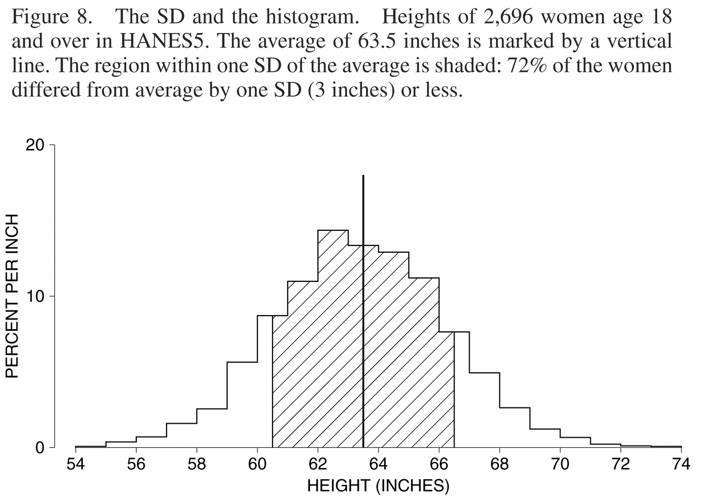
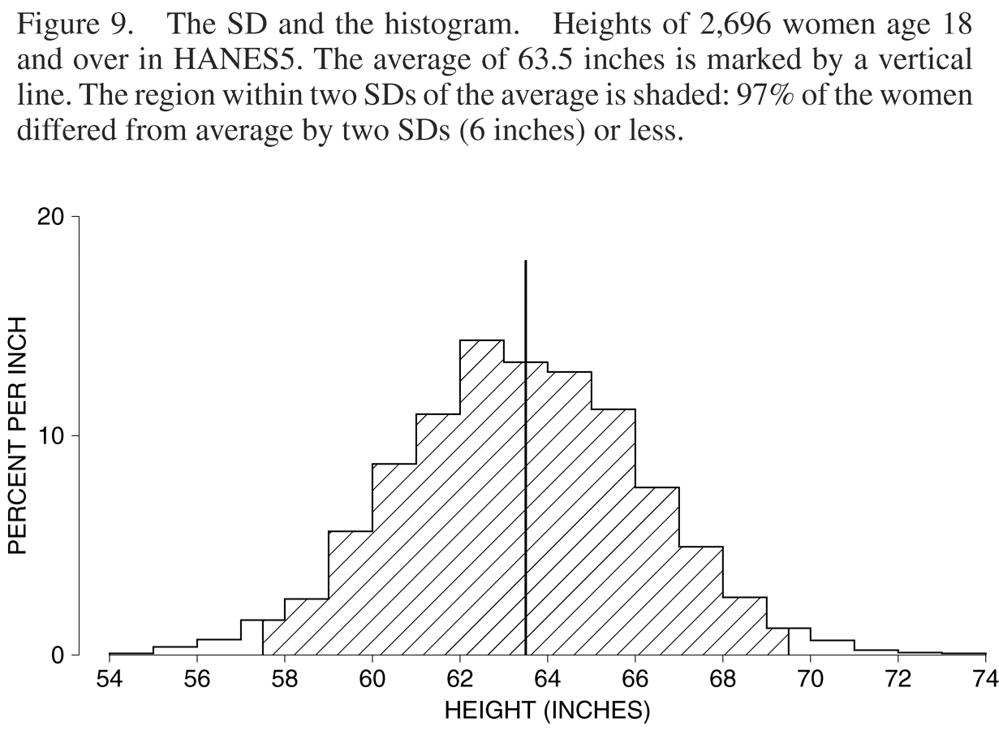

# Computational Formulas
- Variance: 
$$ s^2 = \frac{\sum X_{i}^{2}}{n} - \left(\frac{\sum X_{i}}{n}\right)^2 = \frac{\sum X_{i}^{2}}{n} - \bar{X}^2 $$
- SD:
$$ s = \sqrt{\frac{\sum X_{i}^{2}}{n} - \left(\frac{\sum X_{i}}{n}\right)^2} = \sqrt{\frac{\sum X_{i}^{2}}{n} - \bar{X}^2} $$

# Calculate SD for Grouped Freq. Dist.
$$ s = \sqrt{\frac{\sum f_{j}X_{j}^{2}}{n} - \left(\frac{\sum f_{j}X_{j}}{n}\right)^2} = \sqrt{\frac{\sum f_{j}X_{j}^{2}}{n} - \bar{X}^2} $$
- $f_{j}$ is the frequency of interval $j$.
- $X_{j}$ is the midpoint of interval $j$.

# Example
| X | $f_{j}$ | $X_{j}$ | $f_{j}*X_{j}$ |
|--:|--------:|--------:|--------------:|
| 1 - 4   | 3  | 2.5    | 7.5           |
| 5 - 8   | 4  | 6.5    | 26            | 
| 9 - 12  | 8  | 10.5   | 84            | 
| 13 - 16 | 15 | 14.5   | 217.5         | 
| 17 - 20 | 28 | 18.5   | 518           | 
| 21 - 24 | 12 | 22.5   | 270           | 
| 25 - 28 | 14 | 26.5   | 371           | 
| 29 - 32 | 10 | 30.5   | 305           | 
| 33 - 36 | 6  | 34.5   | 207           |

# Relationship between Q and s
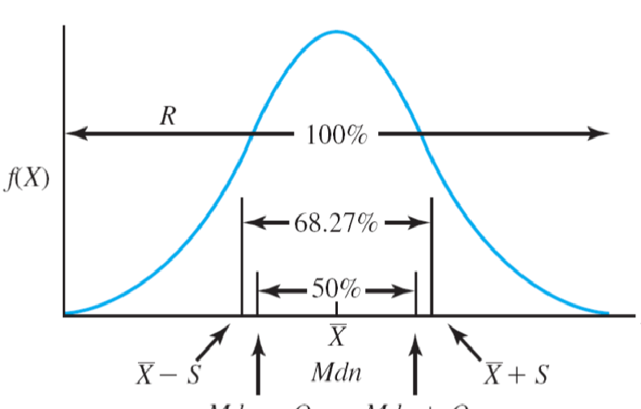

# Q & s with skewed distributions
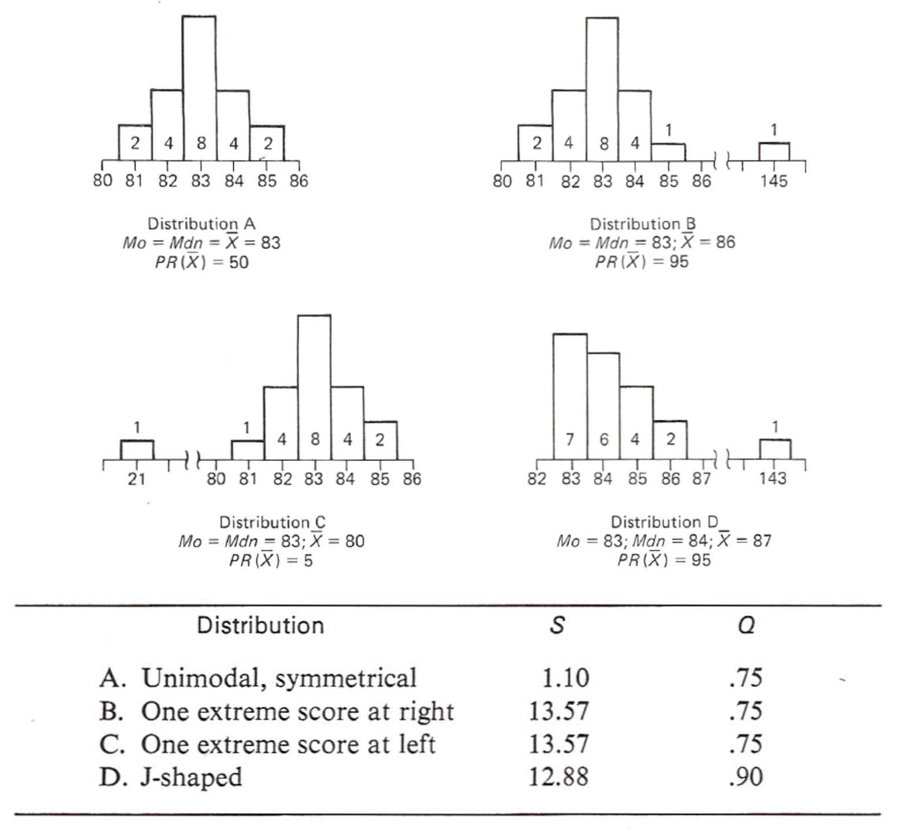

# Football Coaches Salary

```r
library(SemiPar)
data(age.income)
age.income$income <- exp(age.income$log.income)
h <- ggplot(age.income, aes(x = income)) + theme_bw(base_size = 16)
h + geom_histogram(color = "grey", binwidth = 150000) + 
  scale_x_continuous(breaks = seq(0, 3500000, 600000))
```

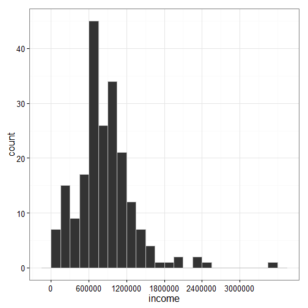 

# Properties of Variability Measures
- Standard Deviation (Variance):
    - A distance measure
    - Preferred measure for symmetric quantitative variables
    - Commonly reported with the mean
    - Best sample stability
    - Widely used in advanced statistical procedures - mathematically tractable
    - Every score affects value
    - Fairly sensitive to extreme scores
    - Not appropriate for qualitative variables
- Semi-interquartile Range:
    - A distance measure
    - Commonly reported with the median
    - Sensitive to the number and not to the value of scores above or below Q3 and Q1 respectively
    - Appropriate for open-ended distributions
    - More sample fluctuation than SD
    - Rarely used in advanced statistical procedures - less mathematically tractable
- Range:
    - A distance measure
    - Simplest measure for quantitative variables
    - Highly influenced by sample fluctuations
    - Dependent on sample size
    - rarely used in advanced statistical procedures - less mathematically tractable
    
# Measures of Variability Uses
1. Describe Distributions
2. Compare Distributions
3. Study the accuracy of certain measuring procedures
    - Consistency of raters rating figure skaters.
    - Estimate the population mean IQ of children aged 3 to 15.

# Describing Distributions
- Used in conjunction with a measure of central tendency, variability helps us understand a distribution of scores.
    - Examples:
         - Consider a unimodal symmetrical distribution:
         - $Mdn = 50$, $Q = 10$.
         - $Mean = 38$, $SD = 6$.

# Comparing Distributions
- If two distributions have the same score scale, then a direct comparison of variability is possible.
- Cannot compare when scales are different:
     - Example:
         - SAT: ranges from 200 to 800, $SD_{SAT} = 100$
         - ACT: ranges from 1 to 36, $SD_{ACT} = 5$
         
# Accuracy of Measuring Procedures
- Roughly 60 million children in the US. aged 3 to 15.
- Not practical to measure the IQ of every child
- Settle for taking a sample of 1000 children and measure the IQ of each
- Use the sample mean as an estimate of the population mean
- How good is the estimate?
     - More complicated because the population mean is unknown

# Population
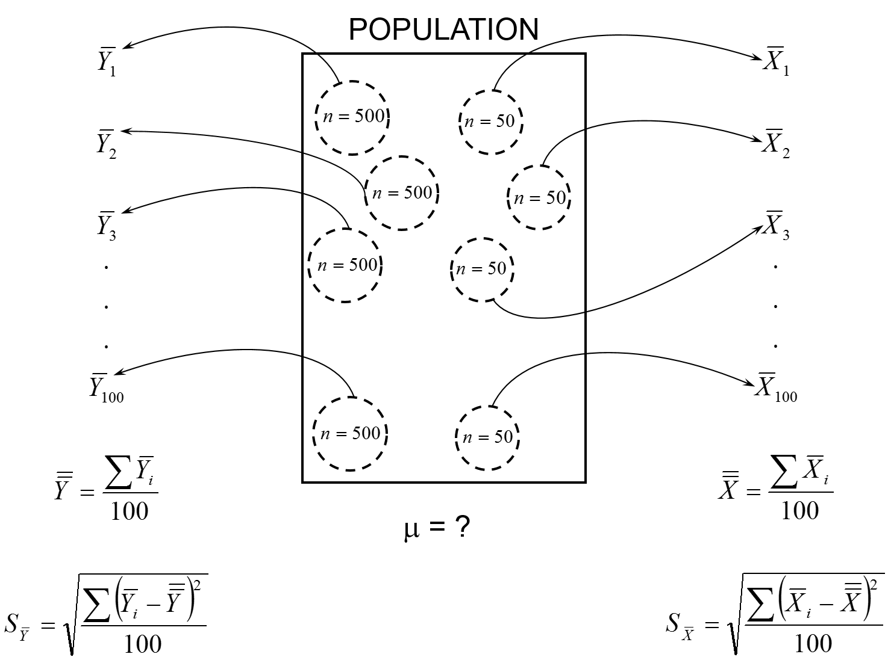

# Standard Deviation 3
- Problem: 
    - If we use the formula for the population on the sample, the variance for the sample is slightly too small - samples are closer to the sample mean than to the population mean.  Recall that sum of squared deviations was smallest for the sample mean.
- Solution:
    - Instead of dividing by $n$, divide by $n-1$.
    
# Standard Deviations for Samples
- Variance: $$ s^2 = \frac{\sum (X - \bar{X})^2}{n - 1} $$
- Standard Deviation: $$ s = \sqrt{s^2} = \sqrt{\frac{\sum (X - \bar{X})^2}{n - 1}} $$


# Standard Deviations for Samples 2
- By using $n - 1$ instead of $n$, the expected value of the sample variance is the population variance.  More formally: $$ E(s^2) = \sigma^2 $$
- In words, the long run average from every possible sample from the population would now equal the population variance.

# Index of Dispersion
$$ D = \frac{c\left( n^2 - \sum n_{j}^{2} \right)}{n^2 (c - 1)} $$

- c is the number of categories
- n is the total number of observations
- $n_{j}$ is the number of observations in category $j$

# Index of Dispersion Example
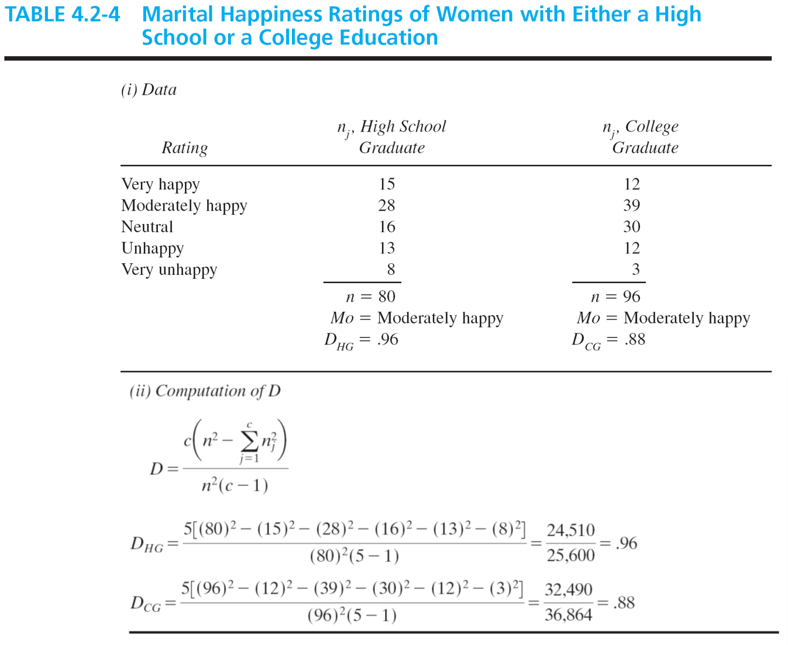

# Skewness
$$Sk = \frac{\sum \left(X_{i} - \bar{X}\right)^3}{n s^3_{X}} $$
- $Sk = 0$, symmetrical
- $Sk > 0$, positively skewed 
- $Sk < 0$, negatively skewed

# Kurtosis
$$Kur = \frac{\sum \left(X_{i} - \bar{X}\right)^4}{n s^4_{X}} - 3 $$
- $Kur = 0$, mesokurtic
- $Kur > 0$, leptokurtic
- $Kur < 0$, platykurtic

# Distribution Differences
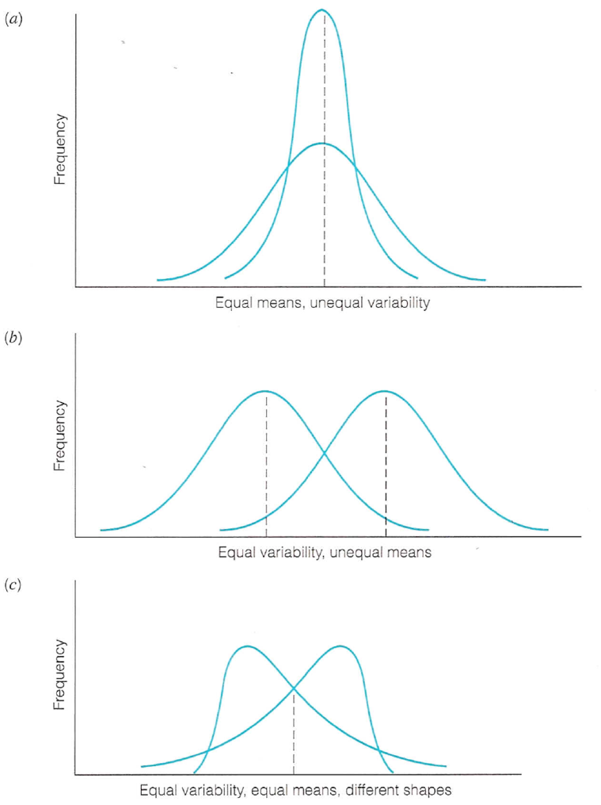

# Boxplot
- These are sometimes called a box and whisker plot


```r
library(ggplot2)
library(plyr)
library(dplyr)
freq_tab <- movies %>%
  filter(year == 2004) %>%
  select(title, length)
freq_tab$x <- 1
b <- ggplot(freq_tab, aes(x = x, y = length))
b + geom_boxplot() + theme_bw(base_size = 16) + 
  scale_y_continuous(breaks = seq(0, 600, 50))
```

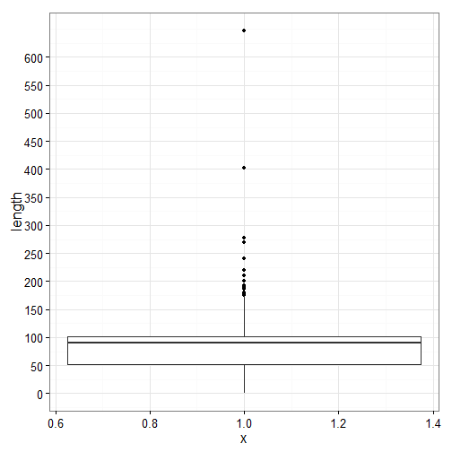 

# Boxplots by group

```r
b <- ggplot(movies, aes(x = year, y = budget, group = round_any(year, 10, floor)))
b + geom_boxplot() + theme_bw(base_size = 16)
```

```
## Warning: Removed 53573 rows containing non-finite values (stat_boxplot).
```

```
## Warning: position_dodge requires constant width: output may be incorrect
```

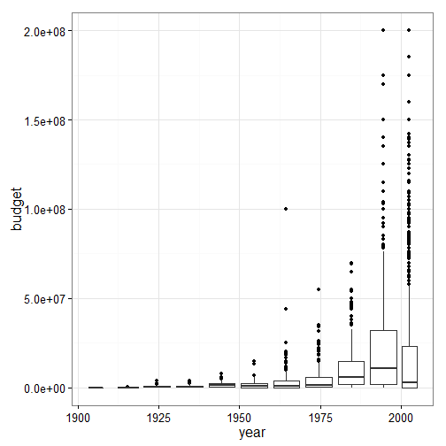 

# Comparing Distributions


