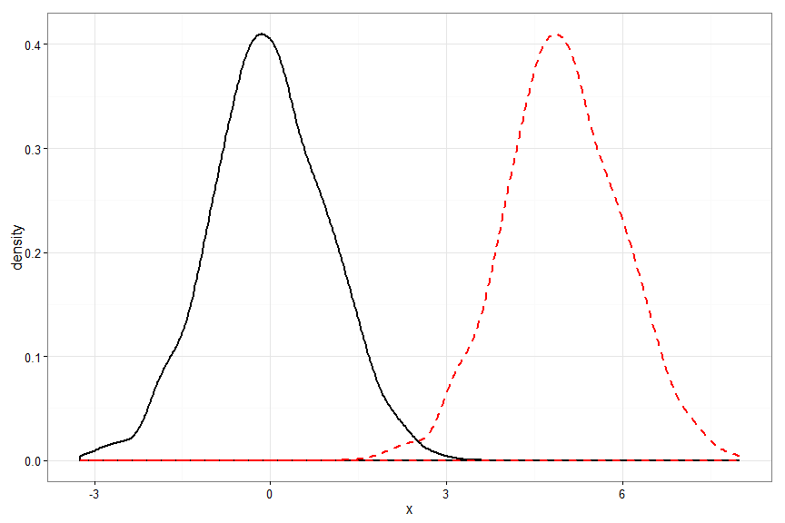
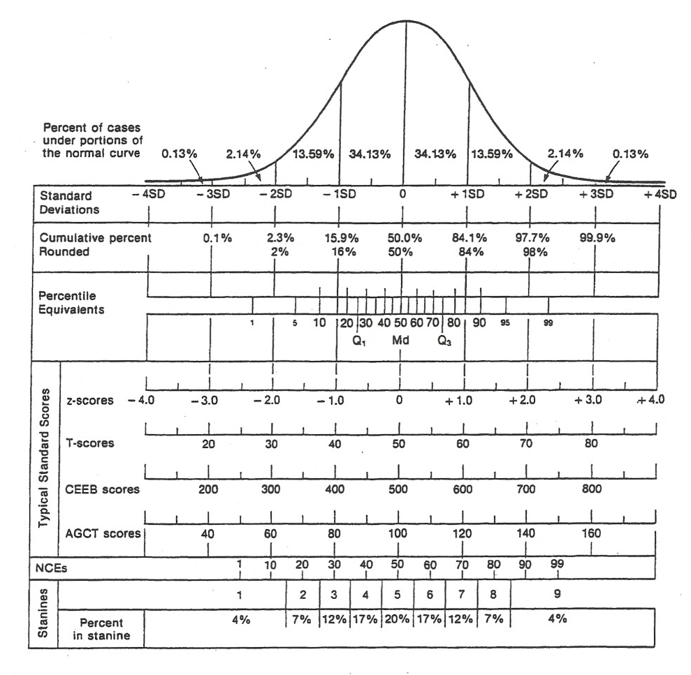
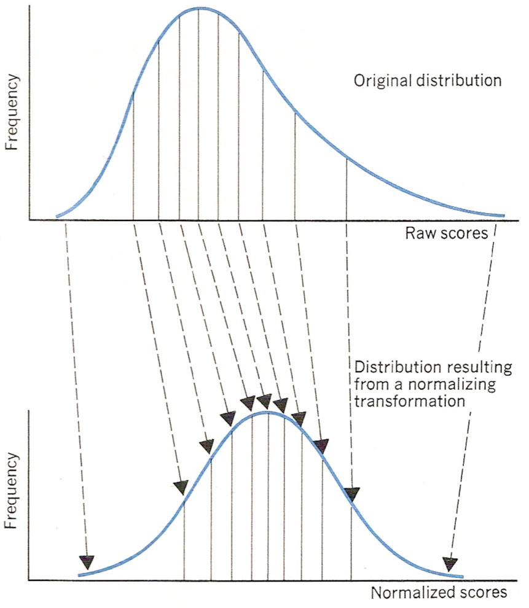

% PSQF 4143: Section 5
% Brandon LeBeau

# Tester
- For the score distribution below, which of the following score changes yields the greatest change in percentile rank?
     - 70 to 80
     - 80 to 90
     - 90 to 100
     - The change is equal
     - Cannot determine
     

# Motivating Example

|       | Univ 1 | Univ 2 | Univ 3 |
|:------|:------:|:------:|:------:|
| Score | 60     | 60     | 60     |
| Mean  | 70     | 50     | 55     |
| SD    | 10     | 20     | 2.5    |

- Which score is more extreme?
- We can transform into *Standard Scores*.

# Linear Transformations
- A linear transformation is an algebraic rule for changing scores in a distribution where the distance between scores are preserved.
     - This means the shape of the distribution is unchanged.
- Example:
     - Suppose we want to change scores by multiplying each score by 5 and adding 20
     - Let X be the original score
     - Then $Y = X*5 + 20$
     - Y is then said to be a linear transformation of X

# Linear Transformation Example
- Suppose we have the following scores:
     - X: 3, 5, 7, 9, 11
     - Y: 35, 45, 55, 65, 75
     
 

# Linear Transformations (cont.)
- In general we can multiply by any value and add any value:
     - $Y = bX + a$
     - Where Y is transformed scores
     - X is the original scores
     - b is the multiplicative constant
     - a is the additive constant
     
# Add a constant to every score
$$Y = X + a$$
$$b = 1$$
- a must be a real number

 

# Add a constant: Data Example

|           | X   | $Y = X + 2$ | $Y = X - 4$ |
|-----------|:---:|:-----------:|:-----------:|
|           | 4   | 6           | 0           |
|           | 5   | 7           | 1           |
|           | 6   | 8           | 2           |
|           | 7   | 9           | 3           |
|           | 8   | 10          | 4           |
|-----------|:---:|:-----------:|:-----------:|
| Sum X     | 30  | 40          | 10          |
| Sum $X^2$ | 190 | 330         | 30          |
| mean      | 6   | 8           | 2           |
| var       | 2   | 2           | 2           |
| std dev   | 1.4 | 1.4         | 1.4         |

- Rule 1: 
     - If $Y = X + a$
     - Then $\bar{Y} = \bar{X} + a$
- Rule 2:
     - If $Y = X + a$
     - Then $s_{y}^2 = s_{x}^2$
     - and $s_{y} = s_{x}$
     
# Multiply every score by a constant
$$Y = bX$$
$$a = 0$$
- b must be a real number

 

# Multiply a constant: Data Example

|           | X   | $Y = 2X$    | $Y = -4X$   |
|-----------|:---:|:-----------:|:-----------:|
|           | 4   | 8           | -16         |
|           | 5   | 10          | -20         |
|           | 6   | 12          | -24         |
|           | 7   | 14          | -28         |
|           | 8   | 16          | -32         |
|-----------|:---:|:-----------:|:-----------:|
| Sum X     | 30  | 60          | -120        |
| Sum $X^2$ | 190 | 760         | 3040        |
| mean      | 6   | 12          | -24         |
| var       | 2   | 8           | 32          |
| std dev   | 1.4 | 2.8         | 5.6         |

- Rule 1: 
     - If $Y = bX$
     - Then $\bar{Y} = \bar{X} * b$
- Rule 2:
     - If $Y = X + a$
     - Then $s_{y}^2 = b^2s_{x}^2$
     - and $s_{y} = |b|s_{x}$
     
# Multiply by a constant, then add a constant
$$Y = bX + a$$
- a and b must be real numbers

 

# Multiply a constant, add constant: Data Example

|           | X   | $Y = 2X - 2$ |
|-----------|:---:|:------------:|
|           | 4   | 6            |
|           | 5   | 8            |
|           | 6   | 10           |
|           | 7   | 12           |
|           | 8   | 14           |
|-----------|:---:|:------------:|
| Sum X     | 30  | 50           |
| Sum $X^2$ | 190 | 540          |
| mean      | 6   | 10           |
| var       | 2   | 8            |
| std dev   | 1.4 | 2.8          |

- Rule 1: 
     - If $Y = bX + a$
     - Then $\bar{Y} = \bar{X} * b + a$
     - and $s_{y}^2 = b^2s_{x}^2$
     - and $s_{y} = |b|s_{x}$
     
# Example
- Suppose the mean score on an attitude survey was 23 and the SD was 7. The score distribution was transformed by $Y = 3X + 11$.
     - What is the mean of the transformed scores?
     - What is the SD of the transformed scores?
     
# Special Linear Transformation
- One transformation has been used a lot and has a special name called *Standard Scores*, *Normal Scores*, or more commonly *z-scores*.

$$Y = \frac{1}{s_{x}}X + \frac{-\bar{X}}{s_{x}}$$

- where $b = \frac{1}{s_{s}}$ and $a = \frac{-\bar{X}}{s_{x}}$

- This can be reformulated as:

$$Z = \frac{(X - \bar{X})}{s_{x}}$$

# z-score examples
- What z-score corresponds to a raw score of 60 in a distribution having a mean of 70 and a standard deviation of 20?
- In a distribution with a mean of 23 and a standard deviation of 4, what raw score corresponds to a z-score of -2.25?

# z-score properties
$$\bar{z} = 0$$
$$s_{z} = 1$$
$$s_{z}^2 = 1$$

- z-scores are great for comparing distributions that have different means and standard deviations.

- To backtransform z-scores:
$$X = s_{x} * z + \bar{X}$$

# Transform z-score example
- In a distribution with a mean of 71 and a SD of 18, a raw score of 85 was found. What is the equivalent score in a distribution with a mean of 50 and a standard deviation of 10?

- More formally:
$$ X_{n} = \left(\frac{s_{n}}{s_{o}} \right) X_{o} + \bar{X}_{n} - \left(\frac{s_{n}}{s_{o}} \right) \bar{X}_{o} $$

# Other common scales
- z-scores are also useful to place scores on a desired scale. 
- There are many common scales that have been used over time.
    - T-scores: mean of 50, sd of 10
    - Stanines: mean of 5, sd of 2
    - Normal Curve Equivalents (NCE): mean of 50, sd of 21
    - SAT: mean of 500, sd of 100, rounded to nearest 10
    - ACT: mean of 21, sd of 5, rounded to nearest whole number
    - GRE: mean of 150, sd of 8.75

# Combining scores from different scales
- Suppose two students are competing for a college scholarship, and we need to decide which student has a better academic record.

|      | ACT | HSGPA  | Total | 
|:-----|:---:|:------:|:-----:|
| A    | 25  | 3.7    | 28.7  |
| B    | 31  | 3.3    | 34.3  |
|:-----|:---:|:------:|:-----:|
| Mean | 28  | 3.5    |       |
| SD   | 3   | 0.2    |       |

# Normalizing Transformations
- Linear transformations preserve the shape of the distribution.
- This is one of their strengths and why they are used extensively.
- However, as we progress to inferential statistics, our methods assume a normal distribution or bell curve.
- As such, what to do with skewed distributions?
- There are nonlinear transformations that can take a skewed distribution and transform it to behave more normal.
     - These transformations change the shape and thus the distance between scores.
     

