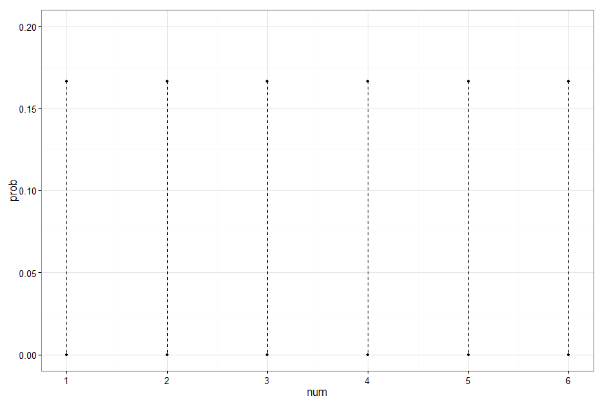
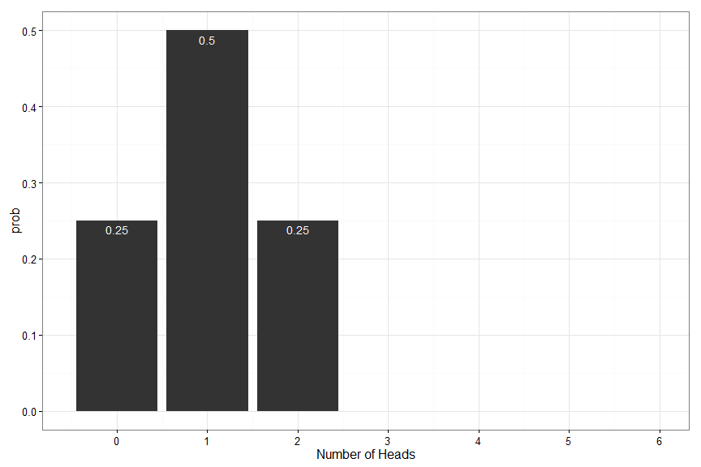
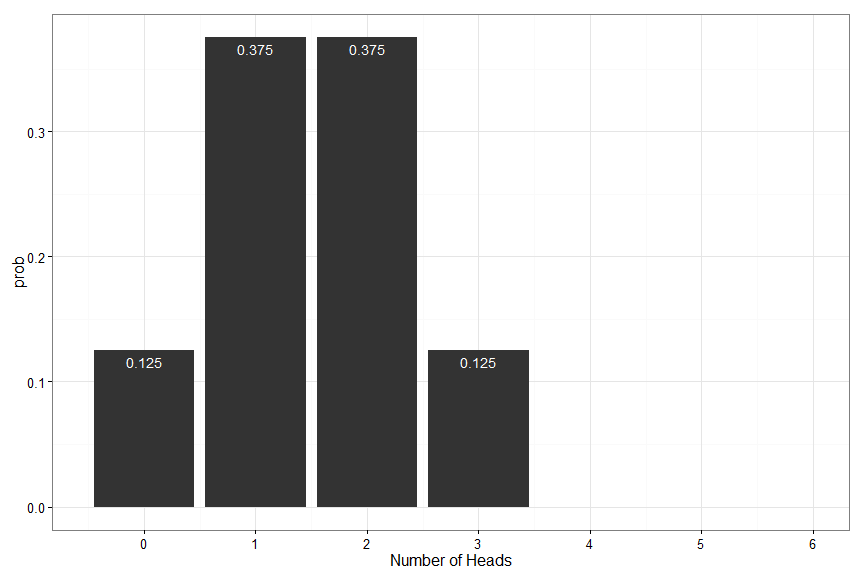
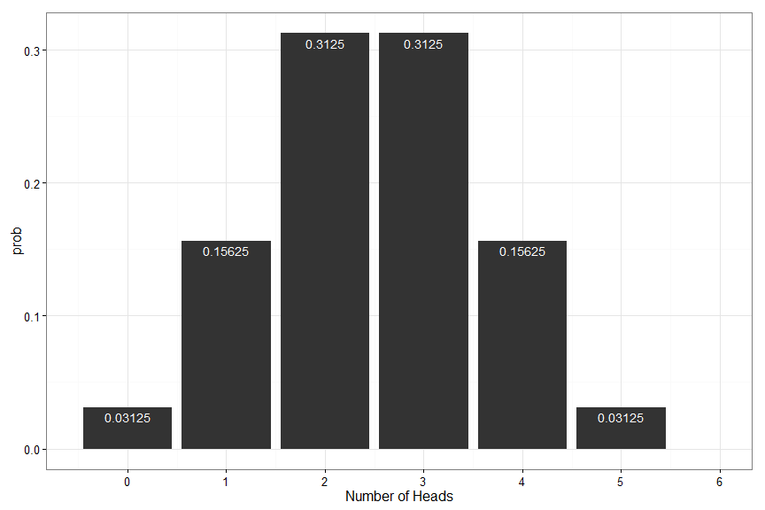
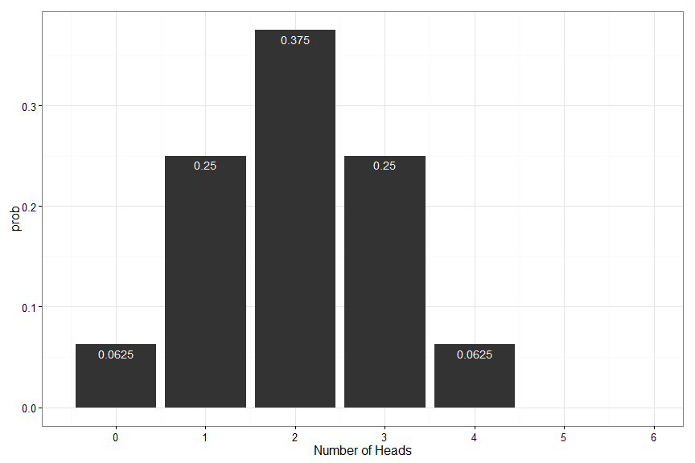
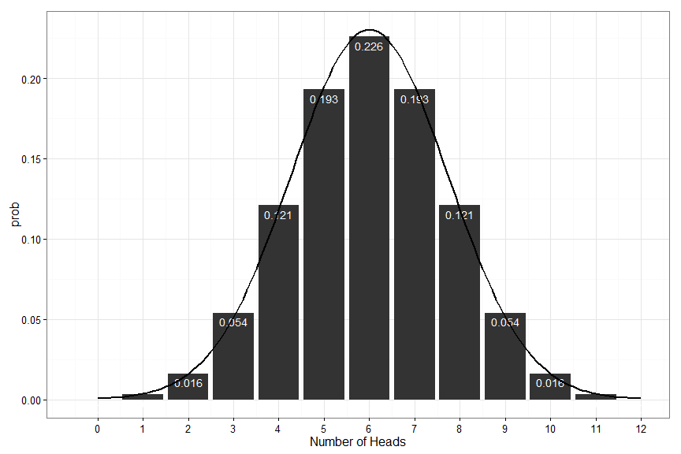
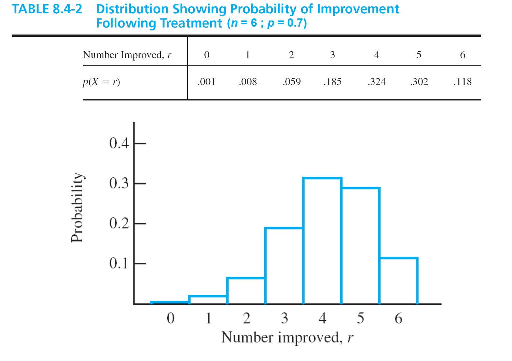
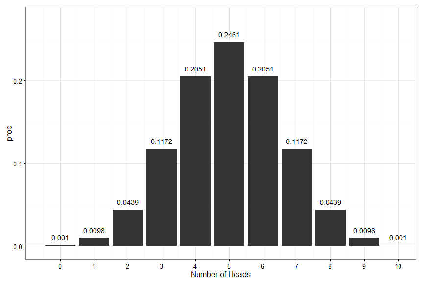

% PSQF 4143: Section 6
% Brandon LeBeau

# Descriptive vs Inferential Statistics
- Descriptive:
    - Useful if we are interested in a single group or comparison
    - Major interest is only with the subjects on hand
- Inferential:
    - Useful whenever we are interested in a larger group of subjects than just those on hand
    - Gallup poll is the most common example
    
# Inferential Loop
1. Ask a question
2. Draw a sample from the population
3. Analyze Data
4. Make inference

- What happens if we draw a second sample?
    - Would we have the same result?

# Reasons for Sampling
- Not all of the population is accessible
    - Too expensive
    - Physically or practically impossible to survey the entire population
- Data collection procedure consumes the elements of the population
    - wine tasting, missle testing, rocket launches
    
# Sampling example

- Would the mean score of all 300,000 be 18 if they all took the prep course?
- Would the mean score of all 300,000 be 15 if they did not take the prep course?
    - Both samples contain error.
    - Therefore, it is not sufficient to consider just the observed difference.
    - Rather, we need a probability statement to quantify the error.
- How to do that?
    - We might assume that there is no difference between the two groups.
    - Based on this assumption, we then determine the probability that the difference between the means is equal to 3.
    - If this probability is small, then maybe our assumption was wrong.
- Probability is the basis of inferential statistics.

# Three Characteristics of an Experiment
1. Repeatable
2. Uncertainty of outcome
3. Able to specify all possible outcomes

- Example:
    - Rolling a six-sided die
        1. You can roll the die over and over again
        2. On any given roll, you don't know ahead of time which number will come up.
        3. The outcome on any given roll will be 1 or 2 or 3 or 4 or 5 or 6.
        
# Definitions
- An **event** is an observable outcome
- A **generating event** is any repeatable process that results in only one outcome at a time
    - Examples: Flipping a coin, rolling a die, drawing a card
- The **probability (Pr)** of an event is the relative frequency with which that event would be observed over an infinite number of repetitions of the generating event, when each repetition is conducted in a like manner.

# Probability of an Event
- Example: Flipping a coin
$$Pr(heads) = \frac{\mbox{number of heads observed}}{\mbox{total number of flips}}$$
$$ = \frac{f(heads) }{N}$$
when observations are recorded for an infinite number of flips

- As a proportion, $0 \leq Pr \leq 1$
- A probability is a proportion characterizing an infinitely long series of occurrences
    - It does not tell us precisely what would happen over any short run
- We could flip a coin several thousand times to obtain an **estimate** of the true proportion of heads
    - This kind of estimate is called an *empirical probability*

# More Definitions
- A **sample space (S)** is a set of all possible outcomes of an experiment (generating event)
- Each individual outcome in a sample space is called a **sample point* $(s_{j})$
- Given a sample space, S, consisting of n sample points, $s_{j}$
    - Let $Pr(s_{j}) \geq 0$ be paired with each sample point
    - Then $\sum Pr(s_{j}) = 1$
    
# Example
- Example: Rolling a fair, six-sided die
$$S = {1, 2, 3, 4, 5, 6}$$
$$Pr(1) = Pr(2) = Pr(3) = Pr(4) = Pr(5) = Pr(6) = 1/6$$
$$Pr(s_{1}) = Pr(s_{2}) = Pr(s_{3}) = Pr(s_{4}) = Pr(s_{5}) = Pr(s_{6}) = 1/6$$
$$\sum Pr(s_{j}) = \frac{1}{6} + \frac{1}{6} + \frac{1}{6} + \frac{1}{6} + \frac{1}{6} + \frac{1}{6} = 1$$

- Equally Likely Model:
    - Given a sample space S with n sample points: $S = {s_{1}, s_{2}, \ldots, s_{n}}$
    - If $Pr(s_{n}) = 1/n$ for each sample point
    - Then the outcomes are equally likely
    
# Probability
- Given a population of possible outcomes (that is, a sample space), each of which is equally likely, the **probability of event A** on a single trial is equal to the number of possible outcomes yielding A divided by the total number of possible outcomes

$$Pr(A) = \frac{\mbox{# of ways A can occur}}{\mbox{total # of possible outcomes}}$$

# Probability 2
- Let the set of sample points in the sample space of an experiment be $s_{j}(j = 1, 2, 3, \ldots, n)$ and let the respective probability values assigned to these events be represented by $Pr(s_{j})$
- Then the set of pairs ${[sj , Pr(s_{j})]; j = 1, 2, 3, \ldots, n}$ is the probability distribution of the experiment

- Example: Rolling a fair, six-sided die

| $s_{j}$ | $Pr(s_{j})$ |
|:-------:|:-----------:|
| 1       | 1/6         |
| 2       | 1/6         |
| 3       | 1/6         |
| 4       | 1/6         |
| 5       | 1/6         |
| 6       | 1/6         |

 

# Two Ways to Calculate Probability
1. Actually conduct the experiment a large number of times
    - This is called an empirical or Monte Carlo method
2. Use a theoretical probability model (for example, the equally likely model)
    - With this method, you do not have to conduct even a single trial of the experiment
    
# Coin Once

# Addition Theorem (OR Rule)
- The probability of occurrence of any one of several particular events is the sum of their individual probabilities, provided the events are mutually exclusive (that is, the occurrence of one precludes others)
- To find the chance that at least one of two things will happen, check to see if they are mutually exclusive; if they are, add their probabilities
- $Pr(A or B) = Pr(A) + Pr(B)$, provided A and B are mutually exclusive

# Coin Twice

# Multiplication Theorem (AND Rule)
- Given two events, A and B, the probability of obtaining both A and B jointly (or successively) is the product of their separate probabilities
    - if A and B are independent (that is, the outcome of one event has no influence on, and is in no way related to, the outcome of the other)
    - then $Pr(A and B) = Pr(A) * Pr(B)$

- if A and B are not independent
    - then $Pr(A and B) = Pr(A) × Pr(B|A)$
    - or $Pr(A and B)= Pr(B) * Pr(A|B)$
    
# Coin Thrice

# Binomial Experiment
- Characteristics:
    1. Universe of N object of two kinds, A or $\bar{A}$ (not A)
    2. Randomly select an object from this universe, note its type, and replace it
         - Sampling with replacement
    3. The probability of an A-type object in the universe it $\phi$ (that is, $Pr(A) = \phi$ and $Pr(\bar{A}) = 1 - \phi$).
    4. Pr(A) must remain constant over n repetitions of the selection process.
    5. The outcome of interest is a random variable
- Binomial Exansion
    - Given a binomial experiment, the probability value associated with each possible outcome can be found using the binomial expansion
    $$ (P + Q)^N$$
    - P is the probability of the outcome (event) of interst
    - Q is the probability of the other outcome (event); that is, $Q = 1 - P$
    - N is the number of trials
    
# Binomial Expansion Example
- Flip a fair coin twice:
    - $P = 0.5$
    - $Q = 0.5$
    - $N = 2$
$$(P + Q)^N = (P + Q)^2 = P^2 + 2PQ + Q^2 $$
$$ = (0.5)^2 + 2(0.5)(0.5) + (0.5)^2 $$
$$ = 0.25 + 0.5 + 0.25 = 1$$

# Probability Distribution
 

# Binomial Expansion Example 2
- Flip a fair coin thrice:
    - $P = 0.5$
    - $Q = 0.5$
    - $N = 3$
$$(P + Q)^N = (P + Q)^3 = P^3 + 3P^2Q + 3PQ^2 + Q^3 $$
$$ = (0.5)^3 + 3(0.5)^2(0.5) + 3(0.5)(0.5)^2 + (0.5)^3 $$
$$ = 0.125 + 0.375 + 0.375 + 0.125 = 1$$

# Probability Distribution 2
 

# Binomial Expansion
- Beyond this the math becomes more difficult
- Fortunately there are tables for this.
- The binomial table can be found in the course pack.
- Example: Flip a coin five times

# Probability Distribution 3
 

# Characteristics of the Binomial Distribution
- Mean: $N * P$
- Variance: $N * P * (1 - P)$
- N is the number of trials
- P is the Pr(success) on a given trial

- Example: Number of heads in four flips of a fair coin
    - $N = 4$
    - $P = 0.5$
    - Mean = 2
    - Variance = 1
    
# Probability Distribution Example
 

# Normal Approximation to Binomial Distribution
  

# Another Binomial Example

# Example 3
What is the chance that someone could get at least half of the questions correct on a 10-question multiple-choice test (4 options per question) if he/she was randomly guessing on each question?

# Taste Test
- Somebody claims to be able to taste the difference between Coke and Pepsi
- To test this claim, we will conduct an experiment
    1. Blindfold the individual
    2. Let the individual taste a sample of Coke and a sample of Pepsi in random order, then ask her to identify which is which
    3. Repeat Step 2 nine more times (10 replications altogether)
- The number of correct identifications in 10 trials is the outcome of the experiment

# Taste Test Results
- Suppose she correctly identifies Coke 7 times in 10 trials.
- Hypothesis:
    - The taster cannot tell the difference	(she is just guessing, on each trial she has a 50/50 chance of correctly	identifying which is which)
- If the taster cannot tell the difference, what is the chance that she will guess correctly at least 7 times in 10 trials?

# Taste Test Probability Distribution
 

# Taste Test Results
- If the taster cannot tell the difference, then there is a (roughly) 17% chance that she would get at least 7 correct in 10 trials
- Something that happens 17 times out of 100 (17% of the time) is not all that unusual (or unlikely)
    - Depends on your definition of unusual (unlikely)
- In other words, if the taster cannot tell the difference, it is not all that unlikely that she would be able to get at least 7 correct on ten trials by randomly guessing
- On the basis of this evidence, I do not have sufficient reason to reject the hypothesis that the taster can’t tell the difference
- I do not have sufficient evidence to conclude that the taster can tell the difference
- The taster has failed to prove that she can tell the difference

# Taste Test: When can someone tell?
- How many times would the taster have to get the correct answer in 10 trials, in order to conclude that she can tell the difference?
    - I would say, “At least 8 out of 10”
    - Because Pr(at least 8 correct in 10 trials) = 0.055
    - If the taster can’t tell the difference, then it would be unlikely (less than a 10% chance) that she would be able to get at least 8 correct by guessing
    - 10% can be thought of as a lenient definition of unlikely
- Others may argue:
    - You might say, “At least 9 out of 10,” because you consider something to be unlikely if the chance of it happening is less than 5%
    - Someone else might say, “10 out of 10,” because he/she considers something to be unlikely if the chance of it happening is less than 1%
    - 1% can be thought of as a stringent definition of unlikely

