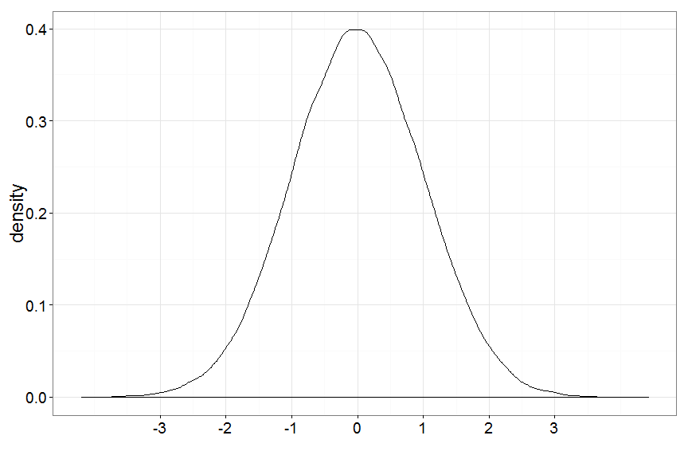
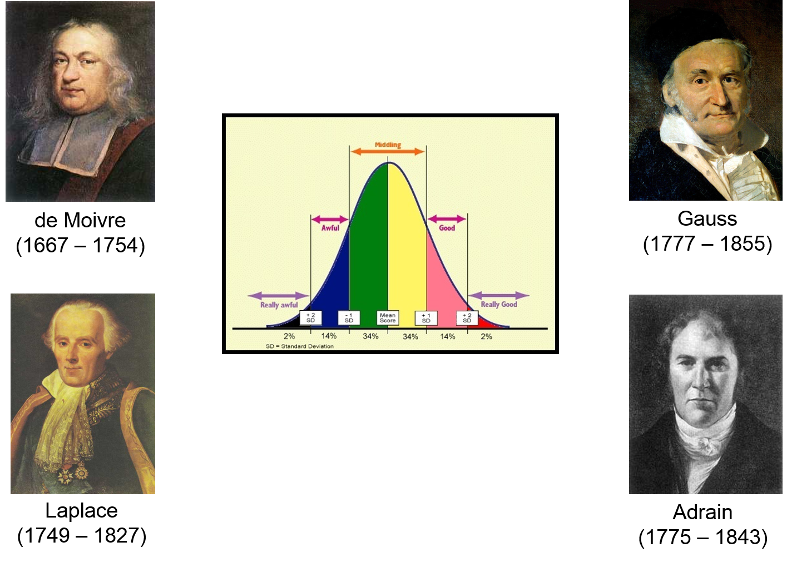
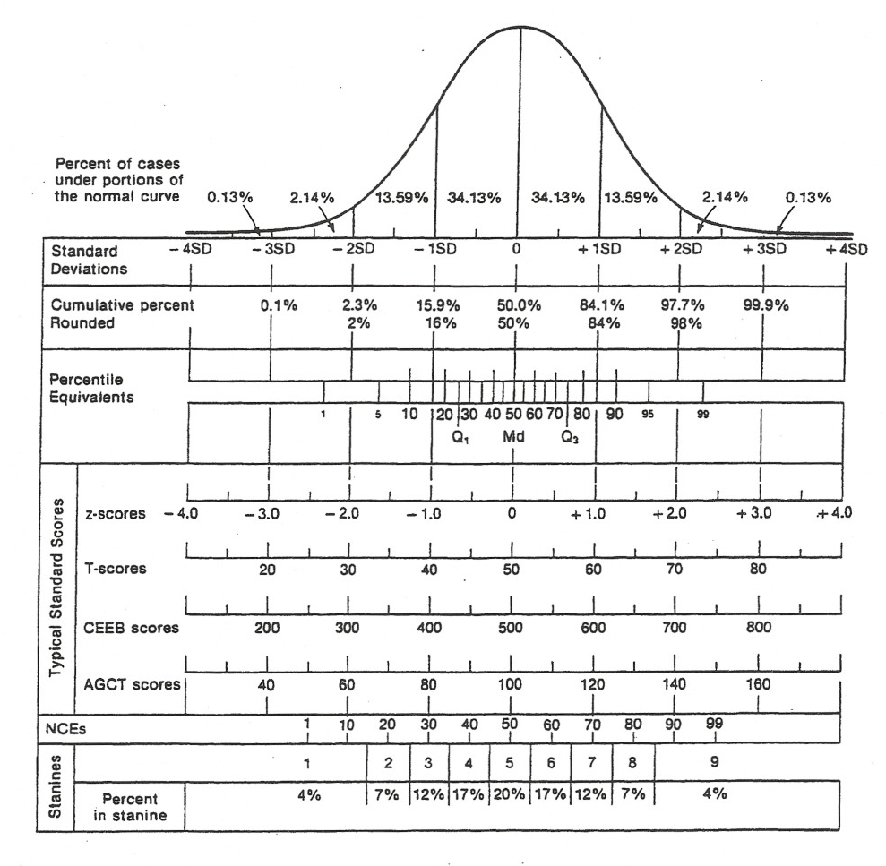
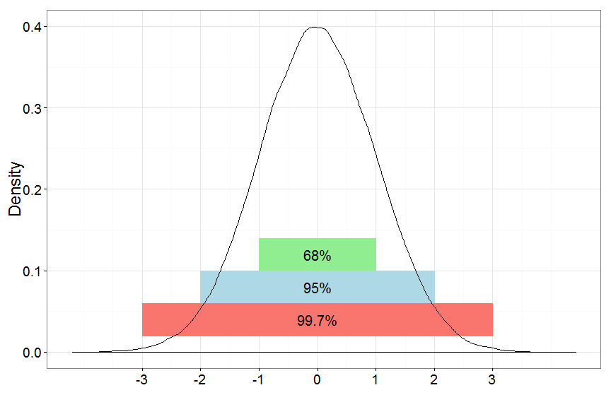
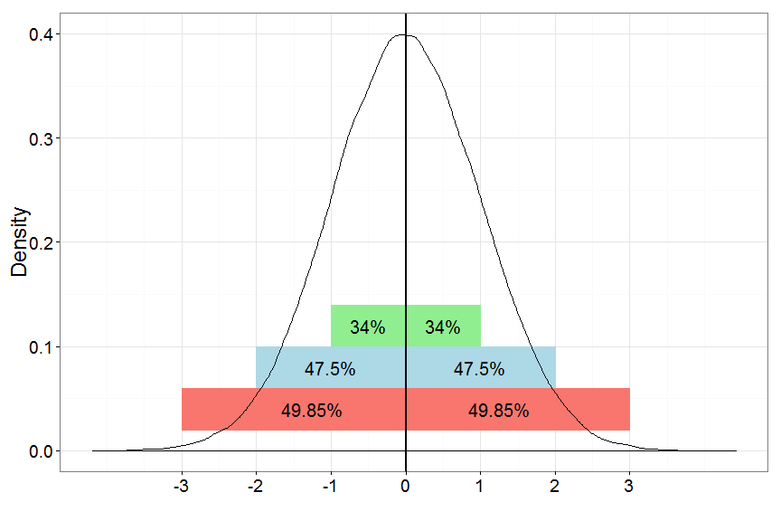
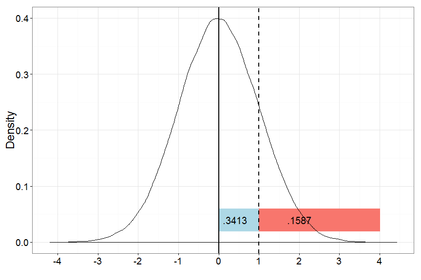

% PSQF 4143: Section 7
% Brandon LeBeau

# The Normal Distribution
 

# Normal Distribution History

# Probability Models
1. Equally-likely Model
2. Binomial Probability Model
3. Normal Probability Distribution
    - As a model for real variables (section 7)
    - As a model for sampling distributions (section 8)
    - As a model for other probability distributions
    
# Properties of Continuous Distributions
1. The vertical axis does not represent probability
2. Probabilities are represented by areas under the curve
3. The total area under the curve is 1.
4. Can't talk about the probabilitly of a single score - always have to talk about ranges
5. Countinuous distributions that have means and standard deviations require calculus to computer

# The Normal Distribution - Mathematical
$$ Y = \frac{1}{\sigma \sqrt{2 \pi}}* e^{-\frac{(X - \mu)^2}{2 \sigma^2}} $$

# Properties of The Normal Distribution
- Symmetric about the center of the distribution.
- Mean, median, and mode are all equal.
- Range: $-\infty \leq X \leq \infty$
- The tails are asymptotic to the x-axis.
    - i.e. The tails get very close to the x-axis, but never touch it.
- The distribution has 0 skewness and kurtosis.  
- Very few scores greater than $\mu + 3\sigma$
- The total area under any probability distribution regardless of the shape is 1.  
- We will use this fact in tandem with the mean and variation of a distribution to assign a probability of a specific value or mean.

# The Empirical Rule 1
 

# The Empirical Rule 2
 

# The Empirical Rule Summary
- About 68% of the data are within 1 standard deviation from the mean.
- About 95% of the data are within 2 standard deviations from the mean.
- About 99.7% of the data are within 3 standard deviations from the mean.

# Empirical Rule Examples
The average length of time a person stays at a job is 4.4 years with a standard deviation of 1.8 years.  

- What percentage of employees stay on the job more than 6.2 years?
- What percentage of employees stay on the job less than 0.8 years?
- What is the probability of an employee staying at a job for more than 9.8 years?
- What is the probability of an employee staying on the job between 2.6 and 6.2 years.
- What is the probability an employee stays more than 7 years on the job?

# Standard Scores
- A *z-score*, also called a standard score, is a way to represent a score in standard deviation units.

- To compute a z-score:  $$ z = \frac{X - \mu}{\sigma} $$
- $X$ is the raw score
- $\mu$ is the population mean
- $\sigma$ is the population standard deviation

- A distribution of z-scores is also called the standard normal distribution.

# Standard Scores Examples
The average length of time a person stays at a job is 4.4 years with a standard deviation of 1.8 years.  

- Calculate the z-score and interpret it:
    - $X = 2.2$
    - $X = 4.8$
    - $X = 8.2$
    
# Using a z-table to find probability/percentage/proportion.
- Answers the following types of questions:
    - What proportion (probability/percentage) of the observations are less than/more than/between X years?

1. Draw a normal curve, label the mean.  Mark the value(s) of interest on the x-axis and shade the region of the curve corresponding to the region in question.
2. Convert the value(s) to a z-score.
3. Use the z-table to find the area below/above/between the calculated z-score(s).

# How to use the z-table
 

# Z-table examples
The average length of time a person stays at a job is 4.4 years with a standard deviation of 1.8 years.  

- What is the probability an employee stays more than 7 years on the job?
- What proportion of employees stay fewer than 4 years on the job?
- What percentage of employees stay more than 5 years on the job but fewer than 8 years?

# Converting z-scores to a raw score
1. Multiply z-score by standard deviation.
2. Add the mean to the result from step 1.  
$X = z*s + \bar{X}$

Examples:
- $Z = 1.25$
- $Z = -.7$
- $Z = 2.12$

# Using the z-table to find a value
What value of the variable is the cut point for the lower or upper percentile?

1. Draw a normal curve, label the mean.
2. Mark the region of interest (upper or lower tail)
3. Use the z-table to find the z-score corresponding to the percentile region (area in the tail).
4. Convert the z-score back into the original metric ($X$)

# Examples
The average length of time a person stays at a job is 4.4 years with a standard deviation of 1.8 years.  

- How many years must an employee work at one job to be in the top 8% of time at the job?
- How many years must an employee work at one job to be in the bottom 2% of time at the job?

# More Examples
- In a normal distribution, what T-score is at the 15th percentile?
- What percentage of the population has an IQ of 120 or higher?
- What percent of scores are in the 6th stanine?

# More Practice
The mean birth weight for infants is 7 pounds with a standard deviation of 1.1 pounds.  

Use the empirical rule to answer:  
1. What proportion of infants weigh more than 8.1 pounds?  
2. What proportion of infants weigh less than 4.8 pounds?  
3. What proportion of infants are between 5.9 and 8.1 pounds?  

Use the z-table to answer the following:  
1. What proportion of infants weigh less than 5 pounds?  
2. What percentage of infants weigh more than 7.2 pounds?  
3. What proportion of infants weigh between 4.9 pounds and 7.1 pounds?  
4. How much would an infant weigh if they were in the top 12%?  
5. How much would an infant weigh if they were in the bottom 4%?  

