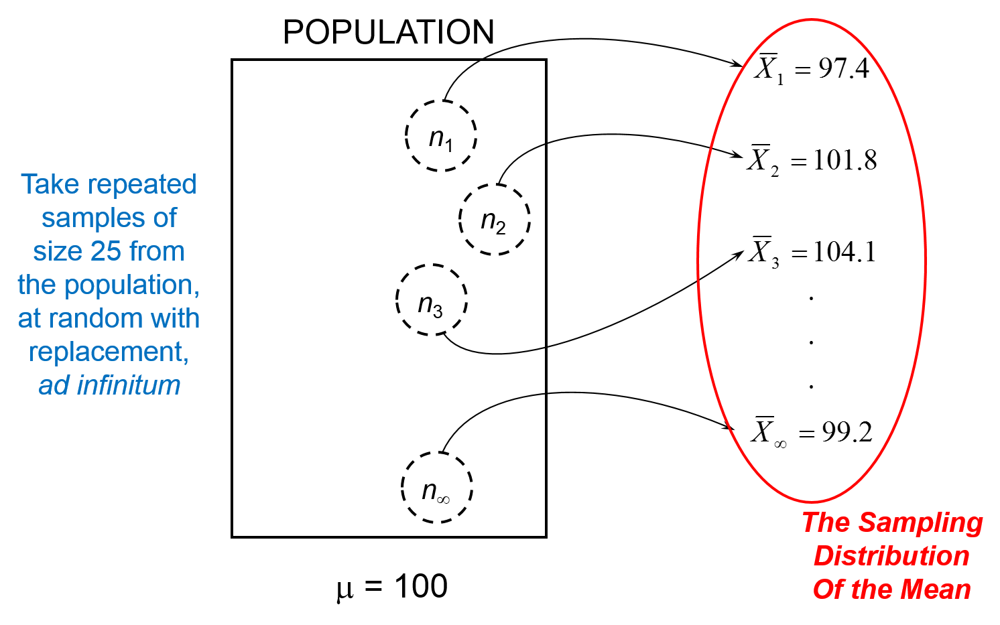
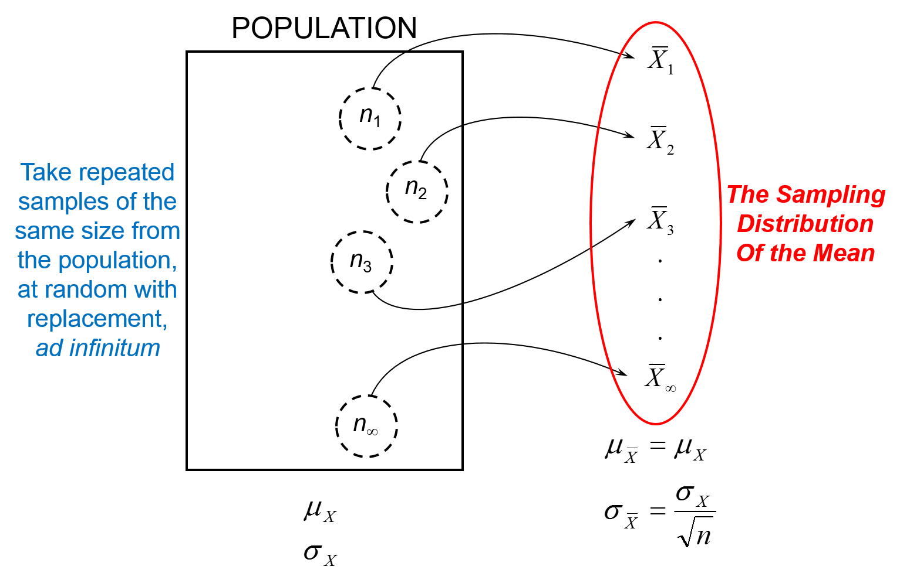

% PSQF 4143: Section 8
% Brandon LeBeau


```{r opts, echo = FALSE}
opts_chunk$set(error=FALSE, warning=FALSE, message=FALSE, dev='png', fig.height=8, fig.width=12,background='white', echo=FALSE)
```

# Statistical Inference
- Useful whenever our concern is with a larger group of subjects than just those on hand
- Examples: 
    - Gallup polls
    - Political polls
- Reasons for sampling
    1. Not all of the population is accessible
        - Too expensive to survey the entire population
        - Physically or practically impossible to survey the entire population
    2. The data collection procedure consumes the elements of the population
        - Example: Wine Tasting
        
# Statistical Inference 2
- The basic aim of statistical inference is to make a conclusion about a **population parameter** based on a **sample statistic** obtained from a sample of the population.

| Characteristic | Parameter   | 
|:---------------|------------:|
| Mean           | $\mu$       |
| Standard Dev.  | $\sigma$    |
| Correlation    | $\rho$      |
| Median         | $\epsilon$  |
| Proportion     | $\pi$       |

# Example


# Population Terminology
- Experimentally Accessible Population (EAP)
    - The population from which we sample
    - The EAP is what is available to the researcher when she does her study
- Target Population (TP)
    - The population to which we generalize
    
# Population Terminology Example


# Population Example 1
- Effects of Guidance on the Results of Standardized Tests.
    - Purpose: 
    > "to ascertain whether a group of students could be effectively motivated, through individual and group guidance activities, to achieve significantly higher results on the ITED than another group of students who were not afforded the same guidance services."
    
    - Subjects:
    > "270 ninth grade students from a midwestern community of mixed social and	ethnic background. One-half the students	were randomly assigned to an experimental group and one-half to a control group"
    
    - Conclusions:
    > "the results of the standardized achievement testing were related to the  motivational and teaching activities that were carried out prior to the testing"
    > "improved test results are obtainable when students become personally involved in, motivated by, and interested in the testing program"
    > "All schools are interested in improving their . . . standardized test [scores], but more important, they must be interested in the individual student and his development"
    
# Population Example 2
- The determination of Social Ranks and Roles
    - Purpose:
    > "Are there individual differences in the quality of maternal care given kids and,	if there are, do these lead to differences in social roles?"
    
    - Variables:
        - speed of birth
	      - immediacy (latency) of maternal responses
	      - intensity of maternal responsiveness
	      - vigor of kid
	      - nursing latency, frequency, and duration
	      - weight and sex of kid
	      - relative dominance during play
	      - priority of access to mother
	      - spatial relations vis-a-vis other kids
	   - Subjects:
	   > "a small group of inbred Toggenburg goats "
	   
	   - Conclusions:
	   > "For goats, and other social species, it	makes  sense to diversify these	capabilities as much as possible -- the	reverse of the all-apples-in-one-basket strategy"
	   
# Population Examples Summary
- In the strictest sense, the results of research studies are limited to generalizations directly to the EAP.
- Any generalizations to the TP require logical considerations of the similarities and differences between the EAP and TP and how these difference may affect the results.
    - This is one place where the art of science enters.
    
# Situations where EAP and TP may differ
1. Learning Experiments (cognitive function)
    - Example: when subjects are undergraduate university students
2. Methods Studies in Education
    - Example: Method to teach fifth-graders to spell
        - Commonly uses intact classrooms
    - Can also happen in medical research
3. Polls
    - Time factor
4. Medical Studies with Animals
    - Example: Saccharine causes cancer in rats, therefore it is banned from human consumption.
    
# Newspaper Example


# Random Sampling
- A **random sample** of a given population is a sample that is drawn so that each possible sample of that size has an equal probability of being selected from the population.
    - Note: It is the method of selection, not the particular sample outcome that defines a random sample.
    
# Sampling Error
- **Sampling Error** is the difference between the value of the population parameter ($\theta$) and that of the sample statistic ($T$)
    - $E = T - \theta$
        - $E$ is the sampling error
        - $T$ is the value of the sample statistic
        - $\theta$ is the value of the population parameter
- The key to any situation in statistical inference is to know what sample values occur in repeated sampling, and with what probability.
- In other words, we need to know the sampling distribution of the statistic.
- We must be able to describe the sampling distribution of the statistic completely if we are to say what would happen when samples are drawn.

# Bias
- If a sample is not done randomly, then there is a biased sample.
- It follows, if we have a biased sample, the sample statistic would not correspond to the population parameter and the sample statistic would be biased.
- This results in **systematic error** in addition to random/sampling error.
- Two major ways to have bias:
    1. Sample selection - troublesome, no way to adjust
    2. Characteristic of the statistic - this we can adjust for if known.
    
# Sampling Distribution for the Mean


# Sampling Distribution Example
- Suppose our population consists of 4 values: 2, 4, 6, 8

- We wish to draw random samples of size 2 from this population with replacement.

# Possible Samples


# Sampling Distribution of the Mean
- For samples of size 2, drawn repeatedly with replacement from the population 2, 4, 6, 8.
```{r sampdist}
dat <- data.frame(mean = rep(c(2, 3, 4, 5, 6, 7, 8), 
                             times = c(1, 2, 3, 4, 3, 2, 1)))
library(ggplot2)
h <- ggplot(dat, aes(x = mean)) + theme_bw()
h + geom_histogram(binwidth = 1, color = "grey") + 
  scale_x_continuous(breaks = seq(2.5, 8.5, 1), labels = seq(2, 8, 1))
```


# Sampling Distribution Process


# Sampling Distribution of the Mean
- The mean of any random sampling distribution of $\bar{X}$, called the **expected value of the sample mean**, is the same as the mean of the population of scores.
$$\mu_{\bar{X}} = \mu_{X}$$
- This is true regardless of the sample size ($n$), standard deviation ($\sigma_{X}$), and the shape of the population distribution.
- Assumes sampling with replacement, or $n < 5%$ of $N$

# Sampling Distribution of the Mean 2
- The standard deviation of the sampling distribution of $\bar{X}$, called the **standard error of the mean**, depends on the standard deviation of the population, $\sigma_{X}$ and the sample size, $n$.
$$ \sigma_{\bar{X}} = \frac{\sigma_{X}}{\sqrt{n}} $$
- The standard error of the mean is based on samples of a specified size.
- Assumes sampling with replacement, or $n < 5%$ of $N$
	
# Sampling Distribution Graphic


# Sampling Distribution Example 2
```{r sampdist2}
dat <- data.frame(mean = rep(c(2, 3, 4, 5, 6, 7, 8), 
                             times = c(1, 2, 3, 4, 3, 2, 1)))
library(ggplot2)
h <- ggplot(dat, aes(x = mean)) + theme_bw()
h + geom_histogram(binwidth = 1, color = "grey") + 
  scale_x_continuous(breaks = seq(2.5, 8.5, 1), labels = seq(2, 8, 1))
```


# Sampling Distribution Example 3


# Central Limit Theorem
- The random sampling distribution of the mean **tends** toward a normal distribution **irrespective of the shape** of the population of observations sampled.
- The approximation to the normal distribution improves as sample size increases.


# Central Limit Theorem Example


# Central Limit Theorem Summary
- If raw scores are normally distributed:
    - Then the sampling distribution of the mean is normally distributed regardless of the sample size.
- If raw scores are not normally distributed:
    - Then the sample distribution of the mean is approximately normally distributed.
    - The approximation is usually good enough as long as $n \geq 25$
    - The larger the sample, the better the approximation.
    
# Examples
- Given a normally distributed population with $\mu_{X} = 70$ and $\sigma_{X} = 20$; that is $X \sim N(70, 20)$
- Assume that we take a random sample of size $n = 25$

# Example 1
- What is the probability of obtaining a random sample with a mean of 80 or higher?
$$ Pr (\bar{X} \geq 80 | X \sim N(70, 20)) $$
$$ Pr (\bar{X} \geq 80 | \bar{X} \sim N(70, 4)) $$

# Example 2
- What is the probability of obtaining a random sample with a mean that differs from the population mean by more than 10 points?
$$ Pr (\bar{X} \geq 80 or \bar{X} \leq 60 | X \sim N(70, 20)) $$
$$ Pr (\bar{X} \geq 80 or \bar{X} \leq 60 | \bar{X} \sim N(70, 4)) $$
$$ Pr (|\bar{X} - \mu_{X}| \geq 10 | \bar{X} \sim N(70, 4)) $$

# Example 3
- What sample mean has a value such that the probability of obtaining one at least that high in random sampling is .05?
- Find $\bar{X}_{o}$ such that:
$$ Pr (\bar{X} \geq \bar{X}_{o} | \bar{X} \sim N(70, 4)) = 0.05 $$

# Example 4
- Within what limits would the central 95% of the sample means fall?
- Find $\bar{X}_{1}$ and $\bar{X}_{2}$ such that:
$$ Pr (\bar{X}_{1} \leq \bar{X} \leq \bar{X}_{2} | \bar{X} \sim N(70, 4)) = 0.95 $$


