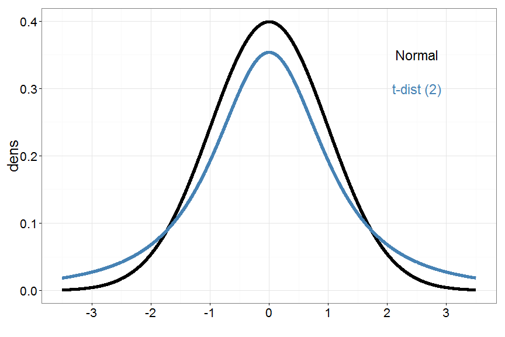
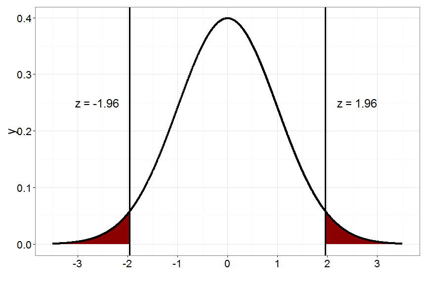
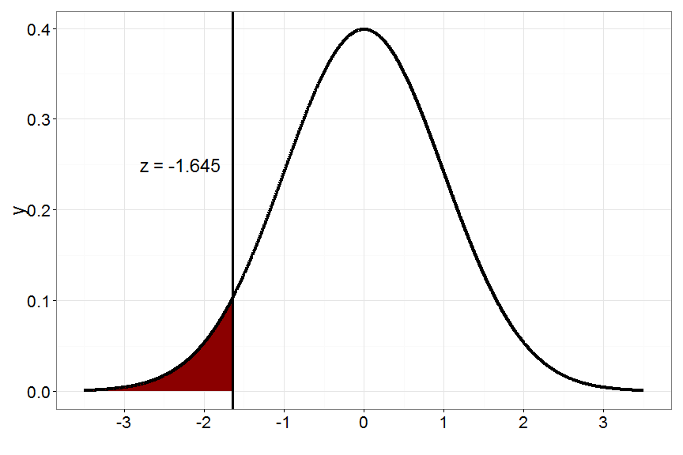
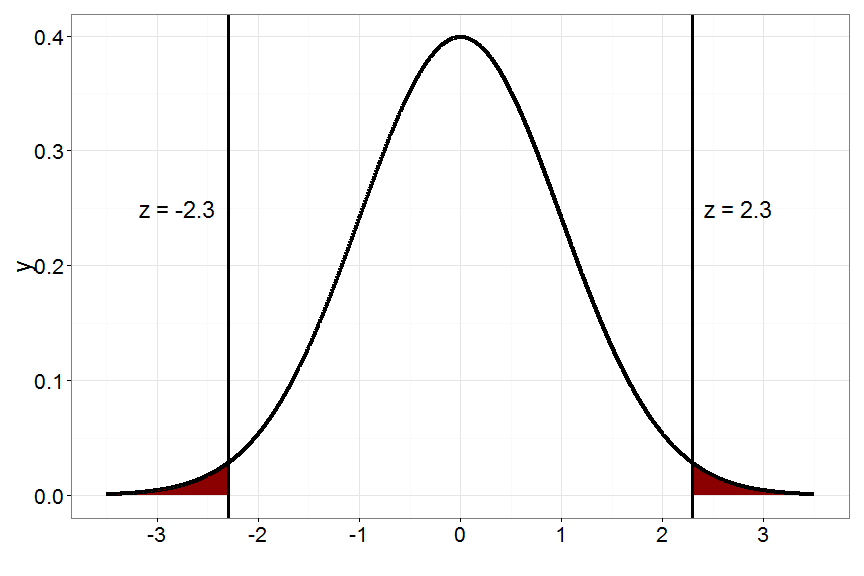

% PSQF 4143: Section 9
% Brandon LeBeau

# Review
- For a randomly selected sample of size $n$ with a mean $\mu$ and a standard deviation $\sigma$, the following is true:
    1. The distribution of sample means $\bar{X}$ is approximately normal, regardless of the population distribution.
    2. The mean of the distribution of sample means is equal to the mean of the population distribution, $\mu_{x} = \mu$.
    3. The standard deviation of the distribution of sample means is equal to: $\sigma_{\bar{X}} = \frac{\sigma}{\sqrt{n}}$

# Using the Central Limit Theorem
- The average length of time a person stays at a job is 4.4 years with a standard deviation ($\sigma_{X}$) of 1.8 years.
- With the Normal Distribution: What proportion of employees stay more than 7 years on the job?
    - $z = \frac{x - \mu}{\sigma} = 1.44, A = .074$
    
- With the CLT: What proportion of *sample means* would have values greater than 7 years?  (i.e. What proportion of samples of size 10 would have an average years on the job greater than 7?)
    - $z = \frac{\bar{X} - \mu_{\bar{X}}}{\sigma_{\bar{X}}} = \frac{\bar{X} - \mu}{\frac{\sigma}{\sqrt{n}}} = 4.57, A < .0001$
    
# Estimating Population Parameters
- The point estimate of the population mean would be the sample mean.
    - The sample mean would vary from sample to sample.
    - One problem, is that the sample mean does not give us an idea of the accuracy to the real value.
    - Our solution is to use a confidence interval.
    
# Estimating Population Parameters 2
- The confidence interval is a set of values that tell us with a specified accuracy level that the value of the parameter is contained within the values.  

Point Estimate $\pm$ Critical Value $*$ Standard Error  
C% CI of $\mu$: $\bar{X} \pm z_{crit} * \frac{\sigma}{\sqrt{n}}$  
- Where $\pm z$ are the z-scores such that the proportion (or area) of the curve within the z-scores is equal to the confidence level.
- $\pm z_{crit} * \frac{\sigma}{\sqrt{n}}$ is referred to as the **Margin of Error**.

# Alpha
- Level of confidence refers to the probability that the researcher is making a correct conclusion.  
- There is an amount of error associated with the confidence.  **Alpha** is the probability of an incorrect conclusion.  
$$ \frac{C%}{100} = 1 - \alpha $$  
- We will talk more about this in the next chapter.

# Confidence Interval for $\mu$
- A 90% confidence interval for $\mu$:  
$$ \bar{X} \pm 1.64 * \frac{\sigma}{\sqrt{n}} $$
- A 95% confidence interval for $\mu$:  
$$ \bar{X} \pm 1.96 * \frac{\sigma}{\sqrt{n}} $$
- A 99% confidence interval for $\mu$:  
$$ \bar{X} \pm 2.58 * \frac{\sigma}{\sqrt{n}} $$

# Example  
- A team statistician for the University of Iowa wants to estimate the average number of points the team will score during the season. The population mean is unknown, but the population standard deviation is 5 points. A random sample of 12 games was selected from the past two seasons; the average number of points scored was 27.4.
    - What is the best point estimate of the population mean?  
    - What is the standard error?
    - What is the 95% confidence interval?
    - What is the 99% confidence interval?
    
# Example  2
- A team statistician for the University of Iowa wants to estimate the average number of points the team will score during the season. The population mean is unknown, but the population standard deviation is 5 points. A random sample of 24 games was selected from the past two seasons; the average number of points scored was 27.4.
    - What is going to change in this example compared to the previous example?
    - What is the best point estimate of the population mean?  
    - What is the standard error?
    - What is the 95% confidence interval?
    - What is the 99% confidence interval?
    
# What do we mean by 95% confidence?
- Run R Shiny App 
- Interpretations for 95\% CI [25.4, 29.4]:
    1. Does $\mu$ fall in this interval?
    2. Is there a 95\% chance that $\mu$ falls in this interval?
    3. If 100 intervals were constructed, about how many intervals would contain $\mu$?
    4. If we constructed an infinte number of intervals, how many would contain $\mu$?

# Student's t-distribution
- Most often, the population standard deviation, $\sigma$ is not known, therefore we are unable to calculate the z-score.
- Luckily, we can estimate $\sigma$ with $s$, the sample standard deviation.
- However, one new problem is that we no longer have a normal distribution by using $s$ as an estimate for $\sigma$.
- We will now use the t-distribution when the population standard deviation in not known and sample size is small.

# Comparing t-distribution to normal distribution.
- The two distributions are very similar.  
    - bell-shaped, symmetric, tails are asymptotic to the x-axis, area under the curve equals 1.  
    
 

# Comparing t-distribution to normal distribution.
- Formula comparisons:  
Population SD: $\sigma = \sqrt{\frac{\sum(X - \bar{X})^2}{n}}$ z-score: $z_{obs} = \frac{\bar{X} - \mu}{\frac{\sigma}{\sqrt{n}}}$  
Sample SD: $s = \sqrt{\frac{\sum(X - \bar{X})^2}{n - 1}}$ t-score: $t_{obs} = \frac{\bar{X} - \mu}{\frac{s}{\sqrt{n}}}$, $df = n - 1$  

- As the degrees of freedom increase, the distribution becomes closer to a normal distribution (i.e. the tails have fewer values in them and more values fall in the center of the distribution.)

# Degrees of Freedom
$$ s = \sqrt{\frac{\sum(X - \bar{X})^2}{n - 1}} $$  
- Degrees of freedom refers to the $n-1$ in the denominator.
- Suppose we let 5 people pick any number. The only requirement we make is that the sum of these 5 numbers must equal 0.
- In this scenario, the first 4 people can pick any number they want (are "free to vary"), while the 5th number is "fixed" to ensure our sum of the numbers is 0.
- More generally from the sample standard deviation above, we say that $n-1$ numbers are "free to vary".

# Confidence Interval for t-distribution
- To calculate a confidence interval for the population mean when the population standard deviation is unknown:  
C% CI of $\mu$: $\bar{X} \pm t_{crit} * \frac{s}{\sqrt{n}}$  
- Where $\pm t$ are the t-scores such that the proportion (or area) of the curve within the t-scores is equal to the confidence level.

# Example  
- A team statistician for the University of Arkansas wants to estimate the average number of points the team will score during the season. A random sample of 18 games was selected from the past two seasons; the average number of points scored was 27.4, and the standard deviation was 4.7.
    - What is the best point estimate of the population mean?  
    - What is the standard error?
    - What is the 95% confidence interval?
    - What is the 99% confidence interval?
    
# Big Picture for Inferential Statistics
1. Establish a Research Hypothesis.
2. Choose statistical test to use based on research question and data/information you have.
3. Make a null and alternative hypothesis, one-tailed or two tailed hypotheses.
4. Set level of significance (type I/II Error).
    - Find a critical value.
    - How confident do you want to be?
5. Calculate test statistic.
    - Find a p-value.
6. Reach statistical conclusion.
7. Make a research conclusion (i.e. translate statistical conclusion into real world terminology).

# Research Question and Type of Test
- What are you interested in knowing?
- What are you trying to discover by doing your research?
- One sample tests analyze a sample's mean versus the population mean.
    - Use a Z-test when the population standard deviation is known.
    - Use a t-test when the population standard deviation is unknown.

# Hypotheses
- A hypothesis is a proposed explanation for a problem.
- The hypothesis is the general "blue-print" for collecting and interpreting data.
- A hypothesis provides direction to the research.
    - Helps us specify the population, what type of data we need, relationship between variables, statistical analyses to use.
- A statistical hypothesis provides a specific relational statement that can be statistically tested.
- **The statistical hypothesis is always stated in terms of population parameter** ($\mu$ for now).
- Can state the hypothesis with words and in notation.
- The type of test being conducted influences how the hypothesis will be stated.

# Types of Hypotheses
- **Null Hypthosis** ($H_{0}$): statement that there is NO relationship, NO impact, or NO difference.
- We assume the null hypothesis is true and test against the null hypothesis.
    - We ultimately make statements about the likelihood the null hypothesis is true.
- The conclusions are stated in terms of the null hypothesis:
    - *Reject the null hypothesis*, which is not agreeing with the null hypothesis.
    - *Fail to reject the null hypothesis*, which is a statement of agreement with the null hypothesis. We never "accept" the null hypothesis, just provide evidence that our sample is not different from the population.
    
# Types of Hypotheses 2
- **Alternative Hypothesis** ($H_{1}$ or $H_{a}$): statement that there IS a relationship among variables or that there is a difference between groups.
- For conclusions, *failing to reject the null hypothesis* provides evidence in favor of the alternative hypothesis.

# Hypotheses for one-sample tests
- Non-directional (two-tailed) test:  
$H_{0}: \mu = \mu_{0}$ and $H_{1}: \mu \neq \mu_{0}$
- Directional (one-tailed) test:  
$H_{0}: \mu = \mu_{0}$ and $H_{1}: \mu > \mu_{0}$ right tailed  
$H_{0}: \mu = \mu_{0}$ and $H_{1}: \mu < \mu_{0}$ left tailed  

where $\mu_{0}$ is the proposed population mean that is to be tested.

# One-tailed vs two-tailed Hypotheses
- With a two-tailed (non-directional) test, you reject the null hypothesis if the sample mean is **either** significantly greater or less than the hypothesized value.
- In a one-tailed (directional) test, the null hypothesis would not be rejected unless the observed difference is in the hypothesized direction.
    - The direction of the hypothesis affects which areas within the curve result in a rejection of $H_{0}$.  It also influences our choice for a critical value.
    
# Hypothesis Example 1
Question: Is the average price of gas in Iowa City less than the national average of \$2.30?  
 
$H_{0}:$  
 
$H_{1}:$

# Hypothesis Example 2
Question: Is the average Big 10 college football head coaches salary greater than the national average of \$1.64 million?  
 
$H_{0}:$  
 
$H_{1}:$

# Level of Significance
- **Level of Significance** (i.e. $\alpha$-level) is a predetermined level of rejecting the null when it is actually true.
- The level of significance is the area in the tail of direction stated in the hypothesis is equal to $\alpha$.
- Confidence level (make correct conclusion C% of the time) $C = 1 - \alpha$
- Common values for $\alpha$ include: .05, .01, .001.
- The researcher *chooses* how confident he or she wants to be in their test. This also determines the chance of error the researcher is willing to make.

# Critical Values
- Critical values are the values that separate the distribution into regions where the null hypothesis will be rejected or regions where the null hypothesis will failed to be rejected.
- The critical values separates the rejection region from the non-rejection region.
- Critical values are found using the distribution tables.
- To find a critical value, we need to know the level of significance, direction of test, and degrees of freedom (except for z-critical values).

# Rejection region
- The rejection region is the range of values for which the null hypothesis is not probable.
    - It is always in the direction of the alternative hypothesis.
    - The total area of the rejection area equal $\alpha$.
- If our test statistic is so large that it falls in the rejection region, your conclusion is to reject the null hypothesis.

# Two-tailed Rejection Region
- For a level of significance of $\alpha = 0.05$, the rejection region for a normal distribution would look like:  

 

# One-tailed Rejection Region (greater than)
- For a level of significance of $\alpha = 0.05$, the rejection region for a normal distribution would look like:  

 

# One-tailed Rejection Region (less than)
- For a level of significance of $\alpha = 0.05$, the rejection region for a normal distribution would look like:    

 

# Critical Value Example
- Z  
    - What are the critical values for a two-tailed z-test with $\alpha = .05$?
    - What are the critical values for a left-tailed z-test with $\alpha = .02$?
- T
     - What are the critical values for a two-tailed t-test with $\alpha = .05$ and degrees of freedom of 10?
    - What are the critical values for a right-tailed t-test with $\alpha = .05$ and degrees of freedom of 25?
    
# Test Statistic
- The type of test determines how the test statistic is calculated.
- In this class we will talk about these tests:
    - One-sample z-test
    - One-sample t-test
    - Independent t-test
    - Dependent/paired t-test
    
# Test Statistic - One Sample Z-test
- A test for quantitative data.
- Information given (known):
    - Population mean ($\mu$)
    - Population standard deviation ($\sigma$)
- Questions answered:
    - Did a particular sample come from a given population?
    - Is a sample mean significantly different/less than/greater than the population mean?
    
# One Sample Z-test: $z_{obs}$
- Formula:  
$z_{obs} = \frac{\bar{X} - \mu}{\frac{\sigma}{\sqrt{n}}}$  
where $\bar{X}$ is the sample mean,  
$\mu$ is the population mean (given),  
$\sigma$ is the population standard deviation (given),  
$n$ is the sample size.  

# Test Statistic t-test
- A test for quantitative data.
- Information given (known):
    - Population mean ($\mu$)
    - *Sample* standard deviation ($s$)
- Questions answered:
    - Did a particular sample come from a given population?
    - Is a sample mean significantly different/less than/greater than the population mean?

# One Sample t-test: $t_{obs}$
- Formula:  
$t_{obs} = \frac{\bar{X} - \mu}{\frac{s}{\sqrt{n - 1}}}$  
where $\bar{X}$ is the sample mean,  
$\mu$ is the population mean (given or calculated from sample),  
$s$ is the sample standard deviation (given or calculated from sample),  
$n$ is the sample size. 

# Statistical Conclusion
- If the test statistic (either $z_{obs}$ or $t_{obs}$) falls in the "rejection region," or outside of the critical value(s), the conclusion is to **reject the null hypothesis**.
    - More formally, we state that the results are "statistically significant" with a certain confidence level.
- If the observed test statistic (either $z_{obs}$ or $t_{obs}$) does not fall in the "rejection region," or inside of the critical value(s), the conclusion is to **fail to reject the null hypothesis**.

# Research Conclusion
- The statistical conclusion can also be stated in terms of words.
- If we **reject the null hypothesis**, we can state that the sample mean differs, is greater than, or less than the population mean.  
    - The direction we can conclude stems back to the direction of our research hypotheses.
- If we **fail to reject the null hypothesis**, we state that the sample mean does not differ, is not greater than, or is less than the population mean.

# p-value
- The **p-value** is the probability of obtaining a result at least as extreme as the one that was actually observed, given that the null hypothesis is true.
- This probability corresponds to the area greater than the observed test-statistic, either $z_{obs}$ or $t_{obs}$.
- When the conclusion is to **reject the null hypothesis** it is known that $p < \alpha$.
- When the conclusion is to **fail to reject the null hypothesis** it is known that $p > \alpha$.

# Visualizing p-value
- Suppose we have a z-obs value of 2.3 with a one-tailed greater than hypothesis.  

 

# Visualizing p-value 2
- Suppose we have a z-obs value of 2.3 with a two-tailed hypothesis.  

 

# Example
The average individual works out an average of 3.75 hours per week (45 minutes, 5 days a week), with a standard deviation of 1 hour. Suppose we collect a sample of 159 participants and the sample mean was 4.87 hours of exercise per week. Is our sample mean significantly greater than the national population at $\alpha = .05$?  

1.  
2.  
3.  
4.  
5.  
6.  
7.  

# Example 2
The average height for US females 20 years and older is about 64 inches with a standard deviation about 4 inches. A sample of 28 players from the UI women's soccer team has an average height of 66.6 inches. How likely is it that the UI women's soccer team is significantly taller than the adult female population with an $\alpha = .05$?  

1.  
2.  
3.  
4.  
5.  
6.  
7.  

# Example 3
Suppose you conduct an experiment to see if a given therapy works to reduce test anxiety in a sample of college students. A standard measure of test anxiety is known to produce a population mean ($\mu$) of 20. With your sample of 61 students, the mean is 18 and the standard deviation is 9. Use an $\alpha = .05$.

1.  
2.  
3.  
4.  
5.  
6.  
7. 

